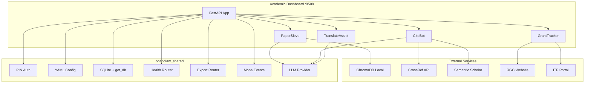

# Academic Dashboard Implementation Plan

## Architecture

Single FastAPI application serving four tools as tab-based views, mirroring the pattern in [tools/03-fnb-hospitality/fnb_hospitality/app.py](tools/03-fnb-hospitality/fnb_hospitality/app.py).




## Tech Stack (from prompts)

- **Framework**: FastAPI + Jinja2 + HTMX + Alpine.js + Tailwind (CDN)
- **Database**: SQLite per tool (raw SQL via `openclaw_shared.database`)
- **Vector DB**: ChromaDB (PaperSieve only)
- **PDF Parsing**: PyMuPDF (fitz), pdfplumber fallback
- **Embeddings**: sentence-transformers (multilingual)
- **LLM**: MLX local inference (Qwen-2.5-7B)
- **Chinese**: opencc (TC/SC conversion), jieba (segmentation)
- **Citations**: citeproc-py, custom GB/T 7714 formatter
- **Scraping**: Playwright (GrantTracker deadlines)
- **Documents**: python-docx, openpyxl
- **Scheduler**: APScheduler (reminders, monitoring)

## File Structure

```
tools/09-academic/
├── config.yaml
├── pyproject.toml
├── academic/
│   ├── __init__.py
│   ├── app.py                    # FastAPI entry, lifespan, router mounting
│   ├── database.py               # Schemas + init_all_databases
│   ├── seed_data.py              # Demo data seeder
│   ├── dashboard/
│   │   ├── static/
│   │   │   ├── css/styles.css
│   │   │   └── js/app.js
│   │   └── templates/
│   │       ├── base.html          # Sidebar nav (4 tabs), activity feed
│   │       ├── setup.html         # First-run wizard
│   │       ├── paper_sieve/       # index.html + partials/
│   │       ├── cite_bot/          # index.html + partials/
│   │       ├── translate_assist/  # index.html + partials/
│   │       └── grant_tracker/     # index.html + partials/
│   ├── paper_sieve/
│   │   ├── __init__.py
│   │   ├── routes.py              # APIRouter(prefix="/paper-sieve")
│   │   ├── ingestion/             # pdf_parser, chunker, metadata_extractor, reference_parser
│   │   ├── indexing/              # embedder, chroma_store, index_manager
│   │   ├── retrieval/             # search_engine, qa_engine, synthesis
│   │   ├── review/                # systematic_review, screening, data_extraction
│   │   └── knowledge/             # concept_extractor, knowledge_graph, citation_network
│   ├── cite_bot/
│   │   ├── __init__.py
│   │   ├── routes.py              # APIRouter(prefix="/cite-bot")
│   │   ├── parsing/               # citation_parser, bibtex_parser, ris_parser, doi_resolver
│   │   ├── formatting/            # apa, harvard, ieee, gbt7714, csl_engine, style_registry
│   │   └── validation/            # doi_checker, duplicate_detector, completeness_checker
│   ├── translate_assist/
│   │   ├── __init__.py
│   │   ├── routes.py              # APIRouter(prefix="/translate-assist")
│   │   ├── translation/           # translator, domain_prompter, abstract_translator, paper_translator
│   │   ├── terminology/           # glossary_manager, term_enforcer, domain_glossaries
│   │   └── processing/            # document_parser, chinese_converter, segmenter
│   └── grant_tracker/
│       ├── __init__.py
│       ├── routes.py              # APIRouter(prefix="/grant-tracker")
│       ├── monitoring/            # rgc_monitor, itf_monitor, nsfc_monitor, deadline_aggregator
│       ├── applications/          # form_populator, checklist_generator, budget_builder, submission_tracker
│       ├── profile/               # researcher_profile, publication_manager, scholar_fetcher
│       └── notifications/         # reminder_engine, whatsapp, email_sender
└── tests/
    ├── __init__.py
    ├── test_paper_sieve/__init__.py
    ├── test_cite_bot/__init__.py
    ├── test_translate_assist/__init__.py
    └── test_grant_tracker/__init__.py
```

## Implementation Details

### 1. Infrastructure (config.yaml, pyproject.toml, app.py, database.py)

**config.yaml** -- port 8509, workspace `~/OpenClawWorkspace/academic`:

```yaml
tool_name: academic
version: "1.0.0"
port: 8509
llm:
  provider: mock
  model_path: "mlx-community/Qwen2.5-7B-Instruct-4bit"
  embedding_model_path: "sentence-transformers/paraphrase-multilingual-MiniLM-L12-v2"
extra:
  researcher_name: ""
  institution: ""
  department: ""
  research_areas: ""
  default_citation_style: "apa7"
  default_translation_direction: "tc_to_en"
  grant_schemes: ["RGC", "ITF", "NSFC"]
  institutional_deadline_offset_days: -21
```

**pyproject.toml** -- academic-specific deps:

- Core: `openclaw-shared`, `fastapi`, `uvicorn`, `jinja2`, `pyyaml`, `pydantic`, `httpx`, `apscheduler`, `psutil`
- PaperSieve: `chromadb`, `PyMuPDF`, `pdfplumber`, `sentence-transformers`, `networkx`
- CiteBot: `citeproc-py` (or pure-Python formatters)
- TranslateAssist: `opencc-python-reimplemented`, `jieba`, `python-docx`
- GrantTracker: `playwright`, `beautifulsoup4`, `openpyxl`, `python-docx`

**database.py** -- 5 schemas (from prompts' SQL):

- `PAPER_SIEVE_SCHEMA`: papers, chunks, queries, systematic_reviews, review_papers
- `CITE_BOT_SCHEMA`: citations, formatted_references, bibliography_projects, project_citations
- `TRANSLATE_ASSIST_SCHEMA`: translation_projects, translation_segments, glossary_terms, translation_memory
- `GRANT_TRACKER_SCHEMA`: researchers, grant_schemes, deadlines, applications, publications, budget_items
- `SHARED_SCHEMA`: shared_researchers (cross-tool researcher profile linking)

Returns `db_paths` dict: `paper_sieve`, `cite_bot`, `translate_assist`, `grant_tracker`, `shared`, `mona_events`

**app.py** -- follows [tools/03-fnb-hospitality/fnb_hospitality/app.py](tools/03-fnb-hospitality/fnb_hospitality/app.py) exactly:

- Lifespan: `load_config` -> `init_all_databases` -> `create_llm_provider`
- Mounts four routers: `paper_sieve_router`, `cite_bot_router`, `translate_assist_router`, `grant_tracker_router`
- Shared routes: `/api/events`, `/setup/`, `/api/connection-test`
- Index redirects to `/paper-sieve/`
- Connection test checks: DBs, LLM, ChromaDB, CrossRef, Playwright

### 2. PaperSieve (most complex -- RAG pipeline)

**ingestion/**:

- `pdf_parser.py`: PyMuPDF layout-aware extraction (two-column detection, font-size heading detection)
- `chunker.py`: ~500-token section-aware chunks with 50-token overlap, paragraph boundary respect
- `metadata_extractor.py`: Title/authors/abstract/DOI extraction from PDF first pages
- `reference_parser.py`: Bibliography section parsing into structured citation data

**indexing/**:

- `embedder.py`: sentence-transformers multilingual embedding generation
- `chroma_store.py`: ChromaDB persistent storage, add/query/delete operations, metadata filters
- `index_manager.py`: Index lifecycle (create collection, update, rebuild, stats)

**retrieval/**:

- `search_engine.py`: Semantic search with top-10 retrieve -> top-5 re-rank, citation tracking
- `qa_engine.py`: RAG QA pipeline (retrieve chunks -> inject into LLM prompt -> generate answer with `[Author, Year, p.XX]` citations)
- `synthesis.py`: Multi-paper synthesis and summarization

**review/**:

- `systematic_review.py`: PRISMA workflow management (screening -> inclusion -> extraction -> quality assessment)
- `screening.py`: Inclusion/exclusion criteria application with batch screening
- `data_extraction.py`: Structured data extraction templates per review

**knowledge/**:

- `concept_extractor.py`: LLM-based key concept and relationship extraction
- `knowledge_graph.py`: NetworkX graph construction, JSON serialization for frontend visualization
- `citation_network.py`: Citation relationship mapping between indexed papers

**routes.py** endpoints:

- `GET /paper-sieve/` -- main page (library browser)
- `POST /paper-sieve/upload` -- PDF upload + ingestion
- `GET /paper-sieve/search?q=...` -- semantic search
- `POST /paper-sieve/qa` -- RAG question answering
- `GET /paper-sieve/papers` -- list papers
- `DELETE /paper-sieve/papers/{id}` -- remove paper
- `GET/POST /paper-sieve/reviews` -- systematic review CRUD
- `POST /paper-sieve/reviews/{id}/screen` -- screening action
- `GET /paper-sieve/knowledge-graph` -- graph data JSON
- `GET /paper-sieve/citation-network` -- citation network JSON
- HTMX partials: `paper_library.html`, `search_results.html`, `qa_chat.html`, `knowledge_graph.html`, `review_workflow.html`

**Dashboard views** (4 template partials):

- Paper Library Browser with tag/year/journal filters
- Semantic search with highlighted passage results
- Q&A chat with streaming responses and "Show Sources"
- Knowledge graph (vis.js or d3 force-directed)
- Systematic review PRISMA workflow
- Citation network visualization

### 3. CiteBot (reference formatting)

**parsing/**:

- `citation_parser.py`: LLM-based unstructured text -> structured JSON fields
- `bibtex_parser.py`: BibTeX file import
- `ris_parser.py`: RIS file import
- `doi_resolver.py`: DOI validation via doi.org, metadata enrichment from CrossRef API (100ms delay between requests)

**formatting/**:

- `apa_formatter.py`: APA 7th edition
- `harvard_formatter.py`: Harvard style
- `ieee_formatter.py`: IEEE numbered style
- `gbt7714_formatter.py`: GB/T 7714 with Chinese punctuation, surname-first, TC/SC variants
- `csl_engine.py`: Generic CSL-based formatting via citeproc-py
- `style_registry.py`: Style definitions, selection, and live preview

**validation/**:

- `doi_checker.py`: Batch DOI verification
- `duplicate_detector.py`: DOI + title similarity + author matching
- `completeness_checker.py`: Missing required fields detection

**routes.py** endpoints:

- `GET /cite-bot/` -- main page (bibliography manager)
- `POST /cite-bot/citations` -- add citation (DOI, manual, or raw text)
- `POST /cite-bot/import` -- batch import (BibTeX/RIS file upload)
- `GET /cite-bot/format?style=apa7` -- format citation in style
- `POST /cite-bot/format-all` -- batch reformat bibliography
- `POST /cite-bot/validate-doi` -- DOI validation
- `GET /cite-bot/duplicates` -- find duplicates
- `POST /cite-bot/export?format=bibtex` -- export bibliography
- `GET/POST /cite-bot/projects` -- bibliography project CRUD
- HTMX partials: `bibliography_table.html`, `citation_preview.html`, `export_panel.html`, `in_text_citation.html`

### 4. TranslateAssist (academic translation)

**translation/**:

- `translator.py`: Core LLM translation engine (paragraph-by-paragraph with previous-paragraph context)
- `domain_prompter.py`: Domain-specific prompt construction (inject glossary terms into system prompt)
- `abstract_translator.py`: Specialized abstract workflow with journal style adherence
- `paper_translator.py`: Full paper section-by-section translation preserving structure

**terminology/**:

- `glossary_manager.py`: CRUD for glossary terms (per-domain and per-project)
- `term_enforcer.py`: Post-processing step to enforce terminology consistency across paragraphs
- `domain_glossaries.py`: Pre-built glossary loader (STEM, social science, medicine, law, business JSON files)

**processing/**:

- `document_parser.py`: PDF/DOCX text extraction with heading structure preservation
- `chinese_converter.py`: OpenCC TC<->SC conversion with academic vocabulary awareness
- `segmenter.py`: jieba-based Chinese word segmentation for glossary term detection

**routes.py** endpoints:

- `GET /translate-assist/` -- main page (side-by-side editor)
- `POST /translate-assist/projects` -- create translation project
- `POST /translate-assist/translate` -- translate text/paragraph
- `POST /translate-assist/translate-document` -- full document translation
- `GET/POST /translate-assist/glossary` -- glossary CRUD
- `POST /translate-assist/convert` -- TC<->SC conversion
- `GET /translate-assist/memory` -- translation memory lookup
- `POST /translate-assist/export` -- export translated document (DOCX/HTML)
- HTMX partials: `editor.html`, `glossary_panel.html`, `translation_memory.html`, `quality_indicators.html`

### 5. GrantTracker (deadline monitoring)

**monitoring/**:

- `rgc_monitor.py`: Playwright scraper for RGC deadlines (GRF, ECS, CRF, TRS, RIF, HKPFS)
- `itf_monitor.py`: ITF portal scraper
- `nsfc_monitor.py`: NSFC deadline tracking
- `deadline_aggregator.py`: Unified deadline calendar with institutional offset calculation

**applications/**:

- `form_populator.py`: Auto-fill application fields from researcher profile
- `checklist_generator.py`: Per-scheme submission checklist with documents and endorsement steps
- `budget_builder.py`: Budget templates with RGC categories, RA salary norms, auto-totals
- `submission_tracker.py`: Application lifecycle (planning -> drafting -> submitted -> outcome)

**profile/**:

- `researcher_profile.py`: PI profile CRUD (name, institution, ORCID, appointment date)
- `publication_manager.py`: Publication list management, formatted for each agency
- `scholar_fetcher.py`: Semantic Scholar API for publication data enrichment

**notifications/**:

- `reminder_engine.py`: APScheduler-based escalating reminders (60/30/14/7/3 days)
- `whatsapp.py`: Twilio WhatsApp deadline alerts
- `email_sender.py`: smtplib email notifications

**routes.py** endpoints:

- `GET /grant-tracker/` -- main page (deadline calendar + kanban board)
- `GET/POST /grant-tracker/deadlines` -- deadline CRUD
- `POST /grant-tracker/scrape` -- trigger scraping run
- `GET/POST /grant-tracker/applications` -- application CRUD
- `POST /grant-tracker/applications/{id}/status` -- transition status
- `GET/POST /grant-tracker/budget/{app_id}` -- budget items CRUD
- `GET/POST /grant-tracker/researchers` -- researcher profile CRUD
- `GET/POST /grant-tracker/publications` -- publication list CRUD
- `POST /grant-tracker/publications/fetch` -- Semantic Scholar import
- `GET /grant-tracker/calendar-events` -- FullCalendar JSON feed
- HTMX partials: `deadline_calendar.html`, `application_board.html`, `budget_calculator.html`, `publication_list.html`, `form_autofill.html`

### 6. Dashboard Templates

**base.html** -- 4 sidebar tabs (paper-sieve, cite-bot, translate-assist, grant-tracker):

- Same dark navy theme as F&B (`#0f1225`, `#1a1f36`, `#2d3352`, gold `#d4a843`)
- CDN: Tailwind, HTMX, Alpine.js, Chart.js, FullCalendar (for GrantTracker), vis.js (for knowledge graph)
- Activity feed with HTMX polling
- EN/繁中 language toggle
- Subtitle: "Academic Dashboard"

**setup.html** -- first-run wizard with fields for:

- Researcher profile (name_en, name_tc, institution, department, research areas, appointment date)
- Messaging (Twilio, Telegram)
- Citation preferences (default style)
- Translation settings (default language pair, domains)
- Grant schemes selection
- Seed demo data checkbox
- Connection test button

### 7. Seed Data

HK-contextualized demo data:

- **PaperSieve**: 5-10 sample paper metadata entries (HKU/CUHK researchers, bilingual titles)
- **CiteBot**: 10-15 sample citations in various styles (DOIs, Chinese/English mix)
- **TranslateAssist**: 2-3 sample translation projects with pre-populated segments and glossary terms
- **GrantTracker**: RGC/ITF/NSFC scheme definitions, upcoming deadlines, 2-3 sample applications, sample researcher profile, sample publications

### 8. Cross-Tool Integration

- **PaperSieve -> CiteBot**: Papers imported into PaperSieve can be added to CiteBot bibliography projects (shared via DOI/paper_id)
- **GrantTracker -> CiteBot**: Publication list formatted via CiteBot formatters for grant applications
- **Shared researcher profile**: Stored in `shared.db`, referenced by GrantTracker and TranslateAssist

## Parallelization Strategy

The work is organized into 5 parallel streams:

```mermaid
gantt
    title Implementation Timeline
    dateFormat X
    axisFormat %s

    section infra ["Infrastructure"]
        config_pyproject_db_app: 0, 1
        base_html_setup_html: 0, 1
        seed_data: 1, 2

    section paperSieve ["PaperSieve"]
        ingestion_modules: 1, 3
        indexing_chroma: 1, 3
        retrieval_qa: 2, 4
        review_knowledge: 3, 5
        ps_routes_templates: 3, 5

    section citeBot ["CiteBot"]
        parsing_modules: 1, 3
        formatting_styles: 1, 3
        validation_modules: 2, 3
        cb_routes_templates: 2, 4

    section translateAssist ["TranslateAssist"]
        translation_engine: 1, 3
        terminology_glossary: 1, 3
        processing_opencc: 2, 3
        ta_routes_templates: 2, 4

    section grantTracker ["GrantTracker"]
        monitoring_scrapers: 1, 3
        applications_budget: 1, 3
        profile_publications: 2, 3
        notifications: 2, 3
        gt_routes_templates: 2, 4
```




- **Stream A (Infrastructure)**: config.yaml, pyproject.toml, app.py, database.py, base.html, setup.html, static files, seed_data.py -- must be done first
- **Streams B-E (4 tools)**: PaperSieve, CiteBot, TranslateAssist, GrantTracker -- all parallelizable once infrastructure is ready
- Within each tool: routes.py + templates depend on business logic modules, but business logic modules within a tool are independent of each other

