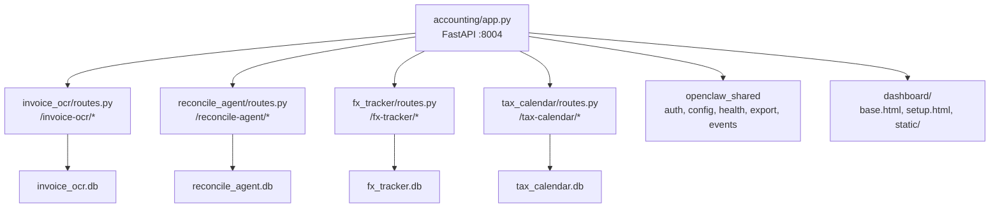

# Accounting Tools Implementation Plan

## Architecture Overview

The accounting tool follows the same architecture as immigration (02) and F&B hospitality (03): a single FastAPI app hosting four sub-tools as routers, sharing a common dashboard, config, and database layer.




## Directory Structure

```
tools/04-accounting/
├── pyproject.toml
├── config.yaml
├── accounting/
│   ├── __init__.py
│   ├── app.py
│   ├── database.py
│   ├── seed_data.py
│   ├── dashboard/
│   │   ├── templates/
│   │   │   ├── base.html
│   │   │   └── setup.html
│   │   └── static/
│   │       ├── css/output.css
│   │       └── js/app.js
│   ├── invoice_ocr/
│   │   ├── __init__.py
│   │   ├── routes.py
│   │   ├── ocr/
│   │   │   ├── __init__.py
│   │   │   ├── vision_engine.py
│   │   │   ├── preprocessor.py
│   │   │   └── line_extractor.py
│   │   ├── extraction/
│   │   │   ├── __init__.py
│   │   │   ├── invoice_parser.py
│   │   │   ├── receipt_parser.py
│   │   │   ├── fapiao.py
│   │   │   └── validator.py
│   │   ├── accounting_push/
│   │   │   ├── __init__.py
│   │   │   ├── categorizer.py
│   │   │   ├── duplicate.py
│   │   │   ├── xero.py
│   │   │   ├── abss.py
│   │   │   └── quickbooks.py
│   │   └── batch/
│   │       ├── __init__.py
│   │       └── watcher.py
│   ├── reconcile_agent/
│   │   ├── __init__.py
│   │   ├── routes.py
│   │   ├── parsers/
│   │   │   ├── __init__.py
│   │   │   ├── base.py
│   │   │   ├── hsbc.py
│   │   │   ├── hang_seng.py
│   │   │   ├── boc.py
│   │   │   ├── standard_chartered.py
│   │   │   ├── virtual_banks.py
│   │   │   ├── ofx_parser.py
│   │   │   └── pdf_parser.py
│   │   ├── matching/
│   │   │   ├── __init__.py
│   │   │   ├── engine.py
│   │   │   ├── strategies.py
│   │   │   ├── fx.py
│   │   │   └── fps.py
│   │   └── reporting/
│   │       ├── __init__.py
│   │       ├── reconciliation.py
│   │       └── discrepancies.py
│   ├── fx_tracker/
│   │   ├── __init__.py
│   │   ├── routes.py
│   │   ├── rates/
│   │   │   ├── __init__.py
│   │   │   ├── fetcher.py
│   │   │   ├── hkma.py
│   │   │   └── cache.py
│   │   ├── transactions/
│   │   │   ├── __init__.py
│   │   │   ├── logger.py
│   │   │   ├── matcher.py
│   │   │   └── revaluation.py
│   │   ├── calculations/
│   │   │   ├── __init__.py
│   │   │   ├── realized.py
│   │   │   ├── unrealized.py
│   │   │   └── exposure.py
│   │   └── reporting/
│   │       ├── __init__.py
│   │       ├── fx_report.py
│   │       ├── tax_schedule.py
│   │       └── charts.py
│   └── tax_calendar/
│       ├── __init__.py
│       ├── routes.py
│       ├── deadlines/
│       │   ├── __init__.py
│       │   ├── calculator.py
│       │   ├── profits_tax.py
│       │   ├── employers_return.py
│       │   ├── mpf.py
│       │   └── business_reg.py
│       ├── reminders/
│       │   ├── __init__.py
│       │   ├── scheduler.py
│       │   └── escalation.py
│       ├── checklists/
│       │   ├── __init__.py
│       │   └── generator.py
│       └── extensions/
│           ├── __init__.py
│           └── tracker.py
└── tests/
    ├── __init__.py
    ├── test_invoice_ocr/
    │   └── __init__.py
    ├── test_reconcile_agent/
    │   └── __init__.py
    ├── test_fx_tracker/
    │   └── __init__.py
    └── test_tax_calendar/
        └── __init__.py
```

## Key Implementation Details

### 1. Scaffolding (config.yaml, pyproject.toml, app.py, database.py)

**[config.yaml](tools/04-accounting/config.yaml)** — Port 8004, tool name `accounting`. Extra section includes:

- `firm_name`, `br_number`, `financial_year_end`, `base_currency: HKD`
- OCR settings: `ocr_engine: vision`, `confidence_threshold_auto: 0.85`, `confidence_threshold_review: 0.70`
- Matching rules: `date_tolerance_days: 3`, `amount_tolerance: 1.0`, `fx_rate_tolerance_pct: 1.0`
- FX settings: `active_currencies: [USD, CNH, EUR, GBP, JPY]`, `rate_fetch_time: "12:00"`, `fifo_method: true`
- Tax calendar: `reminder_intervals: [60, 30, 7]`, `block_extension_dates` (current year), `public_holidays_2026`
- Accounting software: `xero_client_id`, `abss_api_key`, `quickbooks_client_id` (all empty by default)

**[pyproject.toml](tools/04-accounting/pyproject.toml)** — `openclaw-accounting`, following same pattern as [tools/02-immigration/pyproject.toml](tools/02-immigration/pyproject.toml). Dependencies:

- Shared: `openclaw-shared`, `fastapi`, `uvicorn`, `jinja2`, `python-multipart`, `pyyaml`, `pydantic`, `httpx`, `apscheduler`, `psutil`
- OCR: `Pillow`, `opencv-python-headless`, `pdf2image`, `pdfplumber`
- Data: `pandas`, `numpy`, `openpyxl`
- Matching: `rapidfuzz`
- Reports: `reportlab`
- Calendar: `icalendar`, `python-dateutil`, `workalendar`
- OFX parsing: `ofxparse`
- Optional: `pyobjc-framework-Vision` (macos), `xero-python` (xero), `python-quickbooks` (quickbooks)

**[app.py](tools/04-accounting/accounting/app.py)** — Follows [tools/02-immigration/immigration/app.py](tools/02-immigration/immigration/app.py) exactly: lifespan loads config/DBs/LLM into `app.state`, mounts static files, wires auth middleware, includes 4 tool routers + health + export. Default redirect to `/invoice-ocr/`. Setup wizard at `/setup/`.

**[database.py](tools/04-accounting/accounting/database.py)** — Four schemas plus shared + mona_events, following [tools/02-immigration/immigration/database.py](tools/02-immigration/immigration/database.py). Returns `dict[str, Path]` with keys: `invoice_ocr`, `reconcile_agent`, `fx_tracker`, `tax_calendar`, `shared`, `mona_events`. Schemas per the data models in each prompt.

### 2. InvoiceOCR Pro (`accounting/invoice_ocr/`)

Router prefix: `/invoice-ocr`, tag: `InvoiceOCR`

**Routes:**

- `GET /` — Three-column layout: incoming queue | OCR result editor | accounting push controls
- `POST /upload` — Accept invoice images/PDFs
- `POST /process/{invoice_id}` — Run OCR pipeline on uploaded document
- `GET /invoices` — List all invoices with filtering
- `GET /invoices/{invoice_id}` — Invoice detail with editable fields
- `POST /invoices/{invoice_id}/approve` — Approve and push to accounting software
- `POST /invoices/batch-approve` — Multi-select approve + push
- `GET /duplicates/{invoice_id}` — Check for duplicate invoices
- `GET /stats` — Processing statistics (today's count, accuracy rate, time saved)
- `GET /queue/partial`, `GET /editor/partial` — htmx partials

**Submodules:**

- `ocr/vision_engine.py` — macOS Vision OCR wrapper (pyobjc)
- `ocr/preprocessor.py` — Deskew, contrast enhancement, binarization via OpenCV
- `ocr/line_extractor.py` — Table/line-item detection using Hough transforms
- `extraction/invoice_parser.py` — Structured extraction from OCR text (supplier, date, amounts, line items)
- `extraction/receipt_parser.py` — Simplified parser for handwritten/thermal receipts
- `extraction/fapiao.py` — China fapiao-specific field extraction (發票代碼, 發票號碼, etc.)
- `extraction/validator.py` — Data validation and confidence scoring
- `accounting_push/categorizer.py` — Expense auto-categorization using supplier history + description matching
- `accounting_push/duplicate.py` — Duplicate detection (invoice_number + supplier + amount)
- `accounting_push/xero.py`, `abss.py`, `quickbooks.py` — Accounting software integration stubs
- `batch/watcher.py` — Folder watcher for batch processing

**Database tables:** `invoices`, `line_items`, `suppliers`, `category_rules` (per prompt data model)

### 3. ReconcileAgent (`accounting/reconcile_agent/`)

Router prefix: `/reconcile-agent`, tag: `ReconcileAgent`

**Routes:**

- `GET /` — Three-pane matching view (unmatched bank | auto-matched pairs | unmatched ledger)
- `POST /upload-statement` — Upload bank statement with format auto-detection
- `POST /upload-ledger` — Upload ledger export
- `POST /match/{reconciliation_id}` — Run auto-matching engine
- `POST /manual-match` — Create a manual match (drag-drop pair)
- `GET /reconciliations` — List reconciliation history
- `GET /reconciliations/{rec_id}` — Reconciliation detail + summary
- `GET /reconciliations/{rec_id}/report` — Generate PDF/Excel report
- `GET /discrepancies/{rec_id}` — Discrepancy list with suggested resolutions
- `GET /matching-review/partial`, `GET /summary/partial` — htmx partials

**Submodules:**

- `parsers/base.py` — `BaseStatementParser` ABC with `parse(file_path) -> list[Transaction]`
- `parsers/hsbc.py`, `hang_seng.py`, `boc.py`, `standard_chartered.py`, `virtual_banks.py` — Per-bank parsers inheriting from base
- `parsers/ofx_parser.py` — Generic OFX/QFX parser
- `parsers/pdf_parser.py` — PDF statement table extractor using pdfplumber/tabula
- `matching/engine.py` — Core matching orchestrator running strategies in priority order
- `matching/strategies.py` — Exact amount, date proximity, reference matching, fuzzy payee, aggregate matching
- `matching/fx.py` — Multi-currency matching with exchange rate tolerance
- `matching/fps.py` — FPS-specific matching logic (amount + date, minimal reference)
- `reporting/reconciliation.py` — Standard bank reconciliation statement generator (PDF + Excel)
- `reporting/discrepancies.py` — Discrepancy categorization and report

**Database tables:** `bank_transactions`, `ledger_entries`, `reconciliations`, `fx_rates` (shared with FXTracker)

### 4. FXTracker (`accounting/fx_tracker/`)

Router prefix: `/fx-tracker`, tag: `FXTracker`

**Routes:**

- `GET /` — Rate dashboard with live rates + historical charts
- `GET /rates` — Current and historical rates
- `GET /rates/{currency}` — Rate history for a specific currency pair
- `POST /transactions` — Log a new FX transaction
- `GET /transactions` — Transaction log with HKD equivalents
- `POST /transactions/{tx_id}/settle` — Settle a transaction, calculate realized gain/loss
- `POST /revalue` — Run period-end revaluation
- `GET /gains-losses` — Realized and unrealized FX G/L report
- `GET /exposure` — Currency exposure summary + pie chart
- `GET /tax-schedule` — IRD-compliant FX schedule
- `GET /alerts` — Rate alert configuration
- `POST /alerts` — Create/update rate alert
- `GET /rates/partial`, `GET /exposure/partial` — htmx partials

**Submodules:**

- `rates/hkma.py` — HKMA exchange rate API client
- `rates/fetcher.py` — Multi-source rate fetcher with retry logic
- `rates/cache.py` — Rate caching, interpolation for missing dates
- `transactions/logger.py` — Transaction recording with auto-rate lookup
- `transactions/matcher.py` — Settlement matching using FIFO/weighted average
- `transactions/revaluation.py` — Period-end revaluation engine
- `calculations/realized.py` — Realized FX gain/loss (FIFO queue per currency)
- `calculations/unrealized.py` — Unrealized FX gain/loss at closing rate
- `calculations/exposure.py` — Net exposure calculator per currency
- `reporting/fx_report.py` — Comprehensive FX report (PDF + Excel)
- `reporting/tax_schedule.py` — Revenue vs capital FX gains for IRD Profits Tax
- `reporting/charts.py` — Exposure visualization using matplotlib

**Database tables:** `exchange_rates`, `fx_transactions`, `revaluations`, `fx_exposure`, `rate_alerts`

### 5. TaxCalendar Bot (`accounting/tax_calendar/`)

Router prefix: `/tax-calendar`, tag: `TaxCalendar`

**Routes:**

- `GET /` — Calendar view + countdown cards
- `GET /calendar` — Full-year calendar data (JSON for rendering)
- `GET /upcoming` — Next 3 deadlines as countdown cards
- `GET /clients` — Client list
- `POST /clients` — Add client (or CSV bulk import)
- `GET /clients/{client_id}` — Client detail with all deadlines
- `GET /deadlines` — All deadlines with traffic light status
- `GET /deadlines/{deadline_id}` — Deadline detail with checklist
- `POST /deadlines/{deadline_id}/status` — Update filing status
- `POST /deadlines/{deadline_id}/extension` — Record extension application
- `GET /checklists/{deadline_id}` — Filing checklist with completion status
- `POST /checklists/{deadline_id}/toggle` — Toggle checklist item
- `GET /mpf` — MPF deadline tracker
- `GET /report` — Monthly compliance status report
- `GET /export-ics` — Download .ics calendar file
- `GET /calendar/partial`, `GET /countdown/partial` — htmx partials

**Submodules:**

- `deadlines/calculator.py` — Rules engine: year-end month -> IRD code -> base due date -> extension -> holiday adjustment
- `deadlines/profits_tax.py` — BIR51/BIR52 deadline rules (D/M/N codes)
- `deadlines/employers_return.py` — BIR56A deadline rules
- `deadlines/mpf.py` — MPF contribution deadline calculation + surcharge detection
- `deadlines/business_reg.py` — BR renewal deadline calculation
- `reminders/scheduler.py` — APScheduler jobs for WhatsApp/Telegram reminders
- `reminders/escalation.py` — Partner escalation at 7 days if not submitted
- `checklists/generator.py` — Filing checklist builder per form type (BIR51, BIR56A, etc.)
- `extensions/tracker.py` — HKICPA block extension + individual extension tracking

**Database tables:** `clients`, `deadlines`, `reminders`, `mpf_deadlines`, `checklists`

### 6. Dashboard (templates + static)

**[base.html](tools/04-accounting/accounting/dashboard/templates/base.html)** — Same structure as [tools/02-immigration/immigration/dashboard/templates/base.html](tools/02-immigration/immigration/dashboard/templates/base.html) with tabs: InvoiceOCR, ReconcileAgent, FXTracker, TaxCalendar. Title: "Accounting Dashboard". Same navy/gold theme, htmx + Alpine.js + Chart.js.

**[setup.html](tools/04-accounting/accounting/dashboard/templates/setup.html)** — 7-step wizard:

1. Business Profile (company name, BR number, financial year-end, base currency)
2. Messaging Setup (Twilio, Telegram)
3. Accounting Software (Xero/ABSS/QuickBooks OAuth)
4. OCR Settings (watched folder, accuracy level, document formats)
5. FX & Matching Configuration (currencies, tolerance, FIFO vs weighted average)
6. Sample Data (seed demo)
7. Connection Test

**[output.css](tools/04-accounting/accounting/dashboard/static/css/output.css)** — Copy from immigration with same design tokens.

**[app.js](tools/04-accounting/accounting/dashboard/static/js/app.js)** — Same utility functions + accounting-specific helpers (currency formatter, rate display, calendar rendering).

### 7. Seed Data

**[seed_data.py](tools/04-accounting/accounting/seed_data.py)** — Functions: `seed_invoice_ocr()`, `seed_reconcile_agent()`, `seed_fx_tracker()`, `seed_tax_calendar()`, `seed_all()`. Sample data includes:

- 10 sample HK invoices (mix of English, Chinese, fapiao)
- 5 known suppliers with default categories
- 50 bank transactions + 55 ledger entries (some matching, some not)
- 30 days of HKMA exchange rates for USD/CNH/EUR/GBP
- 5 sample FX transactions
- 8 sample clients with various year-end dates (D/M/N codes)
- Pre-calculated deadlines for current assessment year
- 3 MPF records

### 8. Tests

Mirror the sub-tool structure with `test_<module>/` directories. Each contains `__init__.py` placeholder.

## Parallelization Strategy

The work breaks into 6 independent streams that can proceed in parallel:


| Stream                | Scope                                                                                   | Dependencies                      |
| --------------------- | --------------------------------------------------------------------------------------- | --------------------------------- |
| **A: Scaffolding**    | `pyproject.toml`, `config.yaml`, `__init__.py`, `app.py`, `database.py`, `seed_data.py` | None (do first)                   |
| **B: Dashboard**      | `base.html`, `setup.html`, `output.css`, `app.js`                                       | Stream A (needs config structure) |
| **C: InvoiceOCR**     | All files in `invoice_ocr/`                                                             | Stream A (needs DB schema)        |
| **D: ReconcileAgent** | All files in `reconcile_agent/`                                                         | Stream A                          |
| **E: FXTracker**      | All files in `fx_tracker/`                                                              | Stream A                          |
| **F: TaxCalendar**    | All files in `tax_calendar/`                                                            | Stream A                          |


Stream A should be completed first. Streams B-F can run in parallel after A is done.