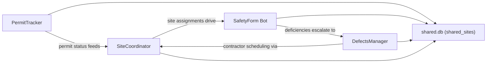

# Construction Dashboard Implementation Plan

## Architecture Overview

```mermaid
graph TD
  subgraph dashboard ["Construction Dashboard :8503"]
    App["app.py (FastAPI + lifespan)"]
    Setup["setup.html (7-step wizard)"]
    Base["base.html (Tailwind + htmx + Alpine)"]
    
    subgraph tools ["Tool Routers"]
      PT["PermitTracker /permit-tracker"]
      SF["SafetyForm /safety-form"]
      DM["DefectsManager /defects-manager"]
      SC["SiteCoordinator /site-coordinator"]
    end
  end

  subgraph shared_lib ["openclaw_shared"]
    Auth["PINAuthMiddleware"]
    Health["create_health_router"]
    Export["create_export_router"]
    LLM["create_llm_provider"]
    Config["load_config / save_config"]
    Messaging["WhatsApp / Telegram"]
    MonaEvents["emit_event / get_events"]
  end

  subgraph databases ["SQLite Databases"]
    PTDB["permit_tracker.db"]
    SFDB["safety_form.db"]
    DMDB["defects_manager.db"]
    SCDB["site_coordinator.db"]
    SharedDB["shared.db"]
    MonaDB["mona_events.db"]
  end

  App --> Auth
  App --> Health
  App --> Export
  App --> LLM
  App --> Config
  App --> MonaEvents
  PT --> PTDB
  SF --> SFDB
  DM --> DMDB
  SC --> SCDB
  App --> SharedDB
  App --> MonaDB
  SF --> Messaging
  DM --> Messaging
  SC --> Messaging
  PT --> Messaging
```




## Inter-Tool Data Flow




Sites/projects are the shared entity across all four tools -- `shared.db` holds a `shared_sites` table that links site records across tool-specific databases.

---

## Directory Structure

```
tools/07-construction/
├── pyproject.toml
├── config.yaml
├── construction/
│   ├── __init__.py                          # Package init, __version__
│   ├── app.py                               # FastAPI app, lifespan, root routes, setup wizard
│   ├── database.py                          # Schema definitions, init_all_databases()
│   ├── seed_data.py                         # Demo data seeder for all 4 tools
│   │
│   ├── permit_tracker/
│   │   ├── __init__.py
│   │   ├── routes.py                        # /permit-tracker/* endpoints
│   │   ├── scrapers/
│   │   │   ├── __init__.py
│   │   │   ├── bd_portal.py                 # BRAVO/BISNET scraper (Playwright)
│   │   │   ├── minor_works.py               # MWCS status checker
│   │   │   ├── nwsc.py                      # New Works/Street Construction tracker
│   │   │   └── parser.py                    # HTML response parsing, BD ref extraction
│   │   ├── monitoring/
│   │   │   ├── __init__.py
│   │   │   ├── status_monitor.py            # APScheduler periodic checks, change detection
│   │   │   ├── alert_engine.py              # Status change notification dispatch
│   │   │   └── timeline.py                  # Expected timeline calc per submission type
│   │   └── notifications/
│   │       ├── __init__.py
│   │       ├── whatsapp.py                  # Twilio WhatsApp alerts
│   │       └── email_sender.py              # SMTP notification sender
│   │
│   ├── safety_form/
│   │   ├── __init__.py
│   │   ├── routes.py                        # /safety-form/* endpoints
│   │   ├── bot/
│   │   │   ├── __init__.py
│   │   │   ├── whatsapp_handler.py          # Twilio webhook for field submissions
│   │   │   ├── checklist_flow.py            # Daily checklist conversation flow
│   │   │   └── incident_reporter.py         # Incident/near-miss reporting flow
│   │   ├── inspections/
│   │   │   ├── __init__.py
│   │   │   ├── checklist_engine.py          # Template management, scoring
│   │   │   ├── photo_processor.py           # EXIF geotagging, timestamping, storage
│   │   │   └── deficiency_tracker.py        # Open deficiencies to resolution
│   │   └── reporting/
│   │       ├── __init__.py
│   │       ├── ssss_report.py               # CIC SSSS compliance doc generator
│   │       ├── monthly_stats.py             # Monthly safety KPI calculations
│   │       ├── toolbox_talk.py              # Toolbox talk template/attendance mgmt
│   │       └── pdf_generator.py             # PDF generation for all report types
│   │
│   ├── defects_manager/
│   │   ├── __init__.py
│   │   ├── routes.py                        # /defects-manager/* endpoints
│   │   ├── bot/
│   │   │   ├── __init__.py
│   │   │   ├── whatsapp_handler.py          # Twilio webhook for resident reports
│   │   │   ├── report_flow.py               # Guided defect reporting conversation
│   │   │   └── status_updater.py            # Status update notifications
│   │   ├── defects/
│   │   │   ├── __init__.py
│   │   │   ├── categorizer.py               # AI defect classification (LLM vision)
│   │   │   ├── priority_engine.py           # Urgency assessment and prioritization
│   │   │   ├── dmc_resolver.py              # DMC responsibility determination
│   │   │   └── lifecycle.py                 # Defect status lifecycle management
│   │   ├── work_orders/
│   │   │   ├── __init__.py
│   │   │   ├── generator.py                 # Work order creation from defect data
│   │   │   ├── contractor_matcher.py        # Auto-assign by trade and availability
│   │   │   └── pdf_export.py                # PDF work order generation
│   │   ├── contractors/
│   │   │   ├── __init__.py
│   │   │   ├── database.py                  # Contractor CRUD and search
│   │   │   └── performance.py               # Performance scoring and tracking
│   │   └── models/
│   │       ├── __init__.py
│   │       ├── llm_handler.py               # MLX inference wrapper
│   │       └── prompts.py                   # Defect classification prompts
│   │
│   ├── site_coordinator/
│   │   ├── __init__.py
│   │   ├── routes.py                        # /site-coordinator/* endpoints
│   │   ├── scheduling/
│   │   │   ├── __init__.py
│   │   │   ├── optimizer.py                 # OR-Tools CP-SAT schedule optimization
│   │   │   ├── trade_dependencies.py        # DAG-based trade sequencing rules
│   │   │   ├── conflict_detector.py         # Resource and schedule conflict detection
│   │   │   └── calendar_manager.py          # Weekly/daily schedule management
│   │   ├── routing/
│   │   │   ├── __init__.py
│   │   │   ├── route_optimizer.py           # Multi-site route calculation
│   │   │   ├── hk_geography.py              # HK 18 districts, tunnels, ferries
│   │   │   └── travel_time.py               # Time-of-day travel time estimation
│   │   └── dispatch/
│   │       ├── __init__.py
│   │       ├── whatsapp_dispatcher.py       # Daily assignment delivery via WhatsApp
│   │       ├── progress_collector.py        # Completion reporting via WhatsApp
│   │       └── assignment_generator.py      # Generate daily assignments per contractor
│   │
│   └── dashboard/
│       ├── static/
│       │   ├── css/
│       │   │   └── output.css               # Tailwind compiled styles
│       │   └── js/
│       │       └── app.js                   # Alpine.js components, map helpers
│       └── templates/
│           ├── base.html                    # Sidebar nav, 4 tool tabs, activity feed
│           ├── setup.html                   # 7-step first-run wizard
│           ├── permit_tracker/
│           │   ├── index.html               # Gantt timeline + submission cards
│           │   └── partials/
│           │       ├── gantt_timeline.html   # Plotly Gantt of submissions vs expected
│           │       ├── submission_card.html  # Per-submission detail card
│           │       ├── alert_history.html    # Chronological alert log
│           │       └── document_archive.html # Per-submission file repository
│           ├── safety_form/
│           │   ├── index.html               # Checklist + compliance calendar
│           │   └── partials/
│           │       ├── daily_checklist.html  # Interactive checklist with photo upload
│           │       ├── ssss_report.html      # SSSS report generator view
│           │       ├── toolbox_talks.html    # Talk records with attendance
│           │       ├── compliance_cal.html   # Calendar of required inspections
│           │       └── photo_gallery.html    # Searchable photo evidence gallery
│           ├── defects_manager/
│           │   ├── index.html               # Defect log + analytics
│           │   └── partials/
│           │       ├── defect_log.html       # Paginated defect table
│           │       ├── defect_detail.html    # Full detail with photos and timeline
│           │       ├── work_order_form.html  # Work order creator/editor
│           │       ├── dmc_matrix.html       # Responsibility matrix visualization
│           │       └── analytics.html        # Charts: by type, resolution time, trends
│           └── site_coordinator/
│               ├── index.html               # Schedule grid + map
│               └── partials/
│                   ├── schedule_grid.html    # Weekly grid, contractors x days
│                   ├── dispatch_log.html     # WhatsApp dispatch history
│                   ├── delivery_schedule.html # Delivery ETA tracking
│                   ├── site_access_log.html  # Digital sign-in/out log
│                   └── resource_dashboard.html # Active teams, equipment, materials
│
├── tests/
│   ├── __init__.py
│   ├── conftest.py                          # Shared fixtures: temp DB, test config
│   ├── test_permit_tracker/
│   │   ├── __init__.py
│   │   ├── test_scrapers.py
│   │   ├── test_monitoring.py
│   │   └── test_routes.py
│   ├── test_safety_form/
│   │   ├── __init__.py
│   │   ├── test_inspections.py
│   │   ├── test_reporting.py
│   │   └── test_routes.py
│   ├── test_defects_manager/
│   │   ├── __init__.py
│   │   ├── test_defects.py
│   │   ├── test_work_orders.py
│   │   └── test_routes.py
│   └── test_site_coordinator/
│       ├── __init__.py
│       ├── test_scheduling.py
│       ├── test_routing.py
│       └── test_routes.py
```

---

## Phase 1: Foundation (Sequential)

All subsequent phases depend on this. Modeled on [tools/02-immigration/pyproject.toml](tools/02-immigration/pyproject.toml), [tools/02-immigration/config.yaml](tools/02-immigration/config.yaml), [tools/02-immigration/immigration/database.py](tools/02-immigration/immigration/database.py), and [tools/02-immigration/immigration/app.py](tools/02-immigration/immigration/app.py).

### 1A. `pyproject.toml`

- Package: `openclaw-construction`
- Core deps: `openclaw-shared`, FastAPI, uvicorn, Jinja2, python-multipart, Pydantic, httpx, apscheduler, psutil
- Tool-specific deps:
  - PermitTracker: playwright, beautifulsoup4, lxml, plotly (Gantt)
  - SafetyForm: Pillow, exifread, reportlab
  - DefectsManager: reportlab, Pillow
  - SiteCoordinator: ortools, folium, geopy
- Optional extras: `mlx`, `messaging`, `macos`, `all`

### 1B. `config.yaml`

```yaml
tool_name: "OpenClaw Construction"
version: "1.0.0"
port: 8503

llm:
  provider: "mock"
  model_path: "mlx-community/Qwen2.5-7B-Instruct-4bit"
  embedding_model_path: "mlx-community/bge-small-en-v1.5-4bit"

messaging:
  whatsapp_enabled: false
  telegram_enabled: false
  default_language: "en"

database:
  workspace_path: "~/OpenClawWorkspace/construction"

auth:
  pin_hash: ""
  session_ttl_hours: 24

extra:
  company_profile:
    company_name: ""
    ap_registration: ""
    rse_registration: ""
    office_address: ""
  permit_tracker:
    scrape_interval_hours: 4
    business_hours_only: true
    bd_portal_credentials: {}
    expected_timelines:
      GBP: 60
      foundation: 45
      superstructure: 45
      drainage: 30
      OP: 90
      minor_works_I: 42
      minor_works_II: 28
      minor_works_III: 14
  safety_form:
    checklist_schedule: "08:00"
    photo_quality: "medium"
    ssss_enabled: true
    heat_stress_threshold: 33
  defects_manager:
    default_priority: "normal"
    contractor_scoring_weights:
      response_time: 0.4
      quality: 0.3
      cost: 0.2
      communication: 0.1
  site_coordinator:
    dispatch_time_evening: "18:00"
    dispatch_time_morning: "07:00"
    working_hours: { start: "08:00", end: "18:00" }
    noise_permit_hours: { start: "07:00", end: "19:00" }
    typhoon_mode: false
  hk_public_holidays:
    - "2026-01-01"
    - "2026-01-29"
    - "2026-01-30"
    - "2026-01-31"
    - "2026-04-03"
    - "2026-04-04"
    - "2026-04-06"
    - "2026-05-01"
    - "2026-05-24"
    - "2026-06-19"
    - "2026-07-01"
    - "2026-09-26"
    - "2026-10-01"
    - "2026-10-17"
    - "2026-10-26"
    - "2026-12-25"
    - "2026-12-26"
```

### 1C. `database.py`

6 databases: `permit_tracker.db`, `safety_form.db`, `defects_manager.db`, `site_coordinator.db`, `shared.db`, `mona_events.db`

Schemas directly from the prompts' data models:

- **PermitTracker**: `projects`, `submissions`, `status_history`, `alerts`, `documents`
- **SafetyForm**: `sites`, `daily_inspections`, `checklist_items`, `deficiencies`, `incidents`, `toolbox_talks`
- **DefectsManager**: `properties`, `defects`, `work_orders`, `contractors`, `defect_updates`
- **SiteCoordinator**: `sites`, `contractors`, `schedule_assignments`, `daily_routes`, `trade_dependencies`
- **Shared**: `shared_sites` (links site/project records across tools)

### 1D. `app.py`

Follow the pattern from [tools/02-immigration/immigration/app.py](tools/02-immigration/immigration/app.py):

- Lifespan: load config, init DBs, create LLM provider, store in `app.state`
- Mount shared routers: auth, health, export
- Mount static files and Jinja2 templates
- Include 4 tool routers: `permit_tracker_router`, `safety_form_router`, `defects_manager_router`, `site_coordinator_router`
- Root `/` redirects to `/permit-tracker/`
- `/setup/` GET/POST for first-run wizard
- `/api/connection-test` validates DB, LLM, Twilio, Telegram, Playwright
- `/api/events` and `/api/events/{id}/acknowledge` for Mona events

### 1E. `__init__.py` and `seed_data.py`

- `__init__.py`: `__version__ = "1.0.0"`
- `seed_data.py`: Per-tool seed functions + `seed_all()` aggregator, following the pattern from [tools/02-immigration/immigration/seed_data.py](tools/02-immigration/immigration/seed_data.py)
- Demo data: HK-specific construction projects, BD references, contractors, defects, safety records

---

## Phase 2: Dashboard Shell (Sequential, depends on Phase 1)

### 2A. `base.html`

Follow [tools/02-immigration/immigration/dashboard/templates/base.html](tools/02-immigration/immigration/dashboard/templates/base.html):

- Sidebar with 4 tabs: PermitTracker, SafetyForm, DefectsManager, SiteCoordinator
- Stack: Tailwind (output.css), Chart.js, htmx, htmx-ext-sse, Alpine.js, Plotly.js, Leaflet/Folium
- Language toggle EN/TC
- Activity feed panel with htmx polling
- Theme: dark navy/gold consistent with other dashboards

### 2B. `setup.html`

7-step wizard (Alpine.js `x-data="{ step: 1 }"`):

1. Company profile (name, AP/RSE registration, address)
2. Projects/sites (add active construction sites with coordinates, capacity)
3. Messaging (Twilio, Telegram, SMTP)
4. BD portal credentials (BRAVO/BISNET login for PermitTracker)
5. Trade dependencies (review/customize sequencing rules for SiteCoordinator)
6. Sample data (seed demo checkbox)
7. Connection test (htmx `hx-get="/api/connection-test"`)

### 2C. Static assets

- `output.css`: Tailwind compiled styles matching other dashboards
- `app.js`: Alpine.js components, map initialization helpers, Gantt chart config

---

## Phase 3: Tool Backends (4 parallel workstreams)

After Phase 2, each tool can be built independently. Each follows the same internal pattern: `routes.py` with `_ctx()` and `_db()` helpers, Pydantic request models, htmx partials.

### 3A. PermitTracker (parallel)

**Backend modules:**

- `scrapers/bd_portal.py`: Playwright headless Chromium automation of BRAVO/BISNET; random 2-5s delays; credential management for AP login
- `scrapers/minor_works.py`: MWCS status checker; Class I/II/III differentiation
- `scrapers/nwsc.py`: New Works/Street Construction approval tracker
- `scrapers/parser.py`: BeautifulSoup4 HTML parsing; BD reference format extraction (`BP/YYYY/XXXX`)
- `monitoring/status_monitor.py`: APScheduler job running every 4-6h during business hours (Mon-Fri 9-18 HKT); once daily on weekends; cached HTML comparison for change detection
- `monitoring/alert_engine.py`: Dispatches alerts on status transitions; uses `emit_event()` for Mona feed
- `monitoring/timeline.py`: Expected durations from config; overdue calculation; custom timeline overrides per submission
- `notifications/whatsapp.py`: Uses `openclaw_shared.messaging.WhatsAppProvider`
- `notifications/email_sender.py`: SMTP via smtplib

**Routes (`routes.py`):**

- `GET /permit-tracker/` -- main dashboard (Gantt + submission cards)
- `GET /permit-tracker/partials/gantt` -- Plotly Gantt partial
- `GET /permit-tracker/partials/submissions` -- filterable submission table
- `GET /permit-tracker/partials/alerts` -- alert history partial
- `POST /permit-tracker/projects` -- add project
- `POST /permit-tracker/submissions` -- add submission
- `POST /permit-tracker/submissions/{id}/check` -- manual status check trigger
- `POST /permit-tracker/documents/upload` -- upload submission documents
- `GET /permit-tracker/submissions/{id}` -- submission detail

**Domain rules:**

- BD targets: GBP 60 days first response; color-code red when exceeded
- BD reference formats: `BP/YYYY/XXXX` (building plans), `MW/YYYY/XXXX` (minor works)
- Status flow: Received -> Under Examination -> Amendments Required -> Approved -> Consent Issued
- Scraper retry: 3 attempts with exponential backoff on portal downtime; error notification on persistent failure

### 3B. SafetyForm Bot (parallel)

**Backend modules:**

- `bot/whatsapp_handler.py`: Twilio webhook; media download and storage; structured naming `{site_id}/{date}/{category}_{item_id}.jpg`
- `bot/checklist_flow.py`: Morning checklist delivery per site; sequential category walkthrough; photo acceptance per item
- `bot/incident_reporter.py`: Structured incident/near-miss form; immediate escalation to project manager
- `inspections/checklist_engine.py`: JSON-configurable templates by site type (building/civil/renovation); scoring with pass/fail/NA; category weights
- `inspections/photo_processor.py`: Pillow + exifread for GPS/timestamp extraction; fallback to site coordinates when EXIF missing
- `inspections/deficiency_tracker.py`: Open -> In Progress -> Resolved lifecycle with photo evidence; severity levels (critical/major/minor/observation)
- `reporting/ssss_report.py`: CIC SSSS-compliant inspection record PDF generation
- `reporting/monthly_stats.py`: Accident frequency rate, incident rate, safety training hours, near-miss reporting rate
- `reporting/toolbox_talk.py`: Bilingual EN/TC talk templates; attendance tracking with name lists
- `reporting/pdf_generator.py`: reportlab-based PDF for all report types

**Routes (`routes.py`):**

- `GET /safety-form/` -- main dashboard (checklist + compliance calendar)
- `GET /safety-form/partials/checklist` -- daily checklist interactive form
- `POST /safety-form/inspections` -- submit completed inspection
- `POST /safety-form/inspections/{id}/items` -- update checklist item with photo
- `GET /safety-form/partials/ssss` -- SSSS report generator
- `POST /safety-form/reports/ssss` -- generate SSSS PDF
- `GET /safety-form/partials/toolbox-talks` -- talk records
- `POST /safety-form/toolbox-talks` -- record new toolbox talk
- `GET /safety-form/partials/gallery` -- photo evidence gallery
- `POST /safety-form/incidents` -- report incident
- `POST /safety-form/webhook` -- Twilio WhatsApp webhook

**Domain rules:**

- Checklist categories: housekeeping, PPE, scaffolding, excavation, lifting, fire precautions
- SSSS: aligned with CIC Smart Site Safety System published templates
- Heat stress: auto-alert when HKO issues Very Hot Weather Warning (threshold 33C from config)
- Green Card tracking: flag workers with expired Construction Industry Safety Training Certificates
- Bilingual: all templates and reports in EN + Traditional Chinese

### 3C. DefectsManager (parallel)

**Backend modules:**

- `bot/whatsapp_handler.py`: Twilio webhook for resident photo reports; auto-create defect record
- `bot/report_flow.py`: Guided conversation: photo -> location (floor/unit) -> description -> category confirmation
- `bot/status_updater.py`: WhatsApp notification to resident on status changes
- `defects/categorizer.py`: LLM-based classification (water seepage, concrete spalling, plumbing, electrical, lift, window, common area, structural); vision model when available, text fallback
- `defects/priority_engine.py`: Emergency (safety hazard) / Urgent (service disruption) / Normal / Low; auto-escalate water seepage and structural
- `defects/dmc_resolver.py`: JSON rules engine for DMC responsibility (owner vs OC vs management); configurable per property
- `defects/lifecycle.py`: Status flow: reported -> assessed -> work_ordered -> in_progress -> completed -> closed / referred
- `work_orders/generator.py`: Create work orders from defect data with scope, estimated cost, deadline
- `work_orders/contractor_matcher.py`: Match by trade specialty, availability, performance score; weighted scoring from config
- `work_orders/pdf_export.py`: reportlab PDF with company header, defect details, scope, contractor info
- `contractors/database.py`: CRUD for contractor records with trade, registration, rates
- `contractors/performance.py`: Scoring: response time 40%, quality 30%, cost 20%, communication 10%
- `models/llm_handler.py`: Wrapper around `openclaw_shared.llm.LLMProvider` for defect-specific prompts
- `models/prompts.py`: Classification prompts for defect photos/descriptions

**Routes (`routes.py`):**

- `GET /defects-manager/` -- main dashboard (defect log + analytics)
- `GET /defects-manager/partials/defects` -- paginated defect table
- `GET /defects-manager/defects/{id}` -- defect detail view
- `POST /defects-manager/defects` -- manual defect entry
- `POST /defects-manager/defects/{id}/assess` -- update assessment
- `POST /defects-manager/work-orders` -- create work order
- `GET /defects-manager/partials/work-orders` -- work order list
- `POST /defects-manager/work-orders/{id}/complete` -- mark completed with photos
- `GET /defects-manager/partials/contractors` -- contractor directory
- `POST /defects-manager/contractors` -- add contractor
- `GET /defects-manager/partials/analytics` -- charts partial
- `GET /defects-manager/partials/dmc-matrix` -- responsibility matrix
- `POST /defects-manager/webhook` -- Twilio WhatsApp webhook

**Domain rules:**

- Water seepage: specialized sub-workflow with Joint Office referral documentation for inter-flat disputes
- DMC rules: JSON-configurable per property; default rules for structural (OC), plumbing inside unit (owner), common area (OC/management)
- MBIS flag: defects found during Mandatory Building Inspection for buildings 30+ years
- MWIS flag: window defects for buildings 10+ years tracked separately
- Contractor registration: validate against registered minor works contractors, electrical workers, licensed plumbers
- Photo storage: `{property_id}/{year}/{month}/{defect_id}/` structure

### 3D. SiteCoordinator (parallel)

**Backend modules:**

- `scheduling/optimizer.py`: OR-Tools CP-SAT solver; interval variables with site, trade, contractor constraints; respects max daily workers, noise permit hours, trade dependencies
- `scheduling/trade_dependencies.py`: DAG from `trade_rules.json`; 15+ trades: demolition -> formwork -> rebar -> concreting -> plumbing/electrical/HVAC/fire -> plastering -> tiling -> painting/carpentry/glazing -> waterproofing -> landscaping; cycle validation
- `scheduling/conflict_detector.py`: Double-booking detection; site capacity overflow; trade dependency violations
- `scheduling/calendar_manager.py`: Weekly/daily views; HK public holidays aware; typhoon mode rescheduling
- `routing/route_optimizer.py`: OSRM/Google Maps for multi-site visit sequence; minimize total travel time
- `routing/hk_geography.py`: Pre-computed 18-district distance/time matrix; tunnel routes (Cross Harbour, Western Harbour, Eastern Harbour); ferry routes (Central-Tsim Sha Tsui, etc.)
- `routing/travel_time.py`: Time-of-day adjustments; peak hours 7:30-9:30, 17:30-19:30; tunnel congestion factors
- `dispatch/whatsapp_dispatcher.py`: Evening dispatch at 18:00 (next day assignments); morning reminder at 07:00; uses `openclaw_shared.messaging.WhatsAppProvider`
- `dispatch/progress_collector.py`: WhatsApp-based completion reporting; status update to dashboard
- `dispatch/assignment_generator.py`: Generate per-contractor daily briefs with site address, scope, tools/materials, site contact

**Routes (`routes.py`):**

- `GET /site-coordinator/` -- main dashboard (schedule grid + map)
- `GET /site-coordinator/partials/schedule` -- weekly grid partial
- `POST /site-coordinator/assignments` -- create assignment
- `POST /site-coordinator/assignments/{id}/status` -- update status
- `POST /site-coordinator/optimize` -- run OR-Tools optimization
- `GET /site-coordinator/partials/map` -- folium map partial
- `GET /site-coordinator/partials/dispatch-log` -- dispatch history
- `POST /site-coordinator/dispatch/send` -- trigger dispatch for date
- `GET /site-coordinator/partials/deliveries` -- delivery schedule
- `POST /site-coordinator/deliveries` -- add delivery
- `GET /site-coordinator/partials/access-log` -- site access log
- `POST /site-coordinator/access-log` -- sign in/out
- `POST /site-coordinator/typhoon-mode` -- toggle typhoon mode
- `POST /site-coordinator/webhook` -- WhatsApp webhook

**Data files:**

- `hk_districts.json`: 18 districts with coordinates, pre-computed distance matrix
- `trade_rules.json`: Trade dependency DAG with `predecessor_trade`, `successor_trade`, `min_gap_days`

**Domain rules:**

- Typhoon mode: integrate HKO RSS feed; auto-reschedule outdoor work on T8+ signal; notify all affected contractors
- Noise Control Ordinance: powered mechanical equipment restricted 7:00-19:00 weekdays in residential areas
- Site capacity: enforce `max_daily_workers` per site
- Dispatch timing: assignments sent 18:00 evening before; morning reminder 07:00
- Schedule utilization: daily report of hours assigned / hours available per contractor

---

## Phase 4: Templates and GUI (4 parallel workstreams, depends on Phase 2 + respective Phase 3 tool)

Each tool's template set can be built in parallel once its backend routes exist.

### 4A. PermitTracker templates

- `index.html`: Gantt timeline (Plotly.js) + submission cards + project filter dropdown
- Partials: `gantt_timeline.html` (Plotly Gantt with actual vs expected overlay, red highlighting for overdue), `submission_card.html` (BD ref, type, status badge, days elapsed), `alert_history.html` (chronological alert log with delivery status), `document_archive.html` (per-submission file list with upload)

### 4B. SafetyForm templates

- `index.html`: Daily checklist + compliance calendar
- Partials: `daily_checklist.html` (checkboxes, photo upload per item via Dropzone.js, text notes), `ssss_report.html` (one-click PDF generation), `toolbox_talks.html` (form with topic, attendees, duration), `compliance_cal.html` (FullCalendar with inspection/audit/training dates), `photo_gallery.html` (filterable gallery by date, site, category)

### 4C. DefectsManager templates

- `index.html`: Defect log table + analytics charts
- Partials: `defect_log.html` (paginated table with photo thumbnail, status badge, severity), `defect_detail.html` (full photo, location, contractor, timeline), `work_order_form.html` (create/edit with contractor dropdown, scope, deadline), `dmc_matrix.html` (category x responsibility matrix), `analytics.html` (Chart.js: defects by type, avg resolution time, overdue count, monthly trends)

### 4D. SiteCoordinator templates

- `index.html`: Schedule grid + map view
- Partials: `schedule_grid.html` (contractors as rows, days as columns, color-coded by trade), `dispatch_log.html` (WhatsApp message history with delivered/read status), `delivery_schedule.html` (ETA tracking table), `site_access_log.html` (sign-in/out log), `resource_dashboard.html` (active teams, equipment, materials summary)

---

## Phase 5: Integration, Seed Data, and Tests (depends on Phase 3 + 4)

- Wire inter-tool data flows (shared_sites, deficiency escalation from SafetyForm to DefectsManager, contractor scheduling from DefectsManager to SiteCoordinator)
- Implement `seed_data.py` with HK-specific demo data (BD references, construction sites in different districts, sample contractors by trade, defect photos, inspection records)
- Write tests in `tests/conftest.py` (shared fixtures) and per-tool test modules
- Validate all connection tests in the setup wizard

---

## Parallelization Strategy

```mermaid
gantt
    title Construction Dashboard Implementation
    dateFormat X
    axisFormat %s

    section Phase1
    Foundation: p1, 0, 1

    section Phase2
    DashboardShell: p2, after p1, 1

    section Phase3
    PermitTracker_Backend: p3a, after p2, 2
    SafetyForm_Backend: p3b, after p2, 2
    DefectsManager_Backend: p3c, after p2, 2
    SiteCoordinator_Backend: p3d, after p2, 2

    section Phase4
    PermitTracker_GUI: p4a, after p3a, 1
    SafetyForm_GUI: p4b, after p3b, 1
    DefectsManager_GUI: p4c, after p3c, 1
    SiteCoordinator_GUI: p4d, after p3d, 1

    section Phase5
    Integration_and_Tests: p5, after p4a p4b p4c p4d, 1
```




- Phase 1 and 2 are sequential (foundation before shell)
- Phase 3: all 4 tool backends in parallel
- Phase 4: each tool's GUI in parallel (once its backend is done)
- Phase 5: integration and tests after all tools complete

