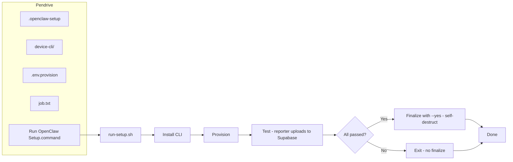

# Device CLI: One-click pendrive setup

## Goal

Make one-time device setup as fast as possible: technician plugs in the pendrive, double-clicks one file, and the script runs provision → test → **auto-finalize (self-destruct)** when all tests pass. No Tier 2 (no Launch Agent or watcher). The existing test reporter already uploads the full test log to Supabase; no extra script logic for that.

---

## 1. Standard pendrive layout

| Path on volume | Purpose |
|----------------|--------|
| `MONOCLAW_SETUP/` | Recommended volume name. |
| `MONOCLAW_SETUP/.openclaw-setup` | Marker file (empty or one line) to identify the setup drive. |
| `MONOCLAW_SETUP/device-cli/` | Copy of repo [device-cli/](device-cli/). |
| `MONOCLAW_SETUP/.env.provision` | `SUPABASE_URL`, `SUPABASE_SERVICE_KEY` (optional: `OPENCLAW_ORDER_ID`, `OPENCLAW_SERIAL`). |
| `MONOCLAW_SETUP/job.txt` (optional) | Two lines: `order_id`, `serial_number`. If present, no prompts. |
| `MONOCLAW_SETUP/Run OpenClaw Setup.command` | Double-clickable entry; invokes `run-setup.sh`. |
| `MONOCLAW_SETUP/run.sh` | Main script (same logic); can be invoked directly. |

Scripts resolve their location via `"$(dirname "$0")"` so they work regardless of mount path (e.g. `/Volumes/MONOCLAW_SETUP`).

---

## 2. Entry script behavior (run-setup.sh)

**File**: [device-cli/scripts/run-setup.sh](device-cli/scripts/run-setup.sh) (new). Wrapper `Run OpenClaw Setup.command` invokes it so double-click opens Terminal.

**Flow**:

1. **Resolve root**: `ROOT="$(cd "$(dirname "$0")" && pwd)"`; exit if `device-cli` or `.openclaw-setup` not found.
2. **Prereqs**: Require Python 3.11+ and `pip3`; else print instructions and exit.
3. **Install CLI**: `pip3 install -e "$ROOT/device-cli"`.
4. **Load env**: Export from `"$ROOT/.env.provision"` (SUPABASE_URL, SUPABASE_SERVICE_KEY). Fail if missing.
5. **Order/serial**: If `"$ROOT/job.txt"` exists, read line1=order_id, line2=serial; else prompt (or use OPENCLAW_ORDER_ID / OPENCLAW_SERIAL from env if set).
6. **Provision**: `openclaw-setup provision --order-id "$ORDER_ID" --serial "$SERIAL"`. Exit on failure.
7. **Device ID**: Read `device_id` from `/opt/openclaw/.setup-credentials` (JSON). Exit if unreadable.
8. **Test**: `openclaw-setup test --device-id "$DEVICE_ID"`. This **already uploads** each result and the summary to Supabase via [openclaw_setup/reporter.py](device-cli/openclaw_setup/reporter.py) (device_test_results, device_test_summaries). No extra script step.
9. **Auto-finalize on success**: If the test command exited 0 (all passed), run `openclaw-setup finalize --device-id "$DEVICE_ID" --yes` immediately. No "Finalize? y/N" prompt — script auto-destructs the CLI and cleans Mac-side setup. If tests failed, do not finalize; print message and exit non-zero.
10. **Done**: Print "Done. Press Enter to close." and read, so the technician can see the result.

No Tier 2: no Launch Agent, no install-watcher, no plist, no monoclaw-on-mount script.

---

## 3. CLI changes

**In** [device-cli/openclaw_setup/cli.py](device-cli/openclaw_setup/cli.py):

- **provision**: Optional env fallback for `--order-id` / `--serial` from `OPENCLAW_ORDER_ID` / `OPENCLAW_SERIAL` so the runner can set them from job.txt.
- **finalize**: Add `--yes` / `-y` to skip confirmation (used by script when auto-destructing after successful tests).
- **device-id** (optional): New subcommand that prints `device_id` from `/opt/openclaw/.setup-credentials` so the script can do `DEVICE_ID=$(openclaw-setup device-id)`.

---

## 4. Supabase test log

No script changes needed. The existing [reporter](device-cli/openclaw_setup/reporter.py) and test [runner](device-cli/openclaw_setup/test_suite/runner.py) already:

- Stream each test result to Supabase (`device_test_results`) as tests run.
- After all tests, write the summary to `device_test_summaries` and update `devices.setup_status`.

The one-click script simply runs `openclaw-setup test`; the CLI handles all Supabase updates.

---

## 5. Implementation summary

**New under device-cli/**:

- `scripts/run-setup.sh` — full flow including auto-finalize on test success.
- `scripts/Run OpenClaw Setup.command` — wrapper that runs `run-setup.sh` (double-clickable).

**CLI**:

- [device-cli/openclaw_setup/cli.py](device-cli/openclaw_setup/cli.py): env fallback for order-id/serial; `--yes` for finalize; optional `device-id` subcommand.

**Docs**:

- [device-cli/README.md](device-cli/README.md): Pendrive layout, .env.provision, job.txt, and "double-click Run OpenClaw Setup.command".
- Optionally update [.cursor/plans/monoclaw_full_implementation_ab62dcb3.plan.md](.cursor/plans/monoclaw_full_implementation_ab62dcb3.plan.md) section 4 to reference the one-click pendrive flow.

**Removed from scope**: Tier 2 (install-watcher, uninstall-watcher, monoclaw-on-mount.sh, Launch Agent plist).

---

## 6. Flow diagram

