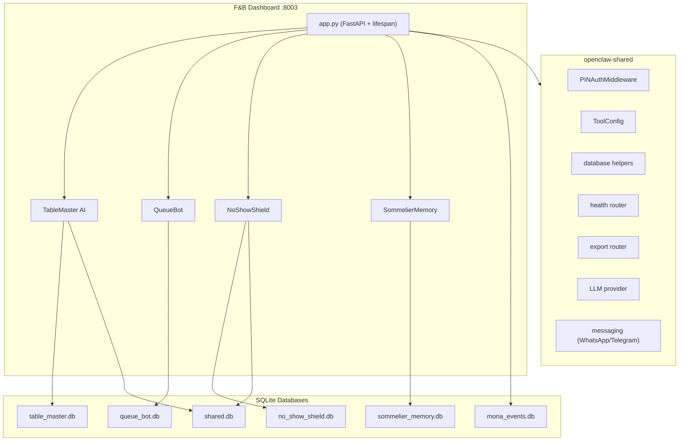
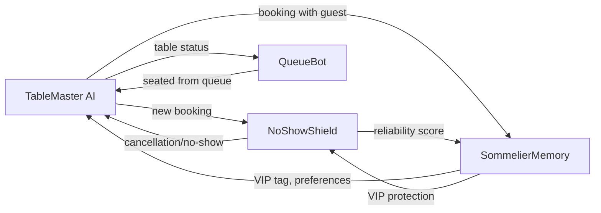

# F&B Hospitality Tools Implementation Plan

## Architecture Overview

A single FastAPI application at `http://mona.local:8003` with tabbed navigation across four tools. Follows the exact same patterns established in [tools/01-real-estate/](tools/01-real-estate/) and [tools/02-immigration/](tools/02-immigration/).




### Inter-Tool Data Flow




## Directory Structure

```
tools/03-fnb-hospitality/
├── config.yaml
├── pyproject.toml
├── README.md
├── fnb_hospitality/
│   ├── __init__.py
│   ├── app.py
│   ├── database.py
│   ├── seed_data.py
│   ├── table_master/
│   │   ├── __init__.py
│   │   ├── routes.py
│   │   ├── channels/
│   │   │   ├── __init__.py
│   │   │   ├── whatsapp.py
│   │   │   ├── instagram.py
│   │   │   ├── openrice.py
│   │   │   └── manual.py
│   │   ├── booking/
│   │   │   ├── __init__.py
│   │   │   ├── parser.py        # LLM-based booking extraction
│   │   │   ├── engine.py        # Conflict detection + resolution
│   │   │   ├── confirmer.py     # Auto-confirmation flow
│   │   │   └── assigner.py      # Smart table assignment
│   │   └── inventory/
│   │       ├── __init__.py
│   │       ├── tables.py        # Table status management
│   │       └── capacity.py      # Capacity + combination logic
│   ├── queue_bot/
│   │   ├── __init__.py
│   │   ├── routes.py
│   │   ├── queue/
│   │   │   ├── __init__.py
│   │   │   ├── manager.py       # Queue state machine
│   │   │   ├── estimator.py     # Wait time calculator (EMA)
│   │   │   └── notifier.py      # WhatsApp/SMS notifications
│   │   ├── web/
│   │   │   ├── __init__.py
│   │   │   └── qr_generator.py  # QR code generation
│   │   ├── analytics/
│   │   │   ├── __init__.py
│   │   │   └── reports.py
│   │   └── pos/
│   │       ├── __init__.py
│   │       └── integration.py   # POS CSV import
│   ├── no_show_shield/
│   │   ├── __init__.py
│   │   ├── routes.py
│   │   ├── confirmation/
│   │   │   ├── __init__.py
│   │   │   ├── sequencer.py     # Multi-step confirmation flow
│   │   │   ├── messenger.py     # WhatsApp/SMS sender
│   │   │   └── templates/
│   │   │       ├── confirm_en.yaml
│   │   │       ├── confirm_zh.yaml
│   │   │       └── deposit_request.yaml
│   │   ├── waitlist/
│   │   │   ├── __init__.py
│   │   │   ├── manager.py       # Waitlist queue logic
│   │   │   └── auto_fill.py     # Cancellation -> waitlist matcher
│   │   └── scoring/
│   │       ├── __init__.py
│   │       ├── reliability.py   # Guest reliability A/B/C/D
│   │       ├── predictor.py     # No-show risk (scikit-learn)
│   │       └── blacklist.py     # Blacklist management
│   ├── sommelier_memory/
│   │   ├── __init__.py
│   │   ├── routes.py
│   │   ├── guests/
│   │   │   ├── __init__.py
│   │   │   ├── profiles.py      # Guest CRUD
│   │   │   ├── preferences.py   # Dietary/allergy management
│   │   │   ├── history.py       # Visit + spending tracker
│   │   │   └── segments.py      # VIP tier logic
│   │   └── intelligence/
│   │       ├── __init__.py
│   │       ├── briefing.py      # Pre-service briefing cards
│   │       ├── celebrations.py  # Birthday/anniversary tracker
│   │       └── recommendations.py  # LLM preference summarizer
│   └── dashboard/
│       ├── static/
│       │   ├── css/
│       │   │   └── styles.css
│       │   └── js/
│       │       └── app.js
│       └── templates/
│           ├── base.html
│           ├── setup.html
│           ├── table_master/
│           │   ├── index.html
│           │   └── partials/
│           ├── queue_bot/
│           │   ├── index.html
│           │   ├── join.html      # Customer-facing queue join
│           │   ├── status.html    # Customer queue status (SSE)
│           │   └── partials/
│           ├── no_show_shield/
│           │   ├── index.html
│           │   └── partials/
│           └── sommelier_memory/
│               ├── index.html
│               └── partials/
└── tests/
    ├── conftest.py
    ├── test_database.py
    ├── test_table_master/
    │   ├── test_booking.py
    │   ├── test_conflict.py
    │   └── test_channels.py
    ├── test_queue_bot/
    │   ├── test_queue.py
    │   ├── test_estimator.py
    │   └── test_notifications.py
    ├── test_no_show_shield/
    │   ├── test_confirmation.py
    │   ├── test_waitlist.py
    │   └── test_scoring.py
    └── test_sommelier_memory/
        ├── test_profiles.py
        ├── test_allergies.py
        └── test_briefings.py
```

## Implementation Phases

Work is organized into 5 phases. Phases 1 and 2 run in parallel. Within each phase, the four tools are largely independent and can be built in parallel.

### Phase 1: Foundation (scaffold + database + config)

All infrastructure that every tool depends on.

**Files to create:**

- `tools/03-fnb-hospitality/pyproject.toml` -- modeled on [tools/01-real-estate/pyproject.toml](tools/01-real-estate/pyproject.toml) with F&B-specific deps: `qrcode`, `Pillow`, `scikit-learn`, `pandas`, `numpy`, `sse-starlette`, `reportlab`, `lunardate`
- `tools/03-fnb-hospitality/config.yaml` -- modeled on [tools/01-real-estate/config.yaml](tools/01-real-estate/config.yaml), port 8003, F&B-specific `extra` section (restaurant profile, table map, dining hours, HK holidays 2026, confirmation timings, VIP thresholds)
- `tools/03-fnb-hospitality/fnb_hospitality/__init__.py` -- just `__version__ = "1.0.0"`
- `tools/03-fnb-hospitality/fnb_hospitality/database.py` -- six schemas: `TABLE_MASTER_SCHEMA` (tables, bookings, booking_analytics), `QUEUE_BOT_SCHEMA` (queue_entries, table_turnover, queue_analytics, notifications), `NO_SHOW_SHIELD_SCHEMA` (guests, confirmations, waitlist, no_show_predictions), `SOMMELIER_MEMORY_SCHEMA` (guests, dietary_info, celebrations, visits, preferences), `SHARED_SCHEMA` (cross-tool guest linking). Plus `init_all_databases(workspace)` creating 6 DB files.
- `tools/03-fnb-hospitality/fnb_hospitality/app.py` -- FastAPI app with lifespan, auth, tool routers, health, export. Modeled on [tools/01-real-estate/real_estate/app.py](tools/01-real-estate/real_estate/app.py).
- `tools/03-fnb-hospitality/fnb_hospitality/seed_data.py` -- sample HK restaurant data: tables (mix of 2/4/6/8/10-tops, round tables), sample bookings across channels, queue entries, guest profiles with HK-typical dietary preferences, VIP guests.
- `tools/03-fnb-hospitality/tests/conftest.py` -- fixtures for `tmp_workspace`, `db_paths`, `seeded_db_paths`.

### Phase 2: Dashboard Shell (base template + static assets)

Can run in parallel with Phase 1's database work.

**Files to create:**

- `dashboard/static/css/styles.css` -- Tailwind-based styles with MonoClaw tokens (navy #1a1f36, gold #d4a843)
- `dashboard/static/js/app.js` -- shared JS: htmx config, Alpine.js init, SSE helpers, common chart setups
- `dashboard/templates/base.html` -- sidebar with 4 tabs (TableMaster, QueueBot, NoShowShield, SommelierMemory), activity feed, approval queue, status cards. Modeled on [tools/01-real-estate/real_estate/dashboard/templates/base.html](tools/01-real-estate/real_estate/dashboard/templates/base.html)
- `dashboard/templates/setup.html` -- first-run wizard: restaurant profile, table layout, messaging credentials, business rules, sample data toggle, connection test

### Phase 3: Tool Business Logic (4 tools in parallel)

Each tool's core logic is independent. These can be built in parallel by four separate work streams.

#### 3A: TableMaster AI

- `table_master/channels/whatsapp.py` -- Twilio webhook handler, parse incoming booking messages
- `table_master/channels/instagram.py` -- IG Graph API webhook for DMs
- `table_master/channels/openrice.py` -- OpenRice integration (scraping fallback via httpx)
- `table_master/channels/manual.py` -- Phone/walk-in entry API
- `table_master/booking/parser.py` -- LLM-based extraction of date/time/party_size/name from free text (Cantonese + English), lazy-load LLM with 5-min idle unload
- `table_master/booking/engine.py` -- Conflict detection (time overlap on same table), suggest nearest available slot (+/- 30 min), capacity check
- `table_master/booking/confirmer.py` -- Auto-confirmation via WhatsApp within 60s, bilingual messages, 2-hour confirmation window
- `table_master/booking/assigner.py` -- Smart assignment: party size fit, preference matching (window/booth/quiet), section balancing, table combination logic
- `table_master/inventory/tables.py` -- Table CRUD, status transitions (available -> reserved -> occupied -> clearing -> available), WebSocket/polling for real-time updates
- `table_master/inventory/capacity.py` -- Capacity calculator considering combinable tables, dining duration by meal type (lunch 75min, dinner weekday 90min, dinner weekend 120min, dim sum 120min)
- `table_master/routes.py` -- APIRouter with prefix `/table-master`: floor plan page, booking list, channel inbox, heatmap, CRUD APIs, htmx partials

#### 3B: QueueBot

- `queue_bot/queue/manager.py` -- Queue state machine: waiting -> notified -> seated/left. FIFO ordering, grace queue for missed calls, typhoon T8+ auto-clear
- `queue_bot/queue/estimator.py` -- Exponential moving average of turnover times, segmented by party size bracket (1-2, 3-4, 5-6, 7+) and time slot. Static fallback for first week
- `queue_bot/queue/notifier.py` -- WhatsApp primary, SMS fallback (60s timeout), position updates at configurable intervals, 5-min arrival window
- `queue_bot/web/qr_generator.py` -- Static QR code pointing to `/queue-bot/join`, A4-sized bilingual sign generation
- `queue_bot/analytics/reports.py` -- Average wait times, walkout rates, peak queue lengths, party size bottlenecks
- `queue_bot/pos/integration.py` -- CSV import for POS data (table, covers, open_time, close_time), nightly import
- `queue_bot/routes.py` -- APIRouter with prefix `/queue-bot`: join form (customer-facing), status page (SSE via sse-starlette), staff dashboard, QR display, management APIs

#### 3C: NoShowShield

- `no_show_shield/confirmation/sequencer.py` -- APScheduler jobs: at booking, T-24hr, T-2hr. Cancel pending jobs on booking cancellation. Auto-release at T-1hr if unconfirmed
- `no_show_shield/confirmation/messenger.py` -- WhatsApp template messages (pre-approved), SMS fallback, bilingual Cantonese templates
- `no_show_shield/confirmation/templates/` -- YAML templates for confirmation, reminder, deposit request messages in EN and ZH
- `no_show_shield/waitlist/manager.py` -- Priority-ranked waitlist per time slot, party size matching (+/- 1), time flexibility (+/- 30 min)
- `no_show_shield/waitlist/auto_fill.py` -- On cancellation/no-show, find matching waitlist entry, send offer via WhatsApp, first-confirm-wins
- `no_show_shield/scoring/reliability.py` -- Guest scoring: A/B/C/D based on completed/no-show/late-cancel ratio. Phone-number-based identity with 24-month confidence decay
- `no_show_shield/scoring/predictor.py` -- Gradient boosting classifier (scikit-learn): features = reliability score, party size, day of week, lead time, confirmation response time, channel. Rule-based heuristics until >200 bookings
- `no_show_shield/scoring/blacklist.py` -- Soft blacklist after 3 no-shows, deposit requirement, configurable thresholds and cooldown
- `no_show_shield/routes.py` -- APIRouter with prefix `/no-show-shield`: confirmation pipeline view, guest reliability cards, waitlist queue, prediction dashboard, blacklist manager

#### 3D: SommelierMemory

- `sommelier_memory/guests/profiles.py` -- Guest CRUD with photo support, phone-based identity, PDPO-compliant deletion
- `sommelier_memory/guests/preferences.py` -- Dietary/allergy CRUD with severity levels, audit log for allergy modifications, HK-common defaults (MSG, shellfish, peanut, lactose)
- `sommelier_memory/guests/history.py` -- Visit logging, lifetime value calc, average spend per head, POS CSV import
- `sommelier_memory/guests/segments.py` -- VIP tier auto-classification (Regular/VIP/VVIP) based on visit count + spend thresholds, custom tags
- `sommelier_memory/intelligence/briefing.py` -- Pre-service briefing card: name, last visit, allergies, wine/tea preferences, VIP tier. LLM-generated natural language summary
- `sommelier_memory/intelligence/celebrations.py` -- Birthday/anniversary tracker, lunar calendar conversion (lunardate), 7-day lookahead report, gesture suggestions
- `sommelier_memory/intelligence/recommendations.py` -- LLM preference summarizer from structured guest data
- `sommelier_memory/routes.py` -- APIRouter with prefix `/sommelier-memory`: guest CRM cards, celebrations calendar, guest tagging/search, visit timeline, briefing card generation

### Phase 4: Dashboard Templates (4 tools in parallel)

Build the Jinja2+htmx templates for each tool's tab. Can run in parallel.

- `templates/table_master/index.html` -- Interactive floor plan (drag-and-drop, colored by status), booking list, channel inbox, booking heatmap (Chart.js)
- `templates/table_master/partials/` -- floor_plan.html, booking_list.html, channel_inbox.html, heatmap.html
- `templates/queue_bot/index.html` -- Staff dashboard with queue management controls, wait time analytics
- `templates/queue_bot/join.html` -- Customer-facing mobile-optimized join form (party size, phone, bilingual)
- `templates/queue_bot/status.html` -- Customer queue status page with SSE position updates
- `templates/queue_bot/partials/` -- queue_list.html, tv_display.html, analytics.html
- `templates/no_show_shield/index.html` -- Confirmation pipeline board, guest reliability cards, waitlist, prediction dashboard, blacklist manager
- `templates/no_show_shield/partials/` -- pipeline.html, reliability_card.html, waitlist.html, predictions.html
- `templates/sommelier_memory/index.html` -- Guest CRM cards, celebrations calendar (FullCalendar), guest search, visit timeline
- `templates/sommelier_memory/partials/` -- guest_card.html, celebration_calendar.html, visit_timeline.html, briefing_card.html

### Phase 5: Tests

Test fixtures are built in Phase 1. Test files can be built in parallel per tool.

- `tests/test_database.py` -- Schema creation, migrations, cross-tool shared DB
- `tests/test_table_master/` -- Booking parser (Cantonese/English), conflict detection, table combination, auto-confirmation, channel parsing
- `tests/test_queue_bot/` -- Queue state machine, wait time estimation accuracy, notification delivery, QR generation
- `tests/test_no_show_shield/` -- Confirmation sequence scheduling, waitlist matching, reliability scoring, prediction model, blacklist logic
- `tests/test_sommelier_memory/` -- Guest CRUD, allergy audit trail, celebration lunar conversion, VIP auto-upgrade, briefing generation

## Key Implementation Details

### Database Schemas

Taken directly from the prompts. The `shared.db` links guests across tools:

```sql
-- shared.db
CREATE TABLE shared_guests (
    id INTEGER PRIMARY KEY,
    phone TEXT UNIQUE NOT NULL,
    table_master_guest_id INTEGER,
    no_show_guest_id INTEGER,
    sommelier_guest_id INTEGER,
    created_at TIMESTAMP DEFAULT CURRENT_TIMESTAMP
);
```

### LLM Usage

Only two tools use LLM (both lazy-load with 5-min idle unload):

- **TableMaster**: Parse natural language booking requests ("4位，星期六7點半") into structured data
- **SommelierMemory**: Generate natural language briefing summaries from structured guest data

### HK-Specific Config (in config.yaml `extra` section)

- Dining hours: lunch 12:00-14:00, dinner 19:00-21:30, weekend dim sum 10:00-14:30
- Dining durations: lunch 75min, dinner weekday 90min, dinner weekend 120min, dim sum 120min
- Phone format: +852 XXXX XXXX (mobile starts with 5/6/7/9)
- Default language: Traditional Chinese (Cantonese register)
- HK public holidays 2026
- Festive mandatory confirmation dates (CNY, Christmas Eve, Valentine's, Mother's Day)

### Parallelization Strategy

- **Phase 1 + 2** run in parallel (foundation + dashboard shell)
- **Phase 3**: All four tool logic modules are independent and can be built simultaneously
- **Phase 4**: All four template sets are independent and can be built simultaneously
- **Phase 5**: All four test suites are independent and can be built simultaneously

