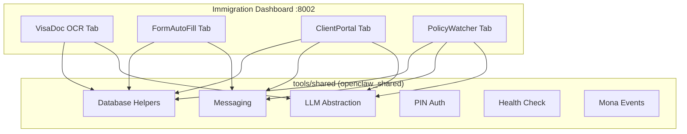
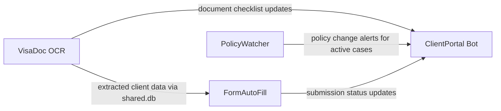

# Immigration Tools Implementation Plan

## Architecture Overview

All 4 tools run as a single FastAPI application on port 8002 (`http://mona.local:8002`), with tab-based sidebar navigation. They share the existing `tools/shared/` library (`openclaw_shared`) for LLM, messaging, database, auth, health, export, mona events, and logging -- identical to how `01-real-estate` is structured.




### Inter-Tool Data Flow




## Directory Structure

```
tools/02-immigration/
├── pyproject.toml
├── config.yaml
├── immigration/
│   ├── __init__.py
│   ├── app.py                    # Unified FastAPI app, mounts all routers
│   ├── database.py               # Schema init for all 4 tools + shared.db
│   ├── seed_data.py              # Demo data seeders
│   ├── dashboard/
│   │   ├── templates/
│   │   │   ├── base.html               # Shell: sidebar nav, activity feed
│   │   │   ├── setup.html              # First-run config wizard
│   │   │   ├── components/             # Reusable htmx partials
│   │   │   ├── visa_doc_ocr/           # Upload, viewer, confidence, batch
│   │   │   ├── form_autofill/          # Client select, form edit, PDF preview
│   │   │   ├── client_portal/          # Cases, timeline, messages, broadcast
│   │   │   └── policy_watcher/         # Feed, diff, alerts, impact
│   │   └── static/
│   │       ├── css/output.css          # Compiled Tailwind
│   │       └── js/app.js              # htmx + Alpine.js
│   ├── visa_doc_ocr/
│   │   ├── __init__.py
│   │   ├── routes.py
│   │   ├── ocr/
│   │   │   ├── vision_engine.py        # macOS Vision framework wrapper
│   │   │   ├── tesseract_engine.py     # Tesseract fallback
│   │   │   ├── preprocessor.py         # Deskew, crop, threshold
│   │   │   └── confidence.py           # Field confidence scoring
│   │   ├── parsers/
│   │   │   ├── hkid.py                 # HKID parser + check digit
│   │   │   ├── passport.py             # MRZ decoder + visual zone
│   │   │   ├── bank_statement.py       # HSBC, Hang Seng, BOC, SCB
│   │   │   ├── tax_return.py           # IRD BIR60 parser
│   │   │   └── employment.py           # Employment contract parser
│   │   └── validators/
│   │       ├── completeness.py         # Scheme document checklist
│   │       ├── expiry.py               # Document age/expiry checker
│   │       └── schemes.py              # GEP, ASMTP, QMAS, IANG reqs
│   ├── form_autofill/
│   │   ├── __init__.py
│   │   ├── routes.py
│   │   ├── forms/
│   │   │   ├── base.py                 # Abstract form interface
│   │   │   ├── id990a.py               # Visa extension
│   │   │   ├── id990b.py               # Change of sponsorship
│   │   │   ├── gep.py                  # General Employment Policy
│   │   │   ├── asmtp.py                # Mainland Talents
│   │   │   ├── qmas.py                 # Quality Migrant
│   │   │   └── iang.py                 # Non-local Graduates
│   │   ├── engine/
│   │   │   ├── overlay.py              # PDF coordinate-based writer
│   │   │   ├── validator.py            # Field constraint engine
│   │   │   └── mapper.py              # Client data -> form fields
│   │   ├── tracking/
│   │   │   ├── version_checker.py      # ImmD form version monitor
│   │   │   └── checklist.py            # Submission checklist generator
│   │   └── templates/
│   │       ├── pdf/                    # Official form PDFs
│   │       └── field_maps/             # JSON coordinate maps
│   ├── client_portal/
│   │   ├── __init__.py
│   │   ├── routes.py
│   │   ├── bot/
│   │   │   ├── router.py              # Intent detection + routing
│   │   │   ├── whatsapp.py            # Twilio webhook handler
│   │   │   ├── telegram.py            # Telegram bot handler
│   │   │   └── escalation.py          # Human handoff logic
│   │   ├── status/
│   │   │   ├── tracker.py             # Case status management
│   │   │   ├── milestones.py          # Milestone notification engine
│   │   │   └── timeline.py            # Processing time estimator
│   │   ├── reminders/
│   │   │   ├── documents.py           # Document deadline tracker
│   │   │   └── scheduler.py           # Reminder scheduling
│   │   ├── faq/
│   │   │   ├── engine.py              # FAQ matching + LLM fallback
│   │   │   └── knowledge_base.yaml    # Curated Q&A pairs
│   │   ├── appointments/
│   │   │   └── booking.py             # Consultation scheduling
│   │   └── templates/
│   │       ├── en/                    # English message templates
│   │       └── zh/                    # Chinese message templates
│   └── policy_watcher/
│       ├── __init__.py
│       ├── routes.py
│       ├── scrapers/
│       │   ├── gazette.py             # Government Gazette scraper
│       │   ├── immd.py                # ImmD news scraper
│       │   ├── legco.py               # LegCo papers scraper
│       │   └── talent_list.py         # Talent List checker
│       ├── analysis/
│       │   ├── differ.py              # Text comparison engine
│       │   ├── summarizer.py          # LLM change summarizer
│       │   └── classifier.py          # Urgency classification
│       ├── alerts/
│       │   ├── dispatcher.py          # Multi-channel sender
│       │   └── preferences.py         # Per-user settings
│       └── archive/
│           └── search.py              # FTS5 search interface
└── tests/
    ├── conftest.py
    ├── test_database.py
    ├── test_visa_doc_ocr/
    ├── test_form_autofill/
    ├── test_client_portal/
    └── test_policy_watcher/
```

## Phase 1 -- App Scaffold and Database (Sequential Foundation)

Everything here must complete before the tool backends can be built.

### 1A. pyproject.toml

Follow the pattern from [tools/01-real-estate/pyproject.toml](tools/01-real-estate/pyproject.toml):

- Package name: `openclaw-immigration`
- Core deps: `openclaw-shared`, `fastapi>=0.115`, `uvicorn[standard]>=0.32`, `jinja2>=3.1`, `python-multipart`, `pyyaml>=6.0`, `pydantic>=2.0`, `httpx>=0.27`, `apscheduler>=3.10`, `psutil>=5.9`
- Tool-specific deps: `reportlab`, `PyPDF2`, `pdfrw` (FormAutoFill PDF overlay), `Pillow`, `opencv-python-headless` (OCR preprocessing), `beautifulsoup4`, `lxml` (PolicyWatcher scraping), `pdfplumber`, `pdf2image` (PDF extraction), `icalendar` (appointments), `dateparser`, `python-dateutil`
- Optional extras: `[mlx]` for `openclaw-shared[mlx]`, `[messaging]` for `openclaw-shared[messaging]`, `[macos]` for `pyobjc-framework-Vision>=10.0`
- Package include: `immigration*`

### 1B. config.yaml

Same structure as [tools/01-real-estate/config.yaml](tools/01-real-estate/config.yaml):

```yaml
tool_name: immigration
version: "1.0.0"
port: 8002

llm:
  provider: mock
  model_path: "mlx-community/Qwen2.5-7B-Instruct-4bit"
  embedding_model_path: "BAAI/bge-base-zh-v1.5"

messaging:
  whatsapp_enabled: false
  telegram_enabled: false
  # twilio/telegram creds...
  default_language: en

database:
  workspace_path: "~/OpenClawWorkspace/immigration"
  encryption_key: ""

auth:
  pin_hash: ""
  session_ttl_hours: 24

extra:
  firm_name: ""
  consultant_registration_number: ""
  office_address: ""
  business_hours: "09:00-18:00"
  saturday_hours: "09:00-13:00"
  ocr_engine: "vision"             # vision or tesseract
  confidence_threshold_auto: 0.85
  confidence_threshold_review: 0.70
  data_retention_days: 90
  immd_scrape_frequency_hours: 24
  gazette_scrape_day: "friday"
```

### 1C. app.py

Follow the lifespan pattern from [tools/01-real-estate/real_estate/app.py](tools/01-real-estate/real_estate/app.py):

- Lifespan: load config, `init_all_databases()`, create LLM provider, store in `app.state`
- Mount 4 tool routers at `/visa-doc-ocr/`, `/form-autofill/`, `/client-portal/`, `/policy-watcher/`
- Mount `create_health_router("immigration", "1.0.0", db_paths)` and `create_export_router(...)`
- Add `PINAuthMiddleware` and `create_auth_router`
- Shared routes: `/api/events`, `/api/events/{id}/acknowledge`, `/setup/`, `/api/connection-test`
- Jinja2 + static file serving

### 1D. database.py

Follow the pattern from [tools/01-real-estate/real_estate/database.py](tools/01-real-estate/real_estate/database.py). Initialize 5 SQLite databases:

- `visa_doc_ocr.db`: `clients`, `documents`, `scheme_applications` tables (from prompt data model)
- `form_autofill.db`: `clients`, `applications`, `form_templates`, `field_maps` tables
- `client_portal.db`: `cases`, `status_history`, `outstanding_documents`, `appointments`, `conversations` tables
- `policy_watcher.db`: `policy_sources`, `policy_documents`, `policy_changes`, `alert_subscriptions`, `alert_log` tables + FTS5 virtual table
- `shared.db`: Cross-tool client data (unified client record linking OCR extractions to form population and case tracking)
- `mona_events.db`: Standard mona events

### 1E. Dashboard Base Template

Adapt [tools/01-real-estate/real_estate/dashboard/templates/base.html](tools/01-real-estate/real_estate/dashboard/templates/base.html):

- Change sidebar tabs: VisaDoc OCR, FormAutoFill, ClientPortal, PolicyWatcher
- Keep MonoClaw branding (navy, gold)
- Keep htmx, Alpine.js, bilingual toggle
- Same block structure: ``, ``, ``, ``

### 1F. setup.html (First-Run Wizard)

Adapt from [tools/01-real-estate/real_estate/dashboard/templates/setup.html](tools/01-real-estate/real_estate/dashboard/templates/setup.html). 6 steps:

1. Practice Profile: firm name, consultant reg number, office address, business hours
2. OCR Settings: engine selection (Vision/Tesseract), confidence thresholds, document types
3. Messaging Setup: Twilio + Telegram creds, default language
4. Monitoring Sources: Gazette, ImmD, LegCo, Talent List (PolicyWatcher config)
5. Sample Data: seed demo toggle
6. Connection Test: validate OCR engine, APIs, messaging

### 1G. seed_data.py

Follow [tools/01-real-estate/real_estate/seed_data.py](tools/01-real-estate/real_estate/seed_data.py) pattern. Create `seed_visa_doc_ocr()`, `seed_form_autofill()`, `seed_client_portal()`, `seed_policy_watcher()`, `seed_all()` with sample:

- Demo clients with HKID, passport, nationality data
- Sample document records (pending/processed states)
- Demo cases at various stages (GEP, QMAS, IANG)
- Sample policy documents and changes
- Sample FAQ entries

## Phase 2 -- Tool Backends (4 Parallel Workstreams)

These 4 tools can be built independently and concurrently after Phase 1 completes. Each tool is a Python subpackage with `routes.py` (FastAPI router) and domain logic.

### 2A. VisaDoc OCR Backend

**OCR Pipeline** (`visa_doc_ocr/ocr/`):

- `vision_engine.py`: Wrap `pyobjc-framework-Vision` (`VNRecognizeTextRequest` with `.accurate` level). Support Chinese (Traditional + Simplified) + English. Batch API with 4-concurrent-page limit.
- `tesseract_engine.py`: Fallback via `pytesseract` with `chi_tra+eng` models. Triggered when Vision confidence < threshold.
- `preprocessor.py`: Pillow/OpenCV pipeline -- deskew, adaptive thresholding, border crop, perspective correction (for HKID cards), row-line detection (for bank statements).
- `confidence.py`: Per-field confidence scoring. Auto-accept >= 0.85, flag 0.70-0.85, reject < 0.70.

**Document Parsers** (`visa_doc_ocr/parsers/`):

- `hkid.py`: Extract name, ID number, DOB, issue date. Check digit validation (weights [9,8,7,6,5,4,3,2,1], mod 11). Reuse pattern from [tools/01-real-estate/real_estate/tenancy_doc/generators/hkid.py](tools/01-real-estate/real_estate/tenancy_doc/generators/hkid.py).
- `passport.py`: MRZ decode (line 1: type + country + name; line 2: doc number + DOB + expiry). Handle HKSAR, BN(O), mainland travel permit, foreign passports. Cross-validate MRZ vs visual zone.
- `bank_statement.py`: Per-bank templates (HSBC, Hang Seng, BOC, SCB). Extract account holder, account number, ending balance, 12-month average. Table parsing via row-line detection.
- `tax_return.py`: IRD BIR60 format. Extract total income, salaries tax payable, net chargeable income. Handle EN + Chinese annotations.
- `employment.py`: Extract employer name, position, salary, start date, contract duration from employment contracts.

**Validators** (`visa_doc_ocr/validators/`):

- `schemes.py`: Define required document lists per scheme (GEP, ASMTP, QMAS, IANG, TTPS, Dependant).
- `completeness.py`: Check extracted documents against scheme checklist. Return missing items, completeness percentage.
- `expiry.py`: Flag documents older than 3 months (bank statements), 1 year (tax returns), expired passports.

**Key Routes**: `POST /visa-doc-ocr/upload`, `GET /visa-doc-ocr/documents/{id}`, `POST /visa-doc-ocr/process/{id}`, `GET /visa-doc-ocr/completeness/{client_id}`, `POST /visa-doc-ocr/approve/{id}` (pushes to FormAutoFill)

### 2B. FormAutoFill Backend

**Forms** (`form_autofill/forms/`):

- `base.py`: Abstract `FormDefinition` with `get_field_map()`, `validate()`, `get_checklist()`.
- `id990a.py`, `id990b.py`, `gep.py`, `asmtp.py`, `qmas.py`, `iang.py`: Each implements field mapping, validation rules (required fields, character limits, date format DD/MM/YYYY, BLOCK CAPITALS), and submission checklist.

**Engine** (`form_autofill/engine/`):

- `overlay.py`: `reportlab` overlay creation + `PyPDF2` merge. Position text at exact (x, y, width, height) coordinates on official PDF. Unicode font (Noto Sans CJK) for Chinese. BLOCK CAPITALS for English fields.
- `validator.py`: Enforce field constraints -- max chars, required, date format, valid country codes, cross-field dependencies (e.g., QMAS points >= 80). Return per-field validation results.
- `mapper.py`: Map client database record (from shared.db or OCR extractions) to form field values. Handle repeating sections (employment history, education).

**Tracking** (`form_autofill/tracking/`):

- `version_checker.py`: APScheduler job scrapes `immd.gov.hk` monthly. Compare file hashes. Alert on new form versions. Invalidate old field maps.
- `checklist.py`: Generate per-scheme submission checklists. Cross-reference with VisaDoc OCR document inventory. Include photo specs, certified copy requirements.

**Key Routes**: `GET /form-autofill/clients`, `POST /form-autofill/generate`, `GET /form-autofill/preview/{app_id}` (PDF preview), `GET /form-autofill/validate/{app_id}`, `GET /form-autofill/checklist/{app_id}`, `POST /form-autofill/batch`, `GET /form-autofill/templates/status`

### 2C. ClientPortal Bot Backend

**Bot** (`client_portal/bot/`):

- `router.py`: LLM-based intent classification (status_query, document_question, appointment_request, faq, escalation). 10-message sliding context window per client. Clear context after 24h inactivity.
- `whatsapp.py`: Twilio webhook handler. Rate limit 1 msg/sec. Template messages for proactive notifications (>24h since last client message).
- `telegram.py`: Telegram bot handler. Mirror WhatsApp functionality.
- `escalation.py`: Detect frustration/unknown queries. Queue for human consultant with full conversation context. Business-hours-only escalation.

**Status** (`client_portal/status/`):

- `tracker.py`: Case status CRUD. Standard labels: Documents Gathering -> Application Submitted -> Acknowledgement Received -> Additional Docs Requested -> Under Processing -> Approval in Principle -> Visa Label Issued -> Entry Made -> HKID Applied.
- `milestones.py`: Watch for status changes. Fire notifications within 5 minutes. Explain next steps in plain language.
- `timeline.py`: Estimate completion based on scheme processing times (GEP: 4-6 weeks, QMAS: 9-12 months, etc.) and submitted date. Adjust for public holidays.

**Reminders** (`client_portal/reminders/`):

- `documents.py`: Track outstanding docs per case. Compute deadlines.
- `scheduler.py`: APScheduler for 7/3/1-day reminders before document deadlines. Include specific requirements.

**FAQ** (`client_portal/faq/`):

- `engine.py`: First try exact match against `knowledge_base.yaml`. Fallback to LLM with FAQ context for natural language answers. Top 20 common immigration questions.
- `knowledge_base.yaml`: Curated Q&A covering processing times, required documents, scheme eligibility, fee schedules.

**Appointments** (`client_portal/appointments/`):

- `booking.py`: Available slot calculation (Mon-Fri 9am-6pm, Sat 9am-1pm HKT). Exclude 17 HK public holidays. Generate .ics calendar invitations. Handle rescheduling/cancellation.

**Key Routes**: `POST /client-portal/webhook` (Twilio incoming), `GET /client-portal/cases`, `GET /client-portal/cases/{id}/timeline`, `POST /client-portal/cases/{id}/status`, `GET /client-portal/messages/{case_id}`, `POST /client-portal/messages/send`, `POST /client-portal/broadcast`, `GET /client-portal/appointments/available`, `POST /client-portal/appointments/book`

### 2D. PolicyWatcher Backend

**Scrapers** (`policy_watcher/scrapers/`):

- `gazette.py`: Scrape `gazette.gov.hk` for Legal Notices and Government Notices related to Cap. 115 (Immigration Ordinance). Parse L.N. and G.N. identifiers. 3-second delay, descriptive User-Agent. Cache aggressively.
- `immd.py`: Scrape `immd.gov.hk` press releases and announcements. Daily at 8am HKT.
- `legco.py`: Scrape LegCo Panel on Security papers. Mondays at 9am HKT.
- `talent_list.py`: Check `talentlist.gov.hk` for updates to eligible professions.

**Analysis** (`policy_watcher/analysis/`):

- `differ.py`: Three-pass detection: (1) content hash comparison, (2) `difflib.unified_diff` structural diff, (3) LLM semantic interpretation.
- `summarizer.py`: LLM generates 3-5 bullet point plain-language summaries from legal text. Identify: what changed, who's affected, effective date, recommended actions.
- `classifier.py`: Urgency classification -- routine (minor procedural), important (eligibility changes), urgent (quota changes, scheme suspension).

**Alerts** (`policy_watcher/alerts/`):

- `dispatcher.py`: Multi-channel delivery (WhatsApp, Telegram, SMTP email). Respect per-user channel and urgency preferences.
- `preferences.py`: CRUD for alert subscriptions. Filter by scheme, urgency threshold.

**Archive** (`policy_watcher/archive/`):

- `search.py`: SQLite FTS5 virtual table over document titles, content, and summaries. `unicode61` tokenizer for Chinese support. Search by keyword or date range.

**Scheduling**: APScheduler with persistent SQLite job store. Default: Gazette Fridays 10am, ImmD daily 8am, LegCo Mondays 9am. Increase frequency during Budget (Feb) and Policy Address (Oct) seasons.

**Key Routes**: `GET /policy-watcher/feed`, `GET /policy-watcher/changes/{id}/diff`, `GET /policy-watcher/search`, `GET /policy-watcher/impact/{change_id}`, `POST /policy-watcher/scrape-now`, `GET /policy-watcher/subscriptions`, `POST /policy-watcher/subscriptions`

## Phase 3 -- Dashboard GUI (4 Parallel Workstreams)

Each tab follows the same pattern as 01-real-estate: `{tool}/index.html` extending `base.html` + `{tool}/partials/*.html` for htmx swaps. Can overlap with late Phase 2 once routes exist.

### 3A. VisaDoc OCR Tab

- **Status Cards**: Documents processed today, pending review, average confidence, flagged items
- **Upload Zone**: Drag-drop area + WhatsApp queue (photos awaiting processing). Dropzone.js.
- **Side-by-Side Viewer**: Left: zoomable document image. Right: extracted fields as editable form with confidence color coding (green >85%, amber 70-85%, red <70%).
- **Batch Queue**: Progress bars per document (queued/processing/done/error).
- **Action Bar**: "Approve and Send to FormAutoFill" button. Pushes verified data to shared.db.
- Partials: `upload_zone.html`, `document_viewer.html`, `batch_queue.html`, `confidence_fields.html`

### 3B. FormAutoFill Tab

- **Status Cards**: Forms generated this month, pending validation, latest form version status
- **Client Selector**: Dropdown with client profile summary card (name, nationality, scheme, completeness).
- **Scheme/Form Selector**: GEP, ASMTP, QMAS, IANG, ID990A/B buttons with scheme-specific field list.
- **Field Preview**: Every form field with value, validation state (checkmark/X), character count vs limit.
- **PDF Preview**: Live-rendered preview of filled form in iframe (updates on field edit via htmx).
- **Submission Checklist**: Interactive checklist with check-off states and missing document alerts.
- **Batch View**: Table of multiple applications with individual status columns (for corporate sponsors).
- Partials: `client_card.html`, `field_editor.html`, `pdf_preview.html`, `checklist.html`, `batch_table.html`

### 3C. ClientPortal Tab

- **Status Cards**: Active cases, awaiting documents, this week's appointments, unread messages
- **Case List**: Table with status badges (color-coded), last-updated timestamps, scheme labels.
- **Case Timeline**: Per-client vertical timeline showing milestones, document submissions, communications.
- **Message History**: Threaded view of WhatsApp/Telegram conversations with sent/delivered/read status.
- **Quick-Reply Composer**: Template-based message composer with bilingual preview. htmx for template selection.
- **Broadcast Panel**: Select clients affected by policy change, compose batch update, preview and send.
- Partials: `case_table.html`, `case_timeline.html`, `message_thread.html`, `quick_reply.html`, `broadcast.html`

### 3D. PolicyWatcher Tab

- **Status Cards**: Policy changes this month, pending review, next scrape time, active subscriptions
- **Policy Feed**: Chronological timeline of changes with severity badges (critical/important/informational).
- **Diff Viewer**: Side-by-side previous vs new text with red/green highlighting (htmx-loaded).
- **Alert Config**: Panel to select schemes to monitor, notification channels, urgency thresholds.
- **Impact Assessment**: Cards showing which active cases are affected by a change, with recommended actions. Cross-references `client_portal.db` cases.
- Partials: `policy_feed.html`, `diff_viewer.html`, `alert_config.html`, `impact_cards.html`

## Phase 4 -- Integration and Testing

- Wire shared.db for cross-tool client data (VisaDoc OCR extractions -> FormAutoFill client records -> ClientPortal case references)
- Wire PolicyWatcher change detection -> ClientPortal broadcast trigger
- Wire VisaDoc OCR document approval -> FormAutoFill auto-populate flow
- End-to-end test: upload document -> OCR extract -> approve -> auto-fill form -> generate PDF
- Verify all health check endpoints aggregate correctly
- Test data export produces valid ZIP
- Validate first-run wizard flow
- Run all testing criteria from each prompt spec
- Test conftest.py with shared fixtures (test DB paths, mock config, mock LLM)

## Dependency Summary (`tools/02-immigration/pyproject.toml`)

- **Core**: `openclaw-shared`, `fastapi>=0.115`, `uvicorn[standard]>=0.32`, `jinja2>=3.1`, `python-multipart`, `pyyaml>=6.0`, `pydantic>=2.0`, `httpx>=0.27`, `apscheduler>=3.10`, `psutil>=5.9`
- **OCR**: `Pillow>=10.0`, `opencv-python-headless>=4.8`
- **PDF**: `reportlab>=4.0`, `PyPDF2>=3.0`, `pdfrw>=0.4`, `pdfplumber>=0.10`, `pdf2image>=1.16`
- **Scraping**: `beautifulsoup4>=4.12`, `lxml>=5.0`
- **Calendar**: `icalendar>=5.0`, `python-dateutil>=2.9`, `dateparser>=1.2`
- **Optional**: `[mlx]`, `[messaging]`, `[macos]` (pyobjc-framework-Vision)

## Parallelization Strategy

```mermaid
gantt
    title Immigration Implementation Timeline
    dateFormat X
    axisFormat %s

    section Phase1
    App Scaffold and DB       :p1a, 0, 1
    Dashboard Base Template   :p1b, 0, 1

    section Phase2
    VisaDoc OCR Backend       :p2a, 1, 3
    FormAutoFill Backend      :p2b, 1, 3
    ClientPortal Bot Backend  :p2c, 1, 3
    PolicyWatcher Backend     :p2d, 1, 3

    section Phase3
    VisaDoc OCR GUI Tab       :p3a, 2, 4
    FormAutoFill GUI Tab      :p3b, 2, 4
    ClientPortal GUI Tab      :p3c, 2, 4
    PolicyWatcher GUI Tab     :p3d, 2, 4

    section Phase4
    Integration and Testing   :p4, 4, 5
```




- **Phase 1** (scaffold + base template): can be done in parallel as two tasks, must complete before Phase 2
- **Phase 2** (4 backends): fully parallelizable after Phase 1
- **Phase 3** (4 GUI tabs): can start once routes for each tool exist (overlap with late Phase 2)
- **Phase 4** (integration): wires everything together after Phases 2-3

This gives us up to **4 parallel workstreams** during Phases 2 and 3, matching the developer delegation pattern from 01-real-estate.