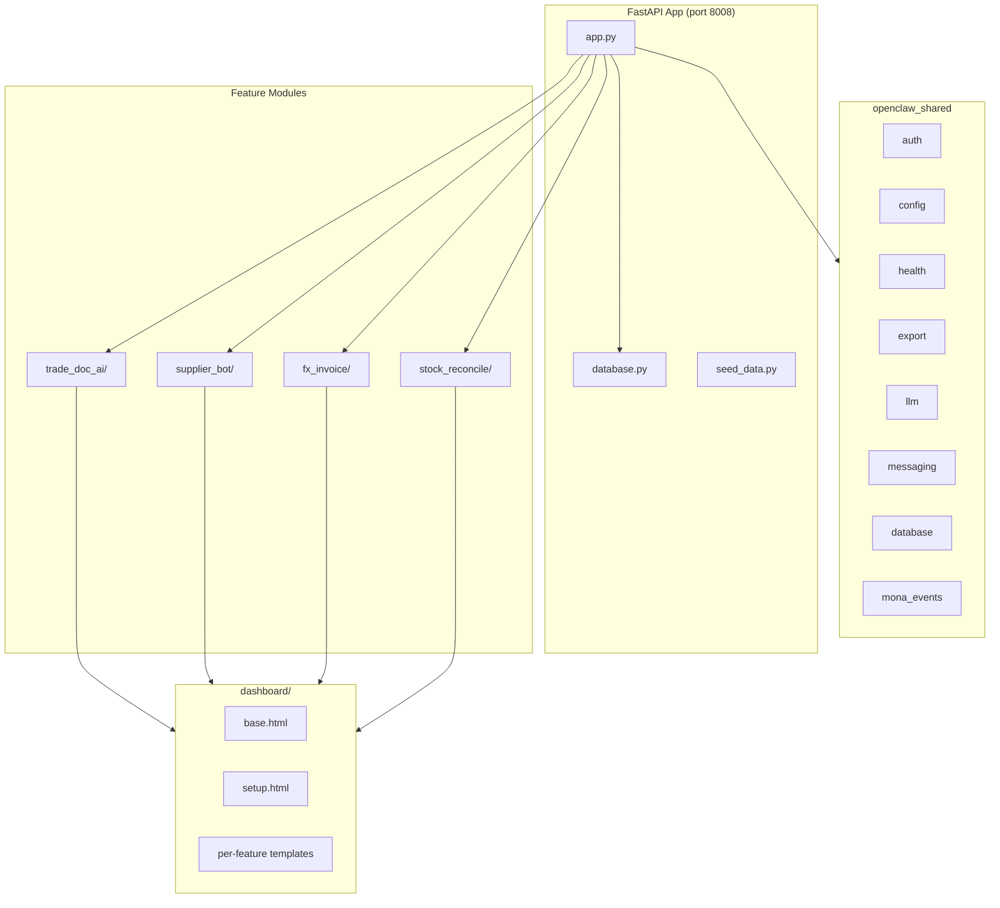

# Import/Export Tool Implementation Plan

## Architecture Overview

Follows the established MonoClaw pattern: a single FastAPI app (`app.py`) at port **8008** serving 4 feature modules, each with its own SQLite database, routes, and dashboard tab. Uses `openclaw_shared` for auth, config, health, export, logging, LLM, and messaging.

## Reference Implementations

- [tools/02-immigration/immigration/app.py](tools/02-immigration/immigration/app.py) -- FastAPI app pattern
- [tools/02-immigration/immigration/database.py](tools/02-immigration/immigration/database.py) -- Database init pattern
- [tools/02-immigration/config.yaml](tools/02-immigration/config.yaml) -- Config structure
- [tools/02-immigration/pyproject.toml](tools/02-immigration/pyproject.toml) -- Package setup
- [tools/03-fnb-hospitality/fnb_hospitality/dashboard/templates/base.html](tools/03-fnb-hospitality/fnb_hospitality/dashboard/templates/base.html) -- Dashboard base template

## Step 1: Scaffolding (Foundation)

Create the project skeleton that all features depend on.

### Files to create:

- `**tools/08-import-export/pyproject.toml**` -- Package `openclaw-import-export` v1.0.0, depends on `openclaw-shared`, FastAPI, uvicorn, Jinja2, Pydantic, httpx, apscheduler, reportlab, openpyxl, python-docx, pdfplumber, rapidfuzz, plotly. Optional extras: `mlx`, `messaging`, `macos`.
- `**tools/08-import-export/config.yaml**` -- port 8008, LLM config (Qwen-2.5-7B), messaging, database workspace `~/OpenClawWorkspace/import-export/`, auth, extra settings (factory hours, currencies, HK holidays, filing deadlines).
- `**tools/08-import-export/import_export/__init__.py**`
- `**tools/08-import-export/import_export/app.py**` -- FastAPI app with lifespan; loads config; inits databases; mounts static/templates; adds PINAuthMiddleware + auth router; registers 4 feature routers at `/trade-doc-ai`, `/supplier-bot`, `/fx-invoice`, `/stock-reconcile`; adds health/export routers; shared routes (`/`, `/setup/`, `/api/events`, `/api/connection-test`).
- `**tools/08-import-export/import_export/database.py**` -- Defines SQL schemas for all 4 features (see data models in prompts); `init_all_databases(workspace)` returns paths for `trade_doc_ai.db`, `supplier_bot.db`, `fx_invoice.db`, `stock_reconcile.db`, `shared.db`, `mona_events.db`.
- `**tools/08-import-export/import_export/seed_data.py**` -- Demo data: sample suppliers, products with HS codes, invoices, shipments, glossary terms.

### Dashboard base templates:

- `**import_export/dashboard/templates/base.html**` -- Jinja2 base with 4-tab sidebar (TradeDoc AI, SupplierBot, FXInvoice, StockReconcile), dark navy + gold theme, htmx + Alpine.js + Tailwind + Chart.js. Follow the pattern from existing tools.
- `**import_export/dashboard/templates/setup.html**` -- Multi-step wizard: (1) Company Profile (name, BR number, base currency), (2) Trade Filing (Tradelink/BECS creds), (3) Messaging (Twilio, Telegram, WeChat), (4) Currency & Banking, (5) Supplier Directory import, (6) Sample Data toggle, (7) Connection Test.
- `**import_export/dashboard/static/css/output.css**` -- Compiled Tailwind CSS.
- `**import_export/dashboard/static/js/app.js**` -- Shared JS utilities.

### Tests scaffolding:

- `tests/__init__.py`, `tests/test_trade_doc_ai/__init__.py`, `tests/test_supplier_bot/__init__.py`, `tests/test_fx_invoice/__init__.py`, `tests/test_stock_reconcile/__init__.py`

---

## Step 2: Feature Modules (Parallelizable -- 4 independent tracks)

All 4 features can be built concurrently after scaffolding is complete. Each feature follows the same internal structure: `__init__.py`, `routes.py` (FastAPI router), sub-packages for business logic, and dashboard templates (`index.html` + partials).

---

### Track A: TradeDoc AI

HS code classification, TDEC generation, commercial invoices, certificates of origin, strategic commodities screening.

**Business logic:**

- `trade_doc_ai/__init__.py`
- `trade_doc_ai/routes.py` -- Endpoints: `GET /trade-doc-ai/` (dashboard), `POST /trade-doc-ai/api/classify` (HS classification), `POST /trade-doc-ai/api/tdec` (generate TDEC), `POST /trade-doc-ai/api/invoice` (commercial invoice), `POST /trade-doc-ai/api/co` (certificate of origin), `GET /trade-doc-ai/api/products` (product catalog CRUD), `GET /trade-doc-ai/api/declarations` (filing list), `POST /trade-doc-ai/api/screen` (strategic commodities check)
- `trade_doc_ai/classification/hs_classifier.py` -- LLM + FTS5 lookup for 8-digit HK HS codes; confidence scoring; "quick classify" mode
- `trade_doc_ai/classification/strategic_screener.py` -- Cross-reference against Strategic Commodities Control List (Cap 60G)
- `trade_doc_ai/classification/hs_database.py` -- SQLite FTS5 queries against HS code schedule
- `trade_doc_ai/documents/tdec_generator.py` -- Auto-populate TDEC forms for import/export/re-export; 14-day deadline tracking
- `trade_doc_ai/documents/invoice_generator.py` -- Commercial invoice with Incoterms, HS codes, multi-currency line items
- `trade_doc_ai/documents/co_generator.py` -- Certificate of Origin (general, CEPA, ASEAN-HK FTA)
- `trade_doc_ai/documents/reexport_linker.py` -- Link import and re-export declarations by product/quantity/HS code
- `trade_doc_ai/filing/tradelink_connector.py` -- Stub for Tradelink/BECS electronic filing API
- `trade_doc_ai/filing/filing_tracker.py` -- Track submission status (draft/filed/accepted/rejected/amended)

**Reference data:**

- `trade_doc_ai/data/hs_codes_hk.json` -- Subset of HK 8-digit HS codes for demo (full schedule ~10K entries)
- `trade_doc_ai/data/strategic_list.json` -- Sample strategic commodities entries

**Dashboard templates:**

- `dashboard/templates/trade_doc_ai/index.html` -- Tab container with 6 views
- `dashboard/templates/trade_doc_ai/partials/hs_classifier.html` -- Product description input, ranked HS code suggestions, manual override search
- `dashboard/templates/trade_doc_ai/partials/tdec_form.html` -- Guided declaration form with auto-fill
- `dashboard/templates/trade_doc_ai/partials/invoice_builder.html` -- Invoice creator with Incoterms dropdown, HS codes per item
- `dashboard/templates/trade_doc_ai/partials/co_form.html` -- CO application with CEPA eligibility check
- `dashboard/templates/trade_doc_ai/partials/strategic_alert.html` -- Red warning banner for controlled items
- `dashboard/templates/trade_doc_ai/partials/filing_tracker.html` -- Status dashboard with deadlines

---

### Track B: SupplierBot

WeChat/Telegram supplier communication, translation, order tracking.

**Business logic:**

- `supplier_bot/__init__.py`
- `supplier_bot/routes.py` -- Endpoints: `GET /supplier-bot/` (dashboard), CRUD for suppliers (`/api/suppliers`), orders (`/api/orders`), conversations (`/api/conversations`), pings (`/api/pings`), `POST /api/send-message`, `POST /api/translate`
- `supplier_bot/messaging/wechat_handler.py` -- WeChat Official Account API via wechatpy
- `supplier_bot/messaging/wechat_work.py` -- WeChat Work enterprise messaging
- `supplier_bot/messaging/message_templates.py` -- Bilingual templates (production update, QC request, shipping, payment)
- `supplier_bot/messaging/auto_ping.py` -- APScheduler-based scheduled status pings; factory-hours-aware; holiday-aware
- `supplier_bot/translation/translator.py` -- CN/EN translation via LLM (Qwen-2.5-7B)
- `supplier_bot/translation/terminology.py` -- Trade glossary management and injection
- `supplier_bot/translation/cantonese_handler.py` -- Cantonese variant detection and handling
- `supplier_bot/extraction/info_extractor.py` -- LLM-based extraction of dates, quantities, issues from messages
- `supplier_bot/extraction/order_updater.py` -- Auto-update order status from extracted data

**Reference data:**

- `supplier_bot/data/glossary.json` -- Trade terminology (EN/SC/TC): moulds, QC, shipping, payment terms

**Dashboard templates:**

- `dashboard/templates/supplier_bot/index.html` -- Tab container with 5 views
- `dashboard/templates/supplier_bot/partials/supplier_directory.html` -- Searchable supplier list
- `dashboard/templates/supplier_bot/partials/message_composer.html` -- Rich editor with auto-translate toggle
- `dashboard/templates/supplier_bot/partials/conversation_history.html` -- Threaded per-supplier conversation log
- `dashboard/templates/supplier_bot/partials/order_board.html` -- Kanban: ordered > shipped > in transit > received
- `dashboard/templates/supplier_bot/partials/price_comparison.html` -- Side-by-side supplier pricing

---

### Track C: FXInvoice

Multi-currency invoicing, FX rates, payment tracking, hedging suggestions.

**Business logic:**

- `fx_invoice/__init__.py`
- `fx_invoice/routes.py` -- Endpoints: `GET /fx-invoice/` (dashboard), CRUD for customers, invoices, invoice items, payments, bank accounts; `GET /api/fx-rates` (live lookup), `GET /api/aging-report`, `GET /api/fx-summary`, `POST /api/invoice/pdf` (generate PDF)
- `fx_invoice/invoicing/invoice_generator.py` -- Multi-currency invoice creation with HKD equivalent
- `fx_invoice/invoicing/statement_generator.py` -- Monthly per-customer statements
- `fx_invoice/invoicing/template_engine.py` -- Jinja2 HTML invoice templates
- `fx_invoice/invoicing/pdf_export.py` -- reportlab PDF generation with company logo, bilingual headers, SWIFT details
- `fx_invoice/fx/rate_fetcher.py` -- Fetch from HKMA, ECB, exchangerate-api.com via httpx
- `fx_invoice/fx/rate_cache.py` -- Hourly caching during HK trading hours, daily outside
- `fx_invoice/fx/converter.py` -- Currency conversion engine with HKD peg awareness
- `fx_invoice/fx/hedging_advisor.py` -- Rule-based suggestions for large invoices with extended terms
- `fx_invoice/payments/payment_tracker.py` -- Multi-currency partial payment recording
- `fx_invoice/payments/reconciler.py` -- Bank statement reconciliation with LLM assist
- `fx_invoice/payments/aging_report.py` -- 30/60/90+ day aging with HKD normalization

**Invoice templates:**

- `fx_invoice/data/invoice_templates/standard.html` -- Professional HTML invoice template

**Dashboard templates:**

- `dashboard/templates/fx_invoice/index.html` -- Tab container with 5 views
- `dashboard/templates/fx_invoice/partials/invoice_builder.html` -- Multi-currency invoice creator with live FX
- `dashboard/templates/fx_invoice/partials/fx_rate_lookup.html` -- Currency pair search with plotly charts
- `dashboard/templates/fx_invoice/partials/payment_tracker.html` -- Per-invoice payment status with aging
- `dashboard/templates/fx_invoice/partials/fx_gain_loss.html` -- FX gain/loss calculator
- `dashboard/templates/fx_invoice/partials/monthly_summary.html` -- Exposure charts and monthly FX summary

---

### Track D: StockReconcile

Shipping manifest parsing, warehouse receipt matching, discrepancy management.

**Business logic:**

- `stock_reconcile/__init__.py`
- `stock_reconcile/routes.py` -- Endpoints: `GET /stock-reconcile/` (dashboard), `POST /api/upload-manifest`, `POST /api/upload-receipt`, `POST /api/reconcile/{shipment_id}`, `GET /api/shipments`, `GET /api/discrepancies`, `GET /api/reconciliation-report/{shipment_id}`, `POST /api/generate-claim`
- `stock_reconcile/ingestion/manifest_parser.py` -- Parse B/L and shipping manifests from PDF/Excel
- `stock_reconcile/ingestion/packing_list_parser.py` -- Packing list extraction
- `stock_reconcile/ingestion/warehouse_receipt_parser.py` -- Warehouse receipt parsing
- `stock_reconcile/ingestion/ocr_handler.py` -- Tesseract OCR for scanned documents
- `stock_reconcile/reconciliation/matching_engine.py` -- 3-pass matching: exact SKU > fuzzy description (rapidfuzz threshold 80%) > LLM semantic
- `stock_reconcile/reconciliation/fcl_reconciler.py` -- FCL single-consignee workflow
- `stock_reconcile/reconciliation/lcl_reconciler.py` -- LCL deconsolidation, group by House B/L
- `stock_reconcile/reconciliation/discrepancy_handler.py` -- Shortage/overage/damage categorization
- `stock_reconcile/tracking/container_tracker.py` -- Container status monitoring by reference
- `stock_reconcile/tracking/shipment_timeline.py` -- Shipment lifecycle timeline
- `stock_reconcile/reports/reconciliation_report.py` -- Match/mismatch summary (Excel + PDF)
- `stock_reconcile/reports/claim_generator.py` -- Carrier/insurer claim documentation

**Dashboard templates:**

- `dashboard/templates/stock_reconcile/index.html` -- Tab container with 5 views
- `dashboard/templates/stock_reconcile/partials/manifest_upload.html` -- Drag-drop upload with format detection
- `dashboard/templates/stock_reconcile/partials/receipt_matching.html` -- Side-by-side manifest vs receipt comparison
- `dashboard/templates/stock_reconcile/partials/discrepancy_report.html` -- Detailed mismatch report
- `dashboard/templates/stock_reconcile/partials/historical_reconciliation.html` -- Accuracy trend chart
- `dashboard/templates/stock_reconcile/partials/inventory_summary.html` -- Aggregated stock levels

---

## Execution Strategy

Step 1 (scaffolding) must complete first. Then the 4 feature tracks (A-D) run **in parallel**. Within each track, the order is: `__init__.py` + `routes.py` first, then business logic sub-packages, then dashboard templates, then reference data files. Each track concludes with its test stubs.

## File Count Estimate

- ~15 scaffolding files (app, database, config, base templates, tests init)
- ~15 files per feature track x 4 = ~60 feature files
- ~25 dashboard template files
- Total: ~100 files

