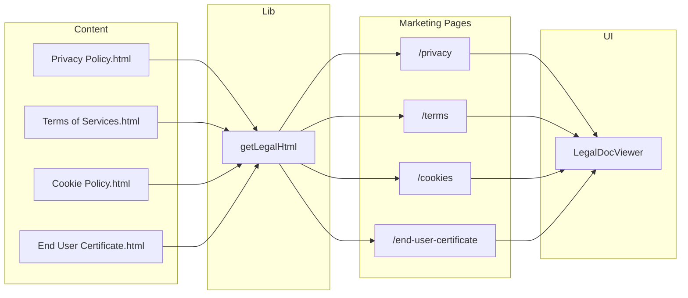

# Legal Pages and Rich Text Viewer Implementation

## Current state

- **Legal HTML files** in `[web/src/content/legal/](web/src/content/legal/)`: `Privacy Policy.html`, `Terms of Services.html`, `Cookie Policy.html`, `End User Certificate.html` (and `Final Contract - MonoClaw.html`). These are full Word “Save as Web Page” exports: `<html>`, `<head>` (Word metadata/styles), and `<body>` with the real content.
- **Contract viewer** in `[web/src/app/[locale]/(checkout)/order/contract/review/contract-review-step.tsx](web/src/app/[locale]/(checkout)`/order/contract/review/contract-review-step.tsx) (lines 222–235): `Card` > `CardHeader` (title) + `CardContent` > inner `div` with `className="prose prose-sm dark:prose-invert max-h-[500px] overflow-y-auto rounded-md border bg-muted/30 p-6"` and `dangerouslySetInnerHTML={{ __html: contractHtml }}`.
- **Footer** in `[web/src/components/footer.tsx](web/src/components/footer.tsx)`: “Legal” section with placeholder `<a href="#">` for Privacy and Terms only; no Cookie Policy or End User Certificate. Uses `footer.privacy` and `footer.terms` from i18n.
- **Marketing pages** (e.g. `[web/src/app/[locale]/(marketing)/about/page.tsx](web/src/app/[locale]/(marketing)`/about/page.tsx)): Server components, `mx-auto max-w-4xl px-4 py-20`, centered title + description, then content sections. No existing “load from file” pattern.

## Architecture

## Implementation steps

### 1. Body extraction and loader

- Add `**web/src/lib/legal.ts**` (or `lib/legal-content.ts`):
  - `**getLegalHtml(slug: 'privacy' | 'terms' | 'cookies' | 'end-user-certificate'): Promise<string>**`
  - Map slug to filename: `privacy` → `Privacy Policy.html`, `terms` → `Terms of Services.html`, `cookies` → `Cookie Policy.html`, `end-user-certificate` → `End User Certificate.html`.
  - Use `fs.promises.readFile` (or `readFileSync` in a sync helper) with `path.join(process.cwd(), 'src/content/legal', filename)`.
  - Return only the **inner HTML of `<body>`** (content between `<body>` and `</body>`), so we never inject a full document into a div. Simple approach: regex or string split on `<body[^>]*>` and `</body>`, then take the middle; or use a lightweight parser (e.g. `node-html-parser`) if available.
  - Optional but recommended: strip `style` attributes from the extracted HTML so Tailwind `prose` controls typography and spacing and design matches the rest of the site. If not done, Word inline styles may override prose.
- Call this only from **server** code (server components or server actions); do not ship file paths or raw HTML to the client except as the string passed to the viewer.

### 2. Shared rich-text viewer component

- Add `**web/src/components/legal-doc-viewer.tsx`** (or `rich-text-legal-viewer.tsx`):
  - **Props**: `title: string`, `html: string`, optional `className?: string` for the outer Card, and optional `scrollableClassName` if we want to override the scroll area (e.g. no max-height on legal pages).
  - **Layout**: Reuse the contract pattern:
    - Outer: `Card` (default `className="mb-6"` or as passed).
    - `CardHeader` with `CardTitle` = `title`.
    - `CardContent` with a single `div`:
      - Same classes as contract: `prose prose-sm dark:prose-invert rounded-md border bg-muted/30 p-6`.
      - For legal pages, use a **taller scroll area** than the contract (e.g. `max-h-[70vh] overflow-y-auto` or `min-h-[400px] max-h-[75vh] overflow-y-auto`) so the page feels like a document viewer rather than a small box.
    - Render content with `dangerouslySetInnerHTML={{ __html: html }}`.
  - No need for a client boundary unless we add client interactivity later; can be a server component that receives the pre-extracted HTML.

This keeps the same design language (Card, prose, muted background, border) as the contract while allowing a different scroll height for full-document legal pages.

### 3. Legal page routes and layout

- Add four **server-component** pages under the **marketing** layout so they get Navbar + Footer and the same overall style as About/Contact:
  - `**web/src/app/[locale]/(marketing)/privacy/page.tsx`**
  - `**web/src/app/[locale]/(marketing)/terms/page.tsx`**
  - `**web/src/app/[locale]/(marketing)/cookies/page.tsx**`
  - `**web/src/app/[locale]/(marketing)/end-user-certificate/page.tsx**`
- **Page structure** (same for all four, parameterised by slug and title):
  - `setRequestLocale(locale)`.
  - Outer container: `mx-auto max-w-4xl px-4 py-20 sm:px-6 lg:px-8` (same as About).
  - Optional short intro: e.g. “Last updated …” or a one-line description; can use a shared `legalPageTitle` / `legalPageDescription` from i18n keyed by slug.
  - Call `getLegalHtml(slug)` (or equivalent) to get body HTML; handle missing file (e.g. 404 or empty state).
  - Render `<LegalDocViewer title={…} html={bodyHtml} />` with the appropriate title (e.g. “Privacy Policy”, “Terms of Service”, “Cookie Policy”, “End User Certificate”). Titles can come from the same i18n keys as the footer for consistency.
- **Slug-to-file mapping** in the loader must match the exact filenames (including spaces) in `web/src/content/legal/`.

### 4. Footer links and i18n

- **Footer** (`[web/src/components/footer.tsx](web/src/components/footer.tsx)`):
  - Replace the two placeholder `<a href="#">` with `<Link href="/privacy">` and `<Link href="/terms">` (using the app’s `Link` from `@/i18n/navigation` so locale is preserved).
  - Add two new list items: Cookie Policy → `<Link href="/cookies">`, End User Certificate → `<Link href="/end-user-certificate">`.
  - Use translation keys: `t("privacy")`, `t("terms")`, and new `t("cookies")`, `t("endUserCertificate")` (or `t("endUserCertificate")`).
- **Messages** (en, zh-hant, zh-hans):
  - Under `footer`, add:
    - `"cookies": "Cookie Policy"` (en), and the correct Chinese labels for zh-hant and zh-hans.
    - `"endUserCertificate": "End User Certificate"` (en), and Chinese equivalents.

### 5. Design and safety notes

- **Design**: Using the same Card + prose + border + `bg-muted/30` as the contract keeps a consistent “rich text viewer” look. The only intentional difference is the scroll height (e.g. `max-h-[70vh]` or similar on legal pages vs `max-h-[500px]` on the contract review step).
- **XSS**: HTML is from the repo under `src/content/legal`. Extracting only `<body>` inner HTML avoids injecting `<script>` in `<head>`. If you later allow CMS or user content, add a sanitizer (e.g. allow only a fixed set of tags/attributes); for now, same-origin static files are acceptable.
- **Final Contract - MonoClaw.html**: Leave as-is in `content/legal` for now. Replacing the NSS contract template in the database with content derived from this file can be a separate change (and would require inserting NSS placeholders into the HTML as in the plan for the purchase-flow contract).

## File summary

| Action | File                                                                                                                   |
| ------ | ---------------------------------------------------------------------------------------------------------------------- |
| New    | `web/src/lib/legal.ts` – slug-to-filename map, read file, extract body HTML, optional strip of `style` attrs           |
| New    | `web/src/components/legal-doc-viewer.tsx` – Card + CardHeader + CardContent + prose div with `dangerouslySetInnerHTML` |
| New    | `web/src/app/[locale]/(marketing)/privacy/page.tsx`                                                                    |
| New    | `web/src/app/[locale]/(marketing)/terms/page.tsx`                                                                      |
| New    | `web/src/app/[locale]/(marketing)/cookies/page.tsx`                                                                    |
| New    | `web/src/app/[locale]/(marketing)/end-user-certificate/page.tsx`                                                       |
| Edit   | `web/src/components/footer.tsx` – replace placeholders with Link, add Cookie Policy and End User Certificate links     |
| Edit   | `web/messages/en.json` – footer.cookies, footer.endUserCertificate                                                     |
| Edit   | `web/messages/zh-hant.json` – same keys                                                                                |
| Edit   | `web/messages/zh-hans.json` – same keys                                                                                |

## Optional enhancement

- **Metadata**: For each legal page, export `generateMetadata` (or set in layout) with a title like “Privacy Policy | MonoClaw” and a short description for SEO, reusing the same i18n titles where possible.

