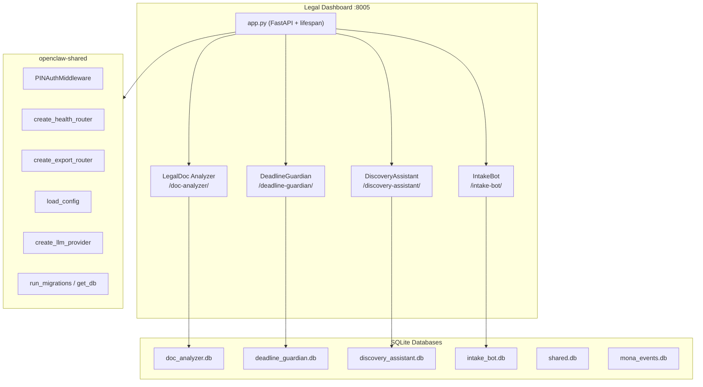

# 05-Legal Tool Suite Implementation Plan

## Architecture

Single FastAPI application (`tools/05-legal/`) with 4 tools served as tab-based sub-routers, 6 SQLite databases, reusing `openclaw-shared` for auth, health, export, config, database, LLM, and messaging. Port 8005.




## File Structure

```
tools/05-legal/
  config.yaml
  pyproject.toml
  legal/
    __init__.py
    app.py
    database.py
    seed_data.py
    doc_analyzer/
      __init__.py, routes.py
      clause_extractor.py, anomaly_detector.py
      employment_checker.py, nda_checker.py
    deadline_guardian/
      __init__.py, routes.py
      limitation.py, court_deadlines.py
      business_days.py, reminder_engine.py, calendar_export.py
    discovery_assistant/
      __init__.py, routes.py
      email_parser.py, privilege_detector.py
      relevance_scorer.py, keyword_search.py
      deduplicator.py, privilege_log.py
    intake_bot/
      __init__.py, routes.py
      conflict_checker.py, fuzzy_match.py
      conversation_flow.py
      intake_form.py, engagement_letter.py
      bot/ (whatsapp.py, telegram.py)
    dashboard/
      static/ (css/styles.css, js/app.js)
      templates/ (base.html, setup.html, + per-tool index.html and partials/)
  tests/
    __init__.py, conftest.py
    test_doc_analyzer/, test_deadline_guardian/
    test_discovery_assistant/, test_intake_bot/
```

---

## Phase 1: Scaffold (sequential, fast)

Create the foundational files that all other phases depend on. Follow exact patterns from [tools/03-fnb-hospitality/pyproject.toml](tools/03-fnb-hospitality/pyproject.toml) and [tools/03-fnb-hospitality/fnb_hospitality/app.py](tools/03-fnb-hospitality/fnb_hospitality/app.py).

### `pyproject.toml`

- Package name: `openclaw-legal`
- Dependencies: `openclaw-shared`, `fastapi`, `uvicorn`, `jinja2`, `python-multipart`, `pyyaml`, `pydantic`, `httpx`, `apscheduler`, `psutil`, `python-dateutil`
- Domain-specific deps:
  - Doc parsing: `python-docx`, `PyPDF2`, `pdfplumber`
  - NLP/search: `whoosh` (full-text search for DiscoveryAssistant), `rapidfuzz` (fuzzy matching for IntakeBot), `pypinyin` (Chinese phonetic matching)
  - Calendar: `icalendar`
  - Export: `openpyxl` (privilege log Excel), `reportlab` (PDF generation)
  - Email: `chardet` (encoding detection)
- Optional extras: `mlx`, `messaging`, `macos` (same pattern as existing)
- Packages: `include = ["legal*"]`

### `config.yaml`

- `tool_name: legal`, `port: 8005`
- Standard sections: `llm`, `messaging`, `database` (workspace: `~/OpenClawWorkspace/legal`), `auth`
- `extra` section with:
  - Firm profile (firm_name, HKLS registration, office_address, practice_areas)
  - Doc Analyzer settings (confidence thresholds)
  - Deadline Guardian settings (reminder_intervals: [30, 14, 7, 3, 1], court tracks)
  - Discovery settings (batch_size: 50, dedup_enabled: true)
  - Intake settings (conflict_match_threshold: 0.75, hkid_last4_only: true)
  - HK public holidays 2026

### `database.py` — 6 schemas

Databases and key tables (from the prompts' data models):

- **doc_analyzer.db**: `contracts`, `clauses`, `reference_clauses`
- **deadline_guardian.db**: `cases`, `deadlines`, `reminders`
- **discovery_assistant.db**: `documents`, `classifications`, `privilege_log`, `tags`
- **intake_bot.db**: `clients`, `matters`, `conflict_checks`, `appointments`
- **shared.db**: `shared_clients` (cross-tool client linking by phone/name)
- **mona_events.db**: via `init_mona_db()`

### `app.py`

Follow the exact pattern from [tools/03-fnb-hospitality/fnb_hospitality/app.py](tools/03-fnb-hospitality/fnb_hospitality/app.py):

- Lifespan: load config, init DBs, create LLM provider, store in `app.state`
- Mount static files, set up templates
- Add `PINAuthMiddleware`, auth router
- Shared routes: `/api/events`, `/api/events/{id}/acknowledge`
- Dashboard: `GET /` redirects to `/doc-analyzer/`, `GET /setup/`, `POST /setup/`
- Setup wizard processes: firm profile, messaging, document templates, legislation references, sample data seed
- Connection test endpoint
- Include 4 tool routers + health + export routers
- Tabs: `doc-analyzer`, `deadline-guardian`, `discovery-assistant`, `intake-bot`

### `seed_data.py`

- `seed_doc_analyzer()`: Sample contracts (tenancy, employment, NDA), reference clauses for each type, sample anomaly-flagged clauses
- `seed_deadline_guardian()`: Sample cases (CFI, DCT), deadlines with various statuses, reminder records
- `seed_discovery_assistant()`: Sample documents (emails, attachments), classifications with mixed privilege statuses, sample tags
- `seed_intake_bot()`: Sample clients (EN/TC names), matters, conflict check results, appointments
- `seed_all(db_paths)` orchestrates all

### `tests/conftest.py`

Copy pattern from [tools/03-fnb-hospitality/tests/conftest.py](tools/03-fnb-hospitality/tests/conftest.py): `tmp_workspace`, `db_paths`, `seeded_db_paths` fixtures.

---

## Phase 2: Dashboard Shell (can start after Phase 1)

### `base.html`

Follow [tools/02-immigration/immigration/dashboard/templates/base.html](tools/02-immigration/immigration/dashboard/templates/base.html) pattern:

- Sidebar with 4 tabs: LegalDoc Analyzer, DeadlineGuardian, DiscoveryAssistant, IntakeBot
- Title: "Legal Dashboard"
- Same CDN includes: Tailwind, Chart.js, htmx, Alpine.js
- Activity feed panel, approval queue
- Bilingual toggle (EN/Traditional Chinese)

### `setup.html`

7-step wizard per the prompts' first-run setup:

1. Firm Profile (firm name, HKLS registration, office address, practice areas)
2. Messaging Setup (Twilio WhatsApp, Telegram bot token)
3. Calendar Integration (Google Calendar / Microsoft 365 API creds)
4. Document Templates (upload standard contract templates, import clause library)
5. HK Legislation References (Cap 57, Cap 7, Cap 117, Cap 347 provisions)
6. Sample Data (seed demo checkbox)
7. Connection Test

### `styles.css` and `app.js`

Copy from existing tools, adapt branding for Legal Dashboard. Standard MonoClaw design tokens (navy, gold, green/amber/red).

---

## Phase 3: Tool Backends (parallelizable -- 4 tools can be built concurrently)

Each tool follows the router pattern from [tools/02-immigration/immigration/visa_doc_ocr/routes.py](tools/02-immigration/immigration/visa_doc_ocr/routes.py): `APIRouter(prefix="/tool-slug")`, `_ctx()` helper, page route + API routes + partials.

### 3A: LegalDoc Analyzer (`doc_analyzer/`)

**Routes** (`routes.py`):

- `GET /doc-analyzer/` -- main page (contract list, stats)
- `POST /doc-analyzer/upload` -- upload contract (docx/pdf), detect type
- `POST /doc-analyzer/analyze/{contract_id}` -- trigger clause extraction + anomaly detection
- `GET /doc-analyzer/contract/{contract_id}` -- clause-by-clause view
- `GET /doc-analyzer/compare` -- comparison mode (two contracts side-by-side)
- `GET /doc-analyzer/export/{contract_id}` -- annotated docx export
- Partials for clause detail, anomaly panel, comparison diff

**Logic modules**:

- `clause_extractor.py`: Regex-based clause boundary detection + LLM classification (termination, indemnity, liability cap, rent review, non-compete, confidentiality). Process by clause, not full doc.
- `anomaly_detector.py`: Compare extracted clauses against `reference_clauses` table. Score deviations (notice periods, penalty amounts, indemnity scope). Uses LLM for semantic reasoning on non-standard terms.
- `employment_checker.py`: Cap 57 compliance -- validate presence of mandatory provisions (Section 31D statutory holidays, Section 31R severance, Section 31RA long service, Section 10 wage period, Section 11A annual leave). Returns checklist of present/missing/non-compliant items.
- `nda_checker.py`: NDA completeness checks -- scope of confidential info, exclusions, permitted disclosures, duration, SFC carve-outs. Reference library matching.

**HK-specific data**: `cap57_provisions.json` embedded or in data/ -- Employment Ordinance mandatory terms.

### 3B: DeadlineGuardian (`deadline_guardian/`)

**Routes** (`routes.py`):

- `GET /deadline-guardian/` -- main page (matter list with urgent deadlines, calendar view)
- `POST /deadline-guardian/cases` -- create new case
- `POST /deadline-guardian/deadlines` -- create deadline (manual or auto-calculated)
- `GET /deadline-guardian/calculate` -- limitation period calculator (interactive form)
- `POST /deadline-guardian/deadlines/{id}/complete` -- mark deadline completed
- `GET /deadline-guardian/audit/{case_id}` -- audit trail for a case
- `GET /deadline-guardian/calendar/export/{case_id}` -- .ics download
- Partials for calendar view, deadline detail, reminder config

**Logic modules**:

- `limitation.py`: Cap 347 calculator -- Section 4 (contract, 6yr), Section 4A (PI, 3yr), Section 27 (defamation, 1yr), Section 4C (latent damage, 3yr from discoverability). Takes accrual date, returns deadline.
- `court_deadlines.py`: CFI/DCT procedural rules -- AoS (14 days), Defence (28 days from AoS), Close of Pleadings (+14 days), Summons for Directions (1 month). Distinguishes CFI vs DCT tracks.
- `business_days.py`: HK business day calculator -- excludes Saturdays, Sundays, 17 statutory holidays. Loaded from config `public_holidays`. Holiday rollover logic (deadline on holiday -> next business day).
- `reminder_engine.py`: APScheduler integration -- schedule reminders at configurable intervals (30d, 14d, 7d, 3d, 1d). Multi-channel: WhatsApp (Twilio), email (smtplib), desktop (osascript). Persist jobs in SQLite via APScheduler's job store.
- `calendar_export.py`: Generate `.ics` files using `icalendar` library. One event per deadline with alarm reminders.

### 3C: DiscoveryAssistant (`discovery_assistant/`)

**Routes** (`routes.py`):

- `GET /discovery-assistant/` -- main page (document collection browser, stats)
- `POST /discovery-assistant/ingest` -- upload email archive (.eml, .mbox) or documents
- `GET /discovery-assistant/documents` -- paginated document list with filters
- `POST /discovery-assistant/classify/{doc_id}` -- trigger privilege/relevance classification
- `POST /discovery-assistant/tag/{doc_id}` -- manual tagging (privilege status, reviewer notes)
- `POST /discovery-assistant/batch-tag` -- batch tagging for multi-select
- `GET /discovery-assistant/search` -- keyword search (Boolean + proximity via Whoosh)
- `GET /discovery-assistant/timeline` -- chronological document view
- `GET /discovery-assistant/privilege-log/export` -- Excel privilege log download
- Partials for document preview, privilege tagger, search results, timeline

**Logic modules**:

- `email_parser.py`: Parse .eml (Python `email` module), .mbox (`mailbox` module). Extract headers, body, attachments. Attachment text extraction via PyPDF2/python-docx.
- `privilege_detector.py`: Two-stage -- keyword pre-filter (solicitor-client patterns, "legally privileged", "without prejudice") then LLM semantic classification. Outputs privilege_status + confidence_score.
- `relevance_scorer.py`: LLM-based relevance tier assignment (directly_relevant, potentially_relevant, not_relevant) based on case keywords.
- `keyword_search.py`: Whoosh full-text index. Build index incrementally during ingestion. Support AND/OR/NOT/NEAR operators.
- `deduplicator.py`: MD5 + SHA256 hashing. Flag exact duplicates, group near-duplicates.
- `privilege_log.py`: Generate HK High Court compliant privilege log spreadsheet (openpyxl). Fields: document date, type, author, recipients, subject description, privilege claimed.

### 3D: IntakeBot (`intake_bot/`)

**Routes** (`routes.py`):

- `GET /intake-bot/` -- main page (intake queue, stats)
- `POST /intake-bot/clients` -- manual client entry
- `GET /intake-bot/clients/{id}` -- client detail view
- `POST /intake-bot/conflict-check/{matter_id}` -- run conflict check
- `GET /intake-bot/conflict-results/{matter_id}` -- conflict check results
- `POST /intake-bot/schedule/{client_id}` -- book consultation meeting
- `GET /intake-bot/conversation/{client_id}` -- conversation thread viewer
- `POST /intake-bot/generate-intake-form/{client_id}` -- PDF intake form
- `POST /intake-bot/generate-engagement-letter/{matter_id}` -- draft engagement letter
- Partials for intake form, conflict panel, conversation viewer, meeting scheduler

**Logic modules**:

- `conflict_checker.py`: Cross-reference new client/adverse party against existing client DB. Uses SQLite FTS5 for fast text search + fuzzy matching.
- `fuzzy_match.py`: Name matching with `rapidfuzz` (Levenshtein). Chinese phonetic matching via `pypinyin` (Mandarin) + Jyutping lookup table (Cantonese). Handles EN, TC, SC, romanized variants.
- `conversation_flow.py`: State machine (5-7 states) for guided intake. States: greeting -> collect_name -> collect_contact -> collect_matter -> collect_adverse_party -> confirm -> complete. "Speak to human" escape hatch at every stage.
- `intake_form.py`: Generate pre-filled intake form PDF (reportlab) or Word (python-docx) from collected client data.
- `engagement_letter.py`: Draft engagement letter with client details, matter type, fee arrangement (hourly/fixed/conditional).
- `bot/whatsapp.py`: Twilio webhook handler for WhatsApp messages. Routes to conversation_flow.
- `bot/telegram.py`: Telegram bot handler. Routes to conversation_flow.

---

## Phase 4: Jinja2 + htmx Templates (parallelizable per tool, after Phase 2 + 3)

Each tool gets an `index.html` extending `base.html`, plus `partials/` directory for htmx fragments.

### DocAnalyzer templates

- `index.html`: Upload area, contract list, status cards (total analyzed, anomalies found, pending review)
- `partials/clause_view.html`: Color-coded clause list (green/amber/red sidebar)
- `partials/anomaly_detail.html`: Reference clause side-by-side with deviation explanation
- `partials/comparison.html`: Two-document diff view

### DeadlineGuardian templates

- `index.html`: Matter list with urgency indicators, calendar view (Chart.js or simple grid), limitation calculator form
- `partials/deadline_card.html`: Deadline with countdown, status badge
- `partials/calendar.html`: Monthly calendar with color-coded deadlines
- `partials/audit_trail.html`: Event log table

### DiscoveryAssistant templates

- `index.html`: Document browser (paginated table), search bar, filter sidebar, stats cards
- `partials/document_preview.html`: Document content with highlighted search terms
- `partials/privilege_tagger.html`: Per-doc privilege controls with batch actions
- `partials/search_results.html`: Keyword search results with context
- `partials/timeline.html`: Chronological document plot

### IntakeBot templates

- `index.html`: Intake queue table, stats cards (pending, cleared, conflicts)
- `partials/client_form.html`: Structured intake form (manual entry or bot-collected review)
- `partials/conflict_panel.html`: Match results with confidence scores, clear/conflict buttons
- `partials/conversation_viewer.html`: Chat thread display
- `partials/meeting_scheduler.html`: Calendar slot picker

---

## Phase 5: Test Suites (parallelizable per tool)

Each tool gets a test directory following the `conftest.py` fixture pattern:

- `test_doc_analyzer/`: Test clause extraction on sample contract text, Cap 57 checker, anomaly scoring
- `test_deadline_guardian/`: Test limitation period calculation, business day logic with holidays, CFI/DCT deadline rules
- `test_discovery_assistant/`: Test email parsing (.eml), deduplication, privilege keyword detection, Whoosh search
- `test_intake_bot/`: Test conflict checker with fuzzy/phonetic matching, conversation state machine, HKID validation

---

## Parallelization Strategy

```mermaid
gantt
    title Implementation Phases
    dateFormat X
    axisFormat %s

    section Phase1
    Scaffold_pyproject_config_db_app_seed_conftest: p1, 0, 1

    section Phase2
    Dashboard_shell_base_setup_css_js: p2, after p1, 1

    section Phase3_parallel
    DocAnalyzer_backend: p3a, after p1, 2
    DeadlineGuardian_backend: p3b, after p1, 2
    DiscoveryAssistant_backend: p3c, after p1, 2
    IntakeBot_backend: p3d, after p1, 2

    section Phase4_parallel
    DocAnalyzer_templates: p4a, after p2, 1
    DeadlineGuardian_templates: p4b, after p2, 1
    DiscoveryAssistant_templates: p4c, after p2, 1
    IntakeBot_templates: p4d, after p2, 1

    section Phase5_parallel
    DocAnalyzer_tests: p5a, after p3a, 1
    DeadlineGuardian_tests: p5b, after p3b, 1
    DiscoveryAssistant_tests: p5c, after p3c, 1
    IntakeBot_tests: p5d, after p3d, 1
```




- **Phase 1** (scaffold) is sequential -- all other phases depend on it
- **Phase 2** (dashboard shell) depends only on Phase 1
- **Phase 3** (4 tool backends) can run fully in parallel after Phase 1
- **Phase 4** (4 template sets) can run in parallel after Phase 2 + respective Phase 3 tool
- **Phase 5** (4 test suites) can run in parallel after respective Phase 3 tool

