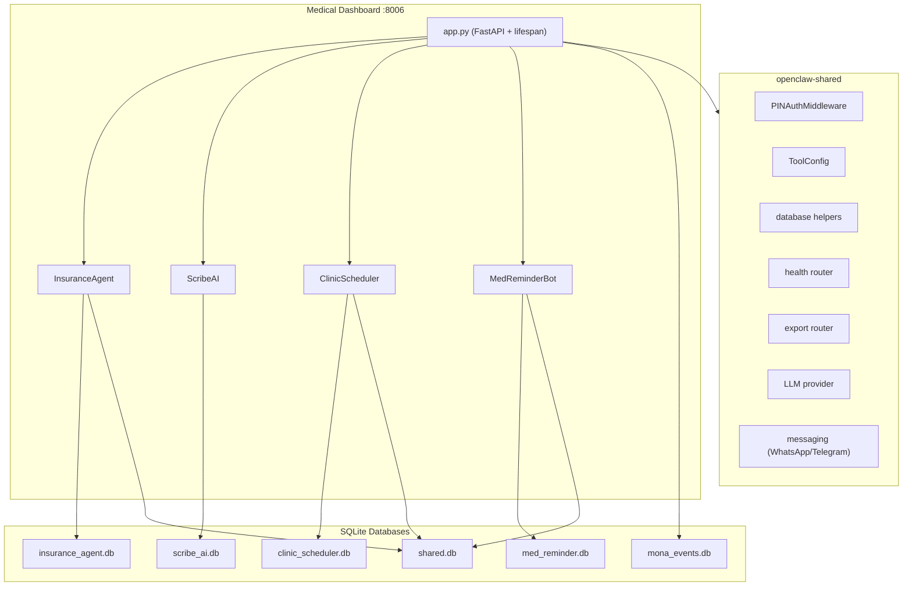
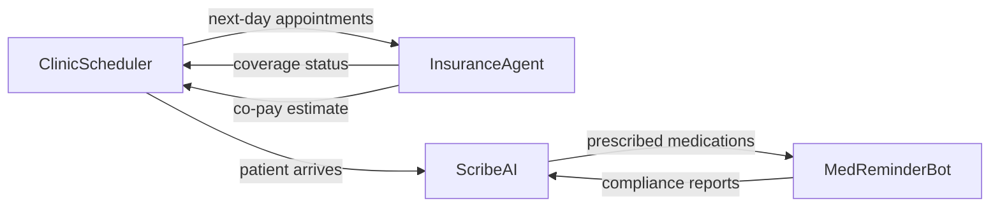

# Medical-Dental Tools Implementation Plan

## Architecture Overview

A single FastAPI application at `http://mona.local:8006` with tabbed navigation across four tools. Follows the exact patterns established in [tools/02-immigration/](tools/02-immigration/) and [tools/03-fnb-hospitality/](tools/03-fnb-hospitality/).




### Inter-Tool Data Flow




- **ClinicScheduler -> InsuranceAgent**: Batch verification of next-day appointments
- **ScribeAI -> MedReminderBot**: Extracted medication prescriptions feed into reminder schedules
- **InsuranceAgent -> ClinicScheduler**: Co-pay estimates shown at booking confirmation
- **shared.db**: Links patients across all 4 tools via phone number

## Directory Structure

```
tools/06-medical-dental/
├── config.yaml
├── pyproject.toml
├── medical_dental/
│   ├── __init__.py
│   ├── app.py
│   ├── database.py
│   ├── seed_data.py
│   ├── insurance_agent/
│   │   ├── __init__.py
│   │   ├── routes.py
│   │   ├── verification/
│   │   │   ├── __init__.py
│   │   │   ├── bupa_connector.py
│   │   │   ├── axa_connector.py
│   │   │   ├── cigna_connector.py
│   │   │   ├── generic_connector.py
│   │   │   └── batch_verify.py
│   │   ├── estimation/
│   │   │   ├── __init__.py
│   │   │   ├── copay_calculator.py
│   │   │   ├── fee_schedule.py
│   │   │   └── ha_rate_lookup.py
│   │   ├── preauth/
│   │   │   ├── __init__.py
│   │   │   ├── form_generator.py
│   │   │   └── submission_handler.py
│   │   └── claims/
│   │       ├── __init__.py
│   │       ├── claim_tracker.py
│   │       └── eob_parser.py
│   ├── scribe_ai/
│   │   ├── __init__.py
│   │   ├── routes.py
│   │   ├── transcription/
│   │   │   ├── __init__.py
│   │   │   ├── whisper_engine.py
│   │   │   ├── audio_capture.py
│   │   │   └── language_detect.py
│   │   ├── structuring/
│   │   │   ├── __init__.py
│   │   │   ├── soap_generator.py
│   │   │   ├── entity_extractor.py
│   │   │   └── icd_coder.py
│   │   └── records/
│   │       ├── __init__.py
│   │       ├── note_manager.py
│   │       ├── template_engine.py
│   │       └── finalization.py
│   ├── clinic_scheduler/
│   │   ├── __init__.py
│   │   ├── routes.py
│   │   ├── bot/
│   │   │   ├── __init__.py
│   │   │   ├── whatsapp_handler.py
│   │   │   ├── booking_flow.py
│   │   │   └── reminder_sender.py
│   │   └── scheduling/
│   │       ├── __init__.py
│   │       ├── availability.py
│   │       ├── booking_engine.py
│   │       ├── waitlist.py
│   │       └── walk_in_queue.py
│   ├── med_reminder/
│   │   ├── __init__.py
│   │   ├── routes.py
│   │   ├── bot/
│   │   │   ├── __init__.py
│   │   │   ├── whatsapp_handler.py
│   │   │   ├── sms_handler.py
│   │   │   └── message_templates.py
│   │   ├── reminders/
│   │   │   ├── __init__.py
│   │   │   ├── scheduler.py
│   │   │   ├── compliance_tracker.py
│   │   │   └── escalation.py
│   │   ├── refill/
│   │   │   ├── __init__.py
│   │   │   ├── photo_processor.py
│   │   │   ├── refill_workflow.py
│   │   │   └── drug_matcher.py
│   │   └── safety/
│   │       ├── __init__.py
│   │       └── interaction_checker.py
│   └── dashboard/
│       ├── static/
│       │   ├── css/
│       │   │   └── styles.css
│       │   └── js/
│       │       └── app.js
│       └── templates/
│           ├── base.html
│           ├── setup.html
│           ├── insurance_agent/
│           │   ├── index.html
│           │   └── partials/
│           ├── scribe_ai/
│           │   ├── index.html
│           │   └── partials/
│           ├── clinic_scheduler/
│           │   ├── index.html
│           │   ├── waiting_room.html
│           │   └── partials/
│           └── med_reminder/
│               ├── index.html
│               └── partials/
└── tests/
    ├── conftest.py
    ├── test_database.py
    ├── test_insurance_agent/
    │   ├── __init__.py
    │   ├── test_verification.py
    │   ├── test_copay.py
    │   └── test_claims.py
    ├── test_scribe_ai/
    │   ├── __init__.py
    │   ├── test_transcription.py
    │   ├── test_soap.py
    │   └── test_entities.py
    ├── test_clinic_scheduler/
    │   ├── __init__.py
    │   ├── test_availability.py
    │   ├── test_booking.py
    │   └── test_waitlist.py
    └── test_med_reminder/
        ├── __init__.py
        ├── test_reminders.py
        ├── test_compliance.py
        └── test_refill.py
```

## Implementation Phases

Phases 1 and 2 run in parallel. Within Phase 3, all four tools are independent and can be built in parallel.

---

### Phase 1: Foundation (scaffold + database + config)

**Files to create:**

- `**pyproject.toml`** -- modeled on [tools/02-immigration/pyproject.toml](tools/02-immigration/pyproject.toml) with medical-specific deps:
  - Core: `fastapi`, `uvicorn`, `jinja2`, `python-multipart`, `pyyaml`, `pydantic`, `httpx`, `apscheduler`, `psutil`
  - InsuranceAgent: `playwright`, `PyPDF2`, `reportlab`, `pdfplumber`
  - ScribeAI: `openai-whisper` (or `mlx-whisper`), `pyaudio`, `soundfile`, `python-docx`
  - ClinicScheduler: `icalendar`, `python-dateutil`
  - MedReminder: `Pillow`, `pytesseract`
  - Optional: `mlx`, `messaging`, `macos`, `all`
- `**config.yaml`** -- port 8006, medical-specific `extra` section:
  - Clinic profile (name, HKMA registration, address)
  - Operating hours: morning 09:00-13:00, afternoon 14:30-18:00, optional evening 18:30-21:00, Saturday 09:00-13:00
  - Appointment durations: GP 15min, specialist 30min, dental cleaning 45min, dental procedure 60min
  - Insurance: supported insurers list (Bupa, AXA, Cigna), portal credentials placeholders, fee schedule path
  - Reminder defaults: morning 08:00, afternoon 14:00, evening 20:00, bedtime 22:00, compliance window 2hr
  - HA public rates: GP $50, specialist $135, A&E $180
  - HK public holidays 2026 (same list as immigration config)
- `**medical_dental/__init__.py**` -- `__version__ = "1.0.0"`
- `**medical_dental/database.py**` -- Six schemas from the prompts:
  - `INSURANCE_AGENT_SCHEMA`: patients, insurance_policies, coverage_details, claims, preauthorizations
  - `SCRIBE_AI_SCHEMA`: patients, consultations, templates, custom_vocabulary
  - `CLINIC_SCHEDULER_SCHEMA`: doctors, schedules, appointments, waitlist
  - `MED_REMINDER_SCHEMA`: patients, medications, compliance_logs, refill_requests
  - `SHARED_SCHEMA`: shared_patients (cross-tool patient linking by phone)
  - `init_all_databases(workspace)` returning `dict[str, Path]` of 6 DB files + mona_events
- `**medical_dental/app.py**` -- FastAPI app modeled on [tools/02-immigration/immigration/app.py](tools/02-immigration/immigration/app.py):
  - Lifespan: load config, init DBs, create LLM provider
  - Auth middleware, static files, templates
  - Shared routes: `/api/events`, `/api/events/{id}/acknowledge`, `/`, `/setup/`, `/api/connection-test`
  - Mount 4 tool routers, health router, export router
  - Default tab redirect: `/insurance-agent/`
- `**medical_dental/seed_data.py**` -- Demo data:
  - 5 sample patients with HK names (bilingual), phone numbers, DOBs
  - Insurance policies (Bupa, AXA, Cigna) with coverage details
  - 3 doctors (GP, specialist, dentist) with schedules
  - Sample appointments, consultations, medication prescriptions
  - Common HK medications (metformin, amlodipine, atorvastatin, etc.)
  - SOAP note templates for URTI, hypertension, diabetes, dental check-up
- `**tests/conftest.py**` -- fixtures for `tmp_workspace`, `db_paths`, `seeded_db_paths`

---

### Phase 2: Dashboard Shell (runs in parallel with Phase 1)

**Files to create:**

- `**dashboard/static/css/styles.css`** -- Tailwind-based styles with MonoClaw tokens (navy #1a1f36, gold #d4a843), medical-specific card styles for SOAP notes, insurance status badges, compliance charts
- `**dashboard/static/js/app.js`** -- Shared JS: htmx config, Alpine.js init, SSE helpers for real-time transcription, Chart.js for compliance charts, audio recording helpers (MediaRecorder API)
- `**dashboard/templates/base.html**` -- Sidebar with 4 tabs (InsuranceAgent, ScribeAI, ClinicScheduler, MedReminder), activity feed, approval queue, status cards. Modeled on [tools/02-immigration/immigration/dashboard/templates/base.html](tools/02-immigration/immigration/dashboard/templates/base.html)
- `**dashboard/templates/setup.html**` -- First-run wizard with 8 steps:
  1. Clinic profile (name, HKMA reg, address, hours)
  2. Practitioners (doctors with specialty, slot duration)
  3. Insurer portal credentials (Bupa, AXA, Cigna)
  4. Messaging (Twilio WhatsApp/SMS, Telegram)
  5. Fee schedule import
  6. Audio/STT settings (microphone, Whisper model size)
  7. Medication database setup, reminder defaults
  8. Sample data toggle + connection test

---

### Phase 3: Tool Business Logic (4 tools in parallel)

#### 3A: InsuranceAgent

- `**verification/generic_connector.py**` -- Abstract base connector interface with `verify_coverage()`, `check_preauth_required()`, `get_benefits()` methods. 24-hour result caching. Rate limiting
- `**verification/bupa_connector.py**` -- Bupa HK integration: Playwright-based portal automation with screenshot-on-failure, retry logic, graceful degradation. Parses coverage status, benefit limits, remaining balance
- `**verification/axa_connector.py**` -- AXA HK portal connector (same pattern as Bupa)
- `**verification/cigna_connector.py**` -- Cigna HK portal connector (same pattern)
- `**verification/batch_verify.py**` -- Bulk verification for next-day appointments: queries ClinicScheduler appointments via shared.db, runs verification per patient, generates coverage issue report
- `**estimation/fee_schedule.py**` -- Clinic fee schedule CRUD (JSON storage, version-controlled). Default HK ranges: GP $300-800, specialist $800-2500, dental $500-1500
- `**estimation/ha_rate_lookup.py**` -- HA public hospital rate reference (GP $50, specialist $135, A&E $180). Private vs public comparison
- `**estimation/copay_calculator.py**` -- Co-pay engine: takes procedure, insurer schedule, clinic fee -> calculates patient out-of-pocket (percentage co-insurance, fixed copay, deductible, sub-limits)
- `**preauth/form_generator.py**` -- Pre-authorization form auto-population with patient + procedure details. PDF generation via reportlab
- `**preauth/submission_handler.py**` -- Pre-auth submission tracking: draft -> submitted -> approved/denied. 3-5 business day timeline tracking
- `**claims/claim_tracker.py**` -- Claim lifecycle: pending -> submitted -> approved/partial/rejected -> paid. Overdue payment flagging
- `**claims/eob_parser.py**` -- Parse insurer EOB (Explanation of Benefits) PDFs via PyPDF2 + LLM for unstructured extraction
- `**routes.py**` -- APIRouter prefix `/insurance-agent`: verification form, co-pay estimator, pre-auth builder, claim tracker, batch verification, htmx partials

#### 3B: ScribeAI

- `**transcription/whisper_engine.py**` -- Whisper STT wrapper: MLX-optimized inference (fp16), model selection (small/medium), 30-second chunk streaming for real-time transcription
- `**transcription/audio_capture.py**` -- PyAudio microphone input handling: start/stop recording, audio level monitoring, temporary WAV file storage
- `**transcription/language_detect.py**` -- Auto-detect English/Cantonese in audio stream, handle code-mixed speech (English medical terms in Cantonese)
- `**structuring/soap_generator.py**` -- SOAP note auto-structuring via LLM: pass full transcription -> structured JSON with S/O/A/P keys. HK-adapted (metric vitals, local lab ranges)
- `**structuring/entity_extractor.py**` -- Clinical NER: medications (with dosages), diagnoses, procedures, follow-up instructions. Cross-reference with HK Drug Formulary
- `**structuring/icd_coder.py**` -- ICD-10 code suggestion from diagnoses. Local `icd10_hk.json` lookup for common HK codes (URTI->J06.9, Hypertension->I10, etc.)
- `**records/note_manager.py**` -- Consultation note CRUD: create from transcription, link to patient, store SOAP sections
- `**records/template_engine.py**` -- Pre-built templates for common consultations: URTI, hypertension follow-up, diabetes review, dental check-up, dental extraction. Template pre-fills SOAP sections
- `**records/finalization.py**` -- Review -> Approve -> Lock workflow. Locked notes are immutable (amendments create new records with reference). Audit trail with timestamps
- `**routes.py**` -- APIRouter prefix `/scribe-ai`: recording interface (SSE for real-time transcription), SOAP note editor, entity sidebar, ICD-10 panel, template selector, finalization workflow

#### 3C: ClinicScheduler

- `**bot/whatsapp_handler.py**` -- Twilio webhook for patient messages. Parse incoming booking requests
- `**bot/booking_flow.py**` -- Conversational booking state machine: select doctor -> service type -> date/time -> confirm. Bilingual (EN/TC). LLM for freeform message understanding
- `**bot/reminder_sender.py**` -- APScheduler jobs: 24hr and 2hr reminders via WhatsApp. Track confirmation responses
- `**scheduling/availability.py**` -- Real-time slot computation: interval-based (not discrete slots). Factors: doctor schedules, room allocation, equipment (X-ray, dental chair), buffer times. Cache with 60s refresh
- `**scheduling/booking_engine.py**` -- Booking CRUD with optimistic locking to prevent race conditions. Appointment status: booked -> confirmed -> arrived -> in_progress -> completed/cancelled/no_show
- `**scheduling/waitlist.py**` -- Priority-ranked waitlist per time slot. Auto-notify on cancellations. Party matching (doctor + service type)
- `**scheduling/walk_in_queue.py**` -- Walk-in patient queue with estimated wait times (based on remaining appointments + average walk-in duration). Web display for waiting room
- `**routes.py**` -- APIRouter prefix `/clinic-scheduler`: doctor schedule grid, booking form, waitlist panel, walk-in queue view (full-screen for waiting room), today's statistics, htmx partials

#### 3D: MedReminderBot

- `**bot/whatsapp_handler.py**` -- Twilio webhook for patient messages: "taken" confirmations, photo submissions for refills, voice message STT via Whisper
- `**bot/sms_handler.py**` -- SMS fallback when WhatsApp unavailable (common for elderly HK patients)
- `**bot/message_templates.py**` -- Bilingual reminder templates (EN/TC): medication name, strength, dosage, route, frequency (matching DH labelling format)
- `**reminders/scheduler.py**` -- APScheduler with SQLite job store: patient-specific reminder jobs with IDs `remind_{patient_id}_{med_id}_{time_slot}`. Configurable times (morning/afternoon/evening/bedtime)
- `**reminders/compliance_tracker.py**` -- Adherence tracking: "taken" within 2hr window = compliant, no response = missed. Weekly/monthly adherence rates per patient per medication
- `**reminders/escalation.py**` -- Low-compliance flagging: patients below threshold flagged for clinic follow-up. Configurable thresholds
- `**refill/photo_processor.py**` -- OCR pipeline: resize -> enhance contrast -> Tesseract extraction -> fuzzy match against drug database -> LLM fallback if confidence <70%
- `**refill/drug_matcher.py**` -- Match OCR text to drug database. Bilingual matching (EN generic name + TC name). Fuzzy string matching for OCR errors
- `**refill/refill_workflow.py**` -- Refill request lifecycle: pending -> approved/modified/rejected -> ready -> collected. Part I poison authorization rules per HK Pharmacy and Poisons Ordinance
- `**safety/interaction_checker.py**` -- Drug interaction cross-reference: curated list of 200 common HK-prescribed drugs with known major interactions. Alert clinic staff on flagged combinations
- `**routes.py**` -- APIRouter prefix `/med-reminder`: patient medication table, reminder status board, refill management queue, compliance reports (Chart.js), drug interaction alerts

---

### Phase 4: Dashboard Templates (4 tools in parallel)

- `**templates/insurance_agent/index.html**` -- Verification form, co-pay estimator, pre-auth builder status board, claim tracker (kanban), batch verification summary
- `**templates/insurance_agent/partials/**` -- verification_result.html, copay_estimate.html, preauth_form.html, claim_list.html, batch_summary.html
- `**templates/scribe_ai/index.html**` -- Recording interface (start/stop + live waveform), SOAP note editor (4 collapsible sections), entity sidebar, ICD-10 panel, template selector
- `**templates/scribe_ai/partials/**` -- transcription_stream.html, soap_editor.html, entity_tags.html, icd10_panel.html, finalization.html
- `**templates/clinic_scheduler/index.html**` -- Doctor schedule grid (time x doctors, color-coded), booking form, waitlist panel, today's stats cards
- `**templates/clinic_scheduler/waiting_room.html**` -- Full-screen walk-in queue display: large fonts, queue position, estimated wait, currently-serving
- `**templates/clinic_scheduler/partials/**` -- schedule_grid.html, booking_form.html, waitlist.html, walk_in_queue.html, stats.html
- `**templates/med_reminder/index.html**` -- Patient medication table with compliance rates, reminder status board, refill queue, compliance charts, interaction alerts
- `**templates/med_reminder/partials/**` -- medication_table.html, reminder_board.html, refill_queue.html, compliance_chart.html, interaction_alerts.html

---

### Phase 5: Tests

- `**tests/test_database.py**` -- Schema creation, migrations, cross-tool shared DB patient linking
- `**tests/test_insurance_agent/**` -- Coverage verification mock (Bupa portal response), co-pay calculation (20% co-insurance on $800 GP visit = $160), batch verification, claim status transitions, EOB parsing
- `**tests/test_scribe_ai/**` -- SOAP structuring from sample transcription, entity extraction (medications + dosages), ICD-10 code suggestion, template pre-fill, finalization immutability
- `**tests/test_clinic_scheduler/**` -- Availability computation (block double-booking, respect buffers), booking with optimistic lock, waitlist notification on cancellation, walk-in wait estimation, HK holiday handling
- `**tests/test_med_reminder/**` -- Reminder scheduling (correct times per medication), compliance tracking (taken/missed), drug interaction detection (warfarin + aspirin), refill OCR pipeline, bilingual template rendering

---

## Key Implementation Details

### Database Schemas

Taken directly from the four prompts. The `shared.db` links patients across tools:

```sql
-- shared.db
CREATE TABLE IF NOT EXISTS shared_patients (
    id INTEGER PRIMARY KEY AUTOINCREMENT,
    phone TEXT UNIQUE NOT NULL,
    name_en TEXT,
    name_tc TEXT,
    date_of_birth DATE,
    insurance_patient_id INTEGER,
    scribe_patient_id INTEGER,
    scheduler_patient_phone TEXT,
    reminder_patient_id INTEGER,
    created_at TIMESTAMP DEFAULT CURRENT_TIMESTAMP
);
```

### LLM Usage

Three tools use LLM (all lazy-load with 5-min idle unload via `openclaw_shared.llm`):

- **InsuranceAgent**: Parse unstructured insurer portal responses and EOB documents into structured coverage data
- **ScribeAI**: SOAP note structuring from transcriptions + clinical entity extraction (heaviest LLM user)
- **MedReminderBot**: Fallback OCR interpretation when Tesseract confidence <70%

### HK-Specific Config (in `config.yaml` `extra` section)

- Clinic hours: morning 09:00-13:00, afternoon 14:30-18:00, Saturday 09:00-13:00
- Appointment durations: GP 15min, specialist 30min, dental cleaning 45min, dental procedure 60min
- HA public rates: GP $50, specialist $135, A&E $180
- Major insurers: Bupa, AXA, Cigna (top 3 priority), Prudential, Manulife, HSBC Insurance, FWD, Zurich
- Drug naming: bilingual (English generic + Traditional Chinese)
- PDPO compliance: health data is most sensitive category, explicit consent for WhatsApp, auto-deletion of audio after finalization
- HK public holidays 2026

### Parallelization Strategy

- **Phase 1 + 2** run in parallel (foundation + dashboard shell)
- **Phase 3**: All four tool logic modules are independent and can be built simultaneously
- **Phase 4**: All four template sets are independent and can be built simultaneously
- **Phase 5**: All four test suites are independent and can be built simultaneously

