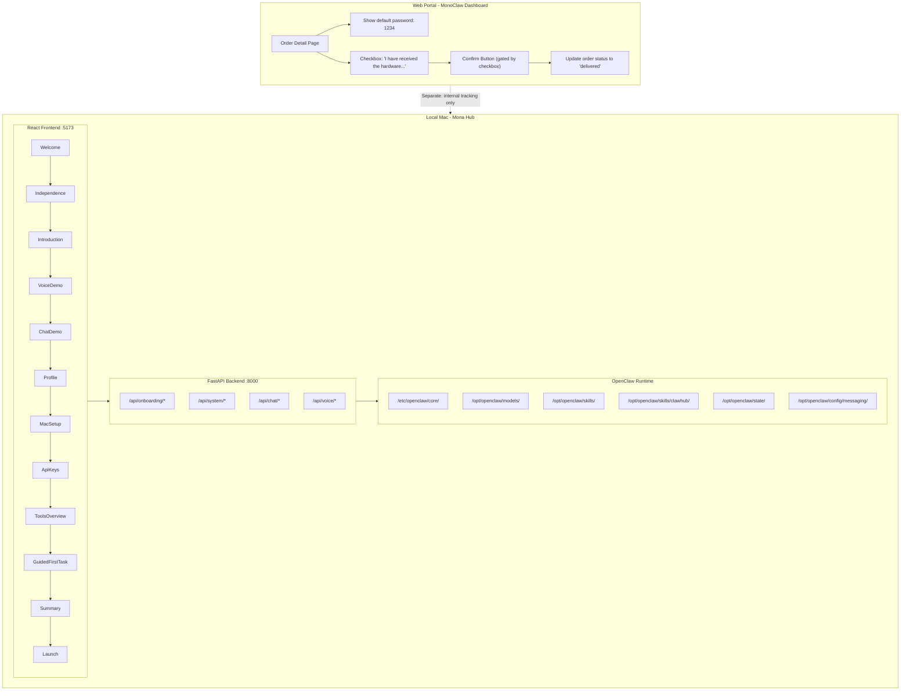
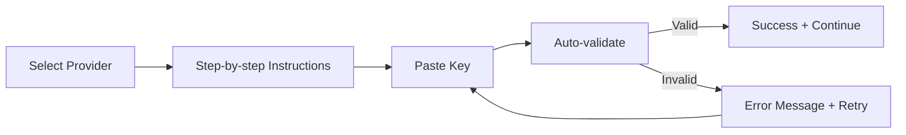

# Mona Onboarding UX Implementation Plan

## Current State Analysis

The codebase has a 13-phase onboarding flow with a comprehensive style guide. Several pieces are missing or need revision:

- **Activation gate to be removed**: The ConfirmReception phase (6-digit code verification via Supabase) is no longer needed. Mona runs directly on the client's Mac, protected by legal contract. Receipt confirmation happens separately on the web dashboard for internal tracking only.
- **Web portal needs updates**: Show default Mac password "1234" to shipped orders; replace "Confirm Device Received" button with a checkbox-gated pattern; remove 6-digit code generation entirely.
- **UI primitives not implemented**: Phase screens import from `@/components/ui` but no `components/ui/` directory exists.
- **API mismatches**: Frontend `api.ts` uses wrong HTTP methods and paths vs. backend routes.
- **Setup script gaps**: No OpenClaw CLI installation, no ClawHub skills, no Telegram/Discord, no `llm-provider.json`.

## Architecture Overview




**Key design decision**: The web portal and local Mac are completely decoupled. The web dashboard confirmation is purely for internal order tracking (updating Supabase status to "delivered"). The Mona onboarding app runs independently with zero network dependencies.

## Onboarding Flow (12 Phases -- No Activation Gate)

The user logs into the Mac with default password "1234" (shown on their web dashboard) and Mona greets them directly. No codes, no verification, no internet required.


| Phase | Screen          | Emotional Beat  | Key Action                                          |
| ----- | --------------- | --------------- | --------------------------------------------------- |
| 0     | Welcome         | Anticipation    | "Your new team member has arrived."                 |
| 1     | Independence    | Empowerment     | "Everything here runs on your Mac. Yours, forever." |
| 2     | Introduction    | Warmth          | Mona introduces herself via Orb + TypeWriter        |
| 3     | VoiceDemo       | Delight         | Hear Mona speak in EN/Cantonese/Mandarin            |
| 4     | ChatDemo        | Connection      | Free-form chat to experience natural conversation   |
| 5     | Profile         | Personalization | Name, language, tone, role                          |
| 6     | MacSetup        | Ownership       | Computer name, iCloud, appearance, notifications    |
| 7     | ApiKeys         | Configuration   | LLM API keys, WhatsApp/Telegram/Discord (optional)  |
| 8     | ToolsOverview   | Confidence      | See all pre-installed tools and ClawHub skills      |
| 9     | GuidedFirstTask | Competence      | Complete a real task together with Mona             |
| 10    | Summary         | Reassurance     | Review everything configured                        |
| 11    | Launch          | Celebration     | "Welcome home."                                     |


---

## Track 1: UI Component Library

**Path**: `[device-cli/mona_hub/frontend/src/components/ui/](device-cli/mona_hub/frontend/src/components/ui/)`

Create the neuomorphic component library that all 12 phase screens depend on. Every component follows the [STYLE_GUIDE.md](device-cli/mona_hub/docs/STYLE_GUIDE.md) specifications exactly.

**Files to create:**

- `index.ts` -- barrel export
- `NeuButton.tsx` -- primary/secondary/ghost variants, sm/md/lg sizes, pill option, loading state
- `NeuCard.tsx` -- default (raised) / inset / flat variants, configurable padding
- `NeuInput.tsx` -- inset neuomorphic input with focus glow, forwardRef for code inputs
- `NeuProgress.tsx` -- track-and-fill with gradient, animated width
- `Orb.tsx` -- Mona's breathing sphere with idle/listening/speaking/thinking/success states
- `TypeWriter.tsx` -- per-character typing with randomized speed, punctuation pauses, cursor blink
- `WaveForm.tsx` -- audio visualization bars responding to amplitude
- `FadeUp.tsx` -- staggered reveal wrapper using Framer Motion childVariants
- `PageTransition.tsx` -- centered full-height layout with AnimatePresence page transitions

Key specs from STYLE_GUIDE.md:

- NeuButton: raised shadow `6px 6px 12px`, hover `8px 8px 16px`, active inset, border-radius 12px
- NeuCard: padding 24px, border-radius 16px, three variants
- NeuInput: inset shadow, height 48px, border-radius 8px, focus ring `0 0 0 3px rgba(124, 154, 142, 0.3)`
- Orb: 120px diameter, radial gradient `var(--accent)`, 4s breathing cycle `scale: [1, 1.03, 1]`
- TypeWriter: 40-80ms/char randomized, 400ms pause at periods, cursor blinks at 530ms

---

## Track 2: Backend API Alignment & Services

**Paths**: `[device-cli/mona_hub/frontend/src/lib/api.ts](device-cli/mona_hub/frontend/src/lib/api.ts)`, `[device-cli/mona_hub/backend/](device-cli/mona_hub/backend/)`

### API Mismatches to Fix


| Frontend call        | Current (wrong)         | Backend expects               |
| -------------------- | ----------------------- | ----------------------------- |
| `saveProfile`        | `POST`                  | `PUT`                         |
| `updateProgress`     | `POST`                  | `PUT`                         |
| `setComputerName`    | `POST`                  | `PUT`                         |
| `setAppearance`      | `POST`                  | `PUT`                         |
| `getInstalledTools`  | `/api/tools/installed`  | `/api/system/installed-tools` |
| `getInstalledModels` | `/api/models/installed` | `/api/system/models`          |
| `startGuidedTask`    | `/api/tasks/guided`     | `/api/chat/guided-task`       |


### Remove Activation Code

- Delete `activateDevice()` from [api.ts](device-cli/mona_hub/frontend/src/lib/api.ts)
- Remove or gut [routers/onboarding.py](device-cli/mona_hub/backend/routers/onboarding.py) `POST /activate` endpoint
- Remove or gut [services/activation.py](device-cli/mona_hub/backend/services/activation.py) (no longer needs Supabase lookup)
- The onboarding state/progress/profile/complete endpoints remain (they persist locally to `/opt/openclaw/state/onboarding.json`)

### New Backend Endpoints Needed

- `GET /api/system/messaging-config` -- return messaging platform configs (WhatsApp, Telegram, Discord)
- `PUT /api/system/messaging-config` -- save messaging credentials
- `GET /api/system/clawhub-skills` -- list installed ClawHub skills
- `GET /api/system/llm-config` -- return LLM provider config (local vs API)
- `PUT /api/system/llm-config` -- save API keys for remote LLM providers

### Service Improvements

- [services/llm.py](device-cli/mona_hub/backend/services/llm.py): Read `/opt/openclaw/state/routing-config.json` and `/opt/openclaw/state/active-work.json` to return real model info; detect API-only mode
- [services/mac_config.py](device-cli/mona_hub/backend/services/mac_config.py): Add `get_clawhub_skills()` reading from `/opt/openclaw/skills/clawhub/`, add `get_messaging_config()` reading from `/opt/openclaw/config/messaging/`
- Add new `services/messaging.py`: Read/write messaging platform configs

---

## Track 3: Onboarding Phase Screen Refinements

**Path**: `[device-cli/mona_hub/frontend/src/components/onboarding/phases/](device-cli/mona_hub/frontend/src/components/onboarding/phases/)`

### Key Changes to the Phase Flow

**Delete [ConfirmReception.tsx](device-cli/mona_hub/frontend/src/components/onboarding/phases/ConfirmReception.tsx)** -- This entire phase is removed. No activation code, no Supabase verification. Mona runs directly.

**Update [App.tsx](device-cli/mona_hub/frontend/src/App.tsx) routes** -- Remove `/welcome/activate` route, update flow so Welcome navigates directly to `/welcome/independence`. Renumber all phase indices in `updateProgress` calls.

**Reword [Independence.tsx](device-cli/mona_hub/frontend/src/components/onboarding/phases/Independence.tsx)** -- Remove the line "That's the last time you'll need the internet for this." (there's no activation step to reference). Replace with messaging that celebrates local ownership from the start:

```
"Everything here runs on your Mac."
"No cloud dependencies. No subscriptions. No tracking."
"You're in full control, forever."
```

The checkmark animation stays (it's a satisfying emotional beat) but the trigger is simply entering this phase, not completing an activation.

**ApiKeys.tsx** -- Complete rewrite with guided setup wizards. See "Guided Setup Wizard Specification" section below for full details. Summary of providers:

- **LLM Providers (Chinese models only)**: DeepSeek, Kimi K2.5 (Moonshot AI), GLM-5 (Zhipu AI)
- **Messaging Platforms**: WhatsApp (Twilio), Telegram (BotFather), Discord (Developer Portal)
- **Email**: SMTP configuration (existing, keep as-is)
- Each provider gets a multi-step wizard with numbered instructions, platform links, auto-validation, and informative error handling
- Each with clear "Skip" option and "You can always set this up later -- just ask Mona" messaging

**ToolsOverview.tsx** -- Show three categories:

- Industry-specific tools (from order, already installed)
- Persona tools (from order, already installed)
- ClawHub skills (pre-installed popular skills, with counts and descriptions)
- Include note: "Mona can find and install new skills anytime -- just ask."

**GuidedFirstTask.tsx** -- Make the guided task contextual to the user's industry. Example tasks:

- Real estate: "Let's draft a property listing together"
- Immigration: "Let's review a visa application checklist"
- Generic: "Let's organize your workspace and send a test message"

---

## Guided Setup Wizard Specification (ApiKeys Phase)

The current [ApiKeys.tsx](device-cli/mona_hub/frontend/src/components/onboarding/phases/ApiKeys.tsx) is a simple accordion with text fields. It must be replaced with a multi-step guided wizard for each service. The pattern is the same for every provider:




### Shared Wizard Component: `GuidedKeySetup`

Create a reusable `GuidedKeySetup` component in `frontend/src/components/ui/GuidedKeySetup.tsx` that accepts a provider config and renders:

1. **Provider header** -- icon, name, one-line description
2. **Numbered step cards** -- each step is a `NeuCard` with a step number badge, instruction text, and optional external link button ("Open Platform ->")
3. **Key input area** -- `NeuInput` with paste-friendly UX (large monospace font, "Paste your key here" placeholder)
4. **Auto-validation** -- on blur or explicit "Verify" button click, call a backend endpoint (`POST /api/system/validate-key`) that tests the key against the provider's API
5. **Validation states**:
  - **Checking**: pulsing accent border, "Verifying..." text
  - **Valid**: green border, checkmark icon, "Key verified successfully" text, auto-advance after 1.5s
  - **Invalid**: red border, clear error message (see per-provider errors below), "Try again" prompt
6. **Skip option** -- "Skip -- you can always set this up later by asking Mona" ghost button at bottom

### Backend: `POST /api/system/validate-key`

New endpoint that accepts `{ provider: string, credentials: Record<string, string> }` and validates:

- **DeepSeek**: `GET https://api.deepseek.com/models` with `Authorization: Bearer <key>` -- 200 = valid
- **Kimi K2.5**: `GET https://api.moonshot.cn/v1/models` with `Authorization: Bearer <key>` -- 200 = valid
- **GLM-5**: `GET https://open.bigmodel.cn/api/paas/v4/models` with `Authorization: Bearer <key>` -- 200 = valid (Zhipu uses JWT-based auth, backend generates JWT from the API key)
- **WhatsApp (Twilio)**: `GET https://api.twilio.com/2010-04-01/Accounts/{sid}` with basic auth -- 200 = valid
- **Telegram**: `GET https://api.telegram.org/bot{token}/getMe` -- 200 = valid
- **Discord**: `GET https://discord.com/api/v10/users/@me` with `Authorization: Bot <token>` -- 200 = valid

Returns `{ valid: boolean, error?: string, details?: string }`.

### LLM Provider Configs

The LLM section shows a provider selector first (radio cards), then the guided steps for the selected provider. If local models are detected (from `/opt/openclaw/state/active-work.json`), show a dismissible note: "Your Mac already has local models installed. Cloud models are optional and useful for heavier tasks."

#### DeepSeek

```typescript
{
  id: "deepseek",
  name: "DeepSeek",
  description: "High-performance reasoning and coding models from DeepSeek.",
  platformUrl: "https://platform.deepseek.com",
  steps: [
    {
      title: "Create a DeepSeek account",
      body: "Visit the DeepSeek Platform and sign up with your email or Google account.",
      link: { label: "Open DeepSeek Platform", url: "https://platform.deepseek.com" },
    },
    {
      title: "Add a payment method",
      body: "Go to Billing in your dashboard sidebar. DeepSeek uses pay-as-you-go pricing — you only pay for what you use.",
      link: { label: "Open Billing Page", url: "https://platform.deepseek.com/usage" },
    },
    {
      title: "Create an API key",
      body: "Go to API Keys in your dashboard sidebar. Click 'Create API Key', give it a name (e.g. 'Mona'), and copy the key. It starts with sk- and is only shown once.",
      link: { label: "Open API Keys Page", url: "https://platform.deepseek.com/api_keys" },
    },
    {
      title: "Paste your key below",
      body: "Mona will verify the key automatically.",
    },
  ],
  fields: [
    { key: "api_key", label: "API Key", placeholder: "sk-...", type: "password" },
  ],
  validationErrors: {
    "401": "This API key wasn't recognised by DeepSeek. Please check you copied the full key (it starts with sk-).",
    "402": "Your DeepSeek account needs a payment method. Please add one in the Billing section, then try again.",
    "network": "Couldn't reach DeepSeek's servers. Please check your internet connection and try again.",
  },
}
```

#### Kimi K2.5 (Moonshot AI)

```typescript
{
  id: "kimi",
  name: "Kimi K2.5",
  description: "Moonshot AI's multimodal model with 256K context window — great for long documents.",
  platformUrl: "https://platform.moonshot.cn",
  steps: [
    {
      title: "Create a Moonshot AI account",
      body: "Visit the Moonshot AI Platform and register with your email address.",
      link: { label: "Open Moonshot AI Platform", url: "https://platform.moonshot.cn" },
    },
    {
      title: "Top up your account",
      body: "Navigate to Billing in your dashboard. Moonshot AI uses prepaid credits — add funds to start using the API.",
      link: { label: "Open Billing", url: "https://platform.moonshot.cn/console/billing" },
    },
    {
      title: "Generate an API key",
      body: "Go to the API Keys section in your dashboard. Click 'Create New Key', name it, and copy the key immediately.",
      link: { label: "Open API Keys", url: "https://platform.moonshot.cn/console/api-keys" },
    },
    {
      title: "Paste your key below",
      body: "Mona will verify the key automatically.",
    },
  ],
  fields: [
    { key: "api_key", label: "API Key", placeholder: "Your Moonshot API key", type: "password" },
  ],
  validationErrors: {
    "401": "This key wasn't recognised by Moonshot AI. Please check you copied the full key.",
    "402": "Your Moonshot AI account has insufficient credits. Please top up in the Billing section.",
    "network": "Couldn't reach Moonshot AI's servers. Please check your internet connection.",
  },
}
```

#### GLM-5 (Zhipu AI)

```typescript
{
  id: "glm5",
  name: "GLM-5",
  description: "Zhipu AI's flagship 745B model — state-of-the-art coding and reasoning.",
  platformUrl: "https://z.ai",
  steps: [
    {
      title: "Create a Zhipu AI account",
      body: "Visit the Z.AI platform and register. You can sign up with your email or phone number.",
      link: { label: "Open Z.AI Platform", url: "https://z.ai/model-api" },
    },
    {
      title: "Add credits to your account",
      body: "Go to the Billing page. Zhipu AI offers a free tier to get started — you can top up later.",
      link: { label: "Open Billing", url: "https://z.ai/manage-apikey/billing" },
    },
    {
      title: "Create an API key",
      body: "Navigate to API Key Management. Click 'Create API Key' and copy the generated key.",
      link: { label: "Open API Key Management", url: "https://z.ai/manage-apikey/apikey-list" },
    },
    {
      title: "Paste your key below",
      body: "Mona will verify the key automatically.",
    },
  ],
  fields: [
    { key: "api_key", label: "API Key", placeholder: "Your Zhipu AI API key", type: "password" },
  ],
  validationErrors: {
    "401": "This key wasn't recognised by Zhipu AI. Please check you copied the full key from the API Key Management page.",
    "402": "Your Zhipu AI account needs credits. Please visit the Billing page to add funds.",
    "network": "Couldn't reach Zhipu AI's servers. Please check your internet connection.",
  },
}
```

### Messaging Platform Configs

Each messaging platform is a separate expandable card. The user can set up any, all, or none.

#### WhatsApp (Twilio)

```typescript
{
  id: "whatsapp",
  name: "WhatsApp",
  description: "Let Mona send and receive WhatsApp messages on your behalf via Twilio.",
  steps: [
    {
      title: "Create a Twilio account",
      body: "Visit Twilio and sign up. You'll get a free trial with test credits to start.",
      link: { label: "Open Twilio", url: "https://www.twilio.com/try-twilio" },
    },
    {
      title: "Set up a Meta Business account",
      body: "Twilio's WhatsApp integration requires a Meta Business Manager account. Create one if you don't have it.",
      link: { label: "Open Meta Business", url: "https://business.facebook.com" },
    },
    {
      title: "Register a WhatsApp sender",
      body: "In Twilio Console, go to Messaging > Senders > WhatsApp Senders. Click 'Create new sender' and follow the guided setup to link your WhatsApp Business account.",
      link: { label: "Open Twilio WhatsApp Setup", url: "https://console.twilio.com/us1/develop/sms/senders/whatsapp-senders" },
    },
    {
      title: "Copy your credentials",
      body: "From your Twilio Console dashboard, copy your Account SID and Auth Token. These are shown at the top of the console homepage.",
      link: { label: "Open Twilio Console", url: "https://console.twilio.com" },
    },
    {
      title: "Paste your credentials below",
      body: "Mona will verify the connection automatically.",
    },
  ],
  fields: [
    { key: "account_sid", label: "Account SID", placeholder: "AC..." },
    { key: "auth_token", label: "Auth Token", placeholder: "Your auth token", type: "password" },
  ],
  validationErrors: {
    "401": "These Twilio credentials weren't accepted. Please double-check your Account SID and Auth Token from the Twilio Console dashboard.",
    "network": "Couldn't reach Twilio. Please check your internet connection.",
  },
}
```

#### Telegram

```typescript
{
  id: "telegram",
  name: "Telegram",
  description: "Let Mona send and receive Telegram messages through a dedicated bot.",
  steps: [
    {
      title: "Open Telegram and find @BotFather",
      body: "BotFather is Telegram's official tool for creating bots. Open Telegram (desktop or mobile) and search for @BotFather.",
      link: { label: "Open BotFather in Telegram", url: "https://t.me/BotFather" },
    },
    {
      title: "Create a new bot",
      body: "Send /newbot to BotFather. Choose a display name (e.g. 'Mona Assistant') and a username ending in 'bot' (e.g. 'mona_assistant_bot').",
    },
    {
      title: "Copy the bot token",
      body: "BotFather will reply with your bot's API token. It looks like: 7123456789:AAHdqTcvCH1vGWJxfSe... Copy the entire token.",
    },
    {
      title: "Paste your token below",
      body: "Mona will verify the bot is working.",
    },
  ],
  fields: [
    { key: "bot_token", label: "Bot Token", placeholder: "7123456789:AAHdqTcvCH1v...", type: "password" },
  ],
  validationErrors: {
    "401": "This token wasn't recognised by Telegram. Please check you copied the full token from BotFather (it contains a colon).",
    "network": "Couldn't reach Telegram's servers. Please check your internet connection.",
  },
}
```

#### Discord

```typescript
{
  id: "discord",
  name: "Discord",
  description: "Let Mona join your Discord server and respond to messages.",
  steps: [
    {
      title: "Open the Discord Developer Portal",
      body: "Visit the Developer Portal and log in with your Discord account.",
      link: { label: "Open Developer Portal", url: "https://discord.com/developers/applications" },
    },
    {
      title: "Create a new application",
      body: "Click 'New Application', give it a name (e.g. 'Mona'), and click 'Create'.",
    },
    {
      title: "Create the bot and copy the token",
      body: "Go to the 'Bot' tab in the sidebar. Click 'Reset Token', then 'Copy'. Save this token — it's only shown once.",
    },
    {
      title: "Invite the bot to your server",
      body: "Go to the 'OAuth2' tab. Under 'Scopes', select 'bot'. Under 'Bot Permissions', select 'Send Messages' and 'Read Message History'. Copy the generated URL and open it in your browser to invite the bot.",
    },
    {
      title: "Paste your token below",
      body: "Mona will verify the bot is working.",
    },
  ],
  fields: [
    { key: "bot_token", label: "Bot Token", placeholder: "Your Discord bot token", type: "password" },
  ],
  validationErrors: {
    "401": "This token wasn't recognised by Discord. Please check you copied it from the Bot tab in the Developer Portal.",
    "network": "Couldn't reach Discord's servers. Please check your internet connection.",
  },
}
```

### UX Design for the Wizard

The ApiKeys phase becomes a two-section layout:

**Section 1: Cloud Language Models** (with radio-card provider selection)

- Heading: "Choose a cloud model provider"
- Subheading: "Optional — your Mac already has local models. Cloud models handle heavier tasks."
- Three radio cards: DeepSeek / Kimi K2.5 / GLM-5, each with name + one-line description
- Selecting a card reveals the guided steps below it (smooth expand animation)
- "Skip — I'll use local models only" ghost button

**Section 2: Messaging Platforms** (expandable cards, like current UI)

- Heading: "Connect messaging platforms"
- Subheading: "Let Mona send and receive messages on your behalf."
- Three expandable `NeuCard`s: WhatsApp / Telegram / Discord
- Each expands to show the guided steps
- Plus the existing Email SMTP card (kept as-is)

**Bottom**: "Continue" button + "Skip all — I'll set these up later" ghost link

---

## Track 4: Setup Script -- OpenClaw CLI, ClawHub Skills, Messaging

**Path**: `[device-cli/openclaw_setup/provisioner.py](device-cli/openclaw_setup/provisioner.py)`

### New Provisioning Steps

Add the following steps to `Provisioner.run()` after `_install_industry_skills()`:

**4a. Install ClawHub CLI and Skills**

Add `_install_clawhub_skills()` method:

```python
def _install_clawhub_skills(self):
    """Install ClawHub CLI and popular community skills."""
    user = _real_user()
    # Install clawhub CLI globally
    subprocess.run(["sudo", "-u", user, "npm", "i", "-g", "clawhub"], check=True)
    
    # Pre-install vetted high-trust skills
    skills = [
        "self-improving-agent",   # 132 stars, 15,962 downloads
        "proactive-agent",        # 49 stars, 7,010 downloads
        "gog",                    # 48 stars, 14,313 downloads
        "clawdbot-documentation-expert",  # 47 stars
        "caldav-calendar",        # 45 stars
        "agent-browser",          # 43 stars, 11,836 downloads
        "wacli",                  # 37 stars, 16,415 downloads
        "byterover",              # 36 stars, 16,004 downloads
        "capability-evolver",     # 33 stars, 35,581 downloads
        "auto-updater-skill",     # 31 stars, 6,601 downloads
        "summarize",              # 28 stars, 10,956 downloads
        "humanize-ai-text",       # 20 stars, 8,771 downloads
        "find-skills",            # 15 stars, 7,077 downloads - CRITICAL for self-service
        "github",                 # 15 stars, 10,611 downloads
        "tavily-web-search",      # 10 stars, 8,142 downloads
        "obsidian",               # 12 stars, 5,791 downloads
    ]
    for skill in skills:
        subprocess.run(
            ["sudo", "-u", user, "npx", "clawhub@latest", "install", skill],
            capture_output=True,
        )
```

Selection criteria: Only skills with 10+ stars and high downloads, avoiding anything flagged during the ClawHavoc incident. The **Find Skills** skill is critical -- it enables Mona to discover and install new skills on demand when users ask.

**4b. Configure Messaging Platforms**

Add `_setup_messaging_config()` method to create config stubs at `/opt/openclaw/config/messaging/`:

```
/opt/openclaw/config/messaging/
  whatsapp.json    # { "enabled": false, "provider": "twilio", "api_key": "", ... }
  telegram.json    # { "enabled": false, "bot_token": "", ... }
  discord.json     # { "enabled": false, "bot_token": "", "guild_id": "", ... }
  email.json       # { "enabled": false, "smtp_host": "", ... }
```

**4c. Update AGENTS.md Template**

In `_get_agents_md()`, add Telegram and Discord alongside WhatsApp:

```markdown
### Communication Tools
- send_whatsapp: Business API (Twilio/WhatsApp Business)
- send_telegram: Telegram Bot API (direct messaging)
- send_discord: Discord Bot API (channel and DM messaging)
- send_email: SMTP integration (credentials in Keychain)
- schedule_meeting: Calendar integration
```

**4d. Create llm-provider.json**

In `_write_core_configs()` or a new method, write `/opt/openclaw/state/llm-provider.json`:

```json
{
  "offline_mode": "local_only",       // or "api_only" or "hybrid"
  "max_tokens": 4096,
  "default_provider": "mlx",          // or "openai", "anthropic"
  "api_keys": {},
  "local_models_path": "/opt/openclaw/models"
}
```

Set `offline_mode` based on `order_spec.llm_plan.plan_type`: `"local_only"` for local plans, `"api_only"` for API-only, `"hybrid"` for max bundle.

**4e. Add OpenClaw CLI Configuration Step**

After creating directories, write a global OpenClaw config at `~/.openclaw/config.json` that references all local paths:

```json
{
  "skills_dir": "/opt/openclaw/skills",
  "clawhub_skills_dir": "/opt/openclaw/skills/clawhub",
  "models_dir": "/opt/openclaw/models",
  "state_dir": "/opt/openclaw/state",
  "workspace": "~/OpenClawWorkspace",
  "messaging_config_dir": "/opt/openclaw/config/messaging"
}
```

---

## Track 5: Web Portal -- Password Display + Checkbox Confirmation

**Paths**: [order-detail-content.tsx](web/src/app/[locale]/(client)/dashboard/orders/[id]/order-detail-content.tsx), [confirm-received/route.ts](web/src/app/api/orders/confirm-received/route.ts)

### 5a. Show Default Mac Password on Shipped Orders

When `order.status === "shipped"`, display a prominent card showing the default Mac login password:

```tsx
{(order.status === "shipped" || order.status === "delivered") && (
  <Card className="mb-8 border-blue-500/30 bg-blue-50 dark:bg-blue-950/20">
    <CardHeader>
      <CardTitle className="flex items-center gap-2">
        <Monitor className="h-5 w-5 text-blue-600" />
        Your Mac Login Credentials
      </CardTitle>
    </CardHeader>
    <CardContent className="space-y-3">
      <p className="text-sm text-muted-foreground">
        Use this password to log into your new Mac for the first time.
      </p>
      <div className="flex flex-col items-center gap-1 rounded-lg border bg-background p-4">
        <p className="text-xs font-medium uppercase tracking-wider text-muted-foreground">
          Default Password
        </p>
        <p className="font-mono text-3xl font-bold tracking-[0.3em]">1234</p>
      </div>
      <p className="text-sm font-medium text-orange-600 dark:text-orange-400">
        Please change this password to something unique after your first login.
      </p>
    </CardContent>
  </Card>
)}
```

### 5b. Checkbox-Gated Receipt Confirmation

Replace the current "Confirm Device Received" button (lines 153-169) with a checkbox + button pattern. Add `receiptConfirmed` state (`useState<boolean>(false)`) and import `Checkbox` from shadcn/ui:

```tsx
{order.status === "shipped" && !confirmed && (
  <Card className="mb-8 border-primary/30 bg-primary/5">
    <CardHeader>
      <CardTitle className="flex items-center gap-2">
        <Package className="h-5 w-5 text-primary" />
        Your device has been shipped!
      </CardTitle>
    </CardHeader>
    <CardContent className="space-y-4">
      <p className="text-sm text-muted-foreground">
        Once you have received and logged into your Mac, please confirm below.
      </p>
      <label className="flex items-start gap-3 cursor-pointer">
        <Checkbox
          checked={receiptConfirmed}
          onCheckedChange={setReceiptConfirmed}
          className="mt-0.5"
        />
        <span className="text-sm leading-relaxed">
          I have received the hardware from Sentimento and hereby
          confirming my receipt.
        </span>
      </label>
      <Button
        onClick={handleConfirmReceived}
        disabled={!receiptConfirmed || confirmLoading}
      >
        {confirmLoading ? "Confirming..." : "Confirm"}
      </Button>
    </CardContent>
  </Card>
)}
```

### 5c. Simplify the API Route

Update [confirm-received/route.ts](web/src/app/api/orders/confirm-received/route.ts):

- Remove the `generateConfirmationCode()` function entirely
- Remove `confirmation_code` from the `hardware_config` update
- Just update `status` to `"delivered"` and insert status history
- Return `{ success: true }` instead of `{ confirmation_code }`

The `handleConfirmReceived` function in the frontend just needs to set a `confirmed` boolean state on success, rather than displaying a code.

### 5d. Post-Confirmation Display

After confirmation, show a simple success card instead of a code display:

```tsx
{(confirmed || order.status === "delivered") && (
  <Card className="mb-8 border-green-500/30 bg-green-50 dark:bg-green-950/20">
    <CardHeader>
      <CardTitle className="flex items-center gap-2">
        <Check className="h-5 w-5 text-green-600" />
        Receipt confirmed
      </CardTitle>
    </CardHeader>
    <CardContent>
      <p className="text-sm text-muted-foreground">
        Thank you for confirming. Your Mona agent is ready to use on your Mac.
        If you need help, email team@sentimento.dev
      </p>
    </CardContent>
  </Card>
)}
```

---

## Track 6: Style Guide Updates

**Path**: `[device-cli/mona_hub/docs/STYLE_GUIDE.md](device-cli/mona_hub/docs/STYLE_GUIDE.md)`

The existing style guide is already comprehensive (869 lines covering colors, typography, spacing, neuomorphism, components, animations, personality, accessibility, and responsiveness). Minor additions needed:

- Add messaging platform icon specs (WhatsApp green, Telegram blue, Discord blurple -- but presented as muted accent variants to maintain the neutral palette)
- Add ClawHub skills card component spec for ToolsOverview
- Add checkbox component spec (neuomorphic checkbox with inset unchecked / raised checked states)
- Document the onboarding flow phases and their emotional pacing in the guide

---

## Parallelization Strategy

These tracks can be executed in parallel by sub-agents:

```mermaid
gantt
    title Implementation Parallelization
    dateFormat X
    axisFormat %s

    section Track1
    UI Components Library          :t1, 0, 3
    
    section Track2
    Backend API Fixes + Cleanup    :t2, 0, 2
    New Endpoints and Services     :t2b, 2, 4
    
    section Track3
    Phase Screen Revisions         :t3, 3, 5
    
    section Track4
    Setup Script - ClawHub         :t4a, 0, 2
    Setup Script - Messaging       :t4b, 0, 2
    Setup Script - LLM Config      :t4c, 0, 1
    
    section Track5
    Web Portal Overhaul            :t5, 0, 2
    
    section Track6
    Style Guide Updates            :t6, 0, 1
```




- **Tracks 1, 2, 4, 5, 6** have zero dependencies and can start immediately in parallel
- **Track 3** depends on Track 1 (UI components must exist before screens can use them)
- Within Track 4, all three sub-tasks (ClawHub, messaging, LLM config) are independent

### Sub-Agent Assignments


| Agent | Track             | Scope                                                                      | Files                                                                         |
| ----- | ----------------- | -------------------------------------------------------------------------- | ----------------------------------------------------------------------------- |
| A     | Track 1           | UI component library (10 components)                                       | `frontend/src/components/ui/*.tsx`                                            |
| B     | Track 2           | Backend API alignment, remove activation, new endpoints                    | `frontend/src/lib/api.ts`, `backend/routers/*.py`, `backend/services/*.py`    |
| C     | Track 4           | Setup script enhancements                                                  | `openclaw_setup/provisioner.py`, `openclaw_setup/order_fetcher.py`            |
| D     | Track 5 + 6       | Web portal overhaul + style guide updates                                  | `web/.../order-detail-content.tsx`, `web/.../route.ts`, `docs/STYLE_GUIDE.md` |
| E     | Track 3 (after A) | Remove ConfirmReception, reword Independence, update routes, refine phases | `frontend/src/components/onboarding/phases/*.tsx`, `App.tsx`                  |


