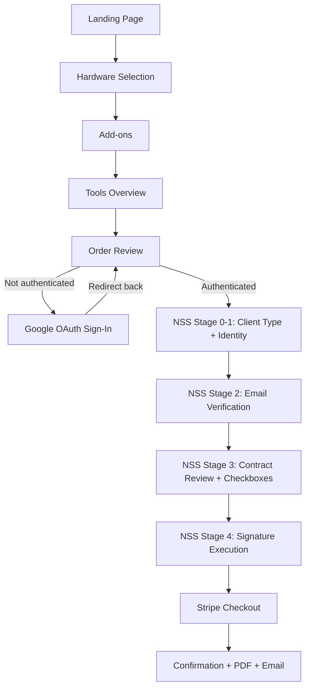

# Native Signing System (NSS) Implementation Plan

## Architecture Overview

The NSS inserts a contract-signing pipeline between the existing order configuration (guest-friendly) and Stripe payment. The key integration points are:




Guest order state persists across auth via existing `localStorage` (`monoclaw_order` key in `[web/src/lib/checkout-context.tsx](web/src/lib/checkout-context.tsx)`). No additional state migration needed.

---

## 1. Database Schema (Migration 004)

Create `[supabase/migrations/004_signing_system.sql](supabase/migrations/004_signing_system.sql)` with:

### New Enums

- `client_type`: `'individual'`, `'entity'`
- `signing_status`: `'pending_email'`, `'pending_signature'`, `'completed'`, `'expired'`
- `audit_event_type`: `'email_sent'`, `'email_verified'`, `'contract_viewed'`, `'checkbox_toggled'`, `'signature_submitted'`, `'pdf_generated'`, `'email_delivered'`

### Table: `signing_sessions`

- `id uuid PRIMARY KEY DEFAULT gen_random_uuid()`
- `user_id uuid REFERENCES auth.users(id)` -- link to authenticated user
- `client_type client_type NOT NULL`
- `legal_name text NOT NULL`
- `entity_jurisdiction text` -- nullable, entities only
- `br_number text` -- nullable, HK BR number
- `representative_name text` -- nullable, entities only
- `representative_title text` -- nullable, entities only
- `email text NOT NULL`
- `email_verified_at timestamptz`
- `verification_code_hash text` -- bcrypt hash of 6-digit code
- `verification_expires_at timestamptz`
- `verification_attempts integer DEFAULT 0`
- `ip_address inet`
- `user_agent text`
- `template_version text`
- `agreement_checks jsonb DEFAULT '[]'`
- `signature_font_text text`
- `signed_at timestamptz`
- `status signing_status DEFAULT 'pending_email'`
- `immutable_pdf_path text`
- `audit_chain_hash text`
- `created_at timestamptz DEFAULT now()`
- `updated_at timestamptz DEFAULT now()`

### Table: `audit_trail`

- `id uuid PRIMARY KEY DEFAULT gen_random_uuid()`
- `session_id uuid REFERENCES signing_sessions(id)`
- `event_type audit_event_type NOT NULL`
- `timestamp timestamptz DEFAULT now()`
- `ip_address inet`
- `user_agent text`
- `metadata jsonb`
- `previous_hash text`
- `current_hash text`

### Table: `contract_templates`

- `id uuid PRIMARY KEY DEFAULT gen_random_uuid()`
- `version text NOT NULL UNIQUE`
- `html_content text NOT NULL`
- `created_at timestamptz DEFAULT now()`
- `is_active boolean DEFAULT false`

### Linking `orders` to `signing_sessions`

- `ALTER TABLE orders ADD COLUMN signing_session_id uuid REFERENCES signing_sessions(id)`

### RLS Policies

- `**audit_trail**`: `ENABLE INSERT ONLY` for authenticated users (no SELECT/UPDATE/DELETE for non-admins). Admins get SELECT + INSERT.
- `**signing_sessions**`: Users can SELECT/INSERT where `user_id = auth.uid()`. Admins get full access.
- `**contract_templates**`: SELECT for all authenticated users. INSERT/UPDATE for admins only.
- **Signed PDFs storage bucket**: Prevent deletion policy on `storage.objects`.

### Hash Chain Trigger

A `BEFORE INSERT` trigger on `audit_trail` that:

1. Fetches the `current_hash` of the most recent row for the same `session_id`
2. Sets `previous_hash` to that value (or `'genesis'` if first entry)
3. Computes `current_hash = SHA-256(session_id || event_type || timestamp || ip_address || metadata || previous_hash)` using `pgcrypto`

```sql
CREATE EXTENSION IF NOT EXISTS pgcrypto;

CREATE OR REPLACE FUNCTION calculate_audit_hash()
RETURNS TRIGGER AS $$ ... $$;

CREATE TRIGGER audit_trail_hash_chain
  BEFORE INSERT ON audit_trail
  FOR EACH ROW EXECUTE FUNCTION calculate_audit_hash();
```

### Seed: Initial Contract Template

Insert a `v1.0` contract template with placeholder HTML content into `contract_templates`.

---

## 2. TypeScript Types

Update `[web/src/types/database.ts](web/src/types/database.ts)` with:

- `ClientType`, `SigningStatus`, `AuditEventType` union types
- `SigningSession`, `AuditTrailEntry`, `ContractTemplate` interfaces
- Update `Order` interface to include optional `signing_session_id`
- Update `Database` type with new table definitions

---

## 3. New Dependencies

Add to `[web/package.json](web/package.json)`:

- `**resend**` -- email sending (verification codes + signed contract delivery)
- `**pdf-lib**` -- serverless-friendly PDF generation
- `**@fontsource/dancing-script**` (or similar) -- signature font for PDF embedding

---

## 4. Backend API Routes

All new routes under `web/src/app/api/signing/`:

### `POST /api/signing/create-session`

- **Auth required**: Yes (Supabase session)
- **Input**: `client_type`, `legal_name`, `entity_jurisdiction?`, `br_number?`, `representative_name?`, `representative_title?`, `email`
- **Action**: Insert into `signing_sessions` with `status: 'pending_email'`, capture `ip_address` (from `x-forwarded-for` header) and `user_agent`
- **Validation**: BR number format (8 or 11 digits), required fields per client_type
- **Returns**: `{ session_id }`

### `POST /api/signing/send-verification`

- **Input**: `session_id`
- **Rate limit**: Max 3 attempts per email per hour (check `verification_attempts`)
- **Action**: Generate 6-digit code, store bcrypt hash + expiry (15 min) in session, send via Resend
- **Audit log**: `email_sent`

### `POST /api/signing/verify-code`

- **Input**: `session_id`, `code`
- **Action**: Compare against hash, check expiry, update `email_verified_at` and `status: 'pending_signature'`
- **Rate limit**: Increment `verification_attempts`, lock after 3 failures
- **Audit log**: `email_verified`

### `POST /api/signing/log-event`

- **Input**: `session_id`, `event_type`, `metadata`
- **Action**: Insert into `audit_trail` (hash chain handled by trigger)
- **Used for**: `contract_viewed`, `checkbox_toggled` events

### `POST /api/signing/submit-signature`

- **Input**: `session_id`, `signature_font_text`, `agreement_checks`
- **Validation**: All 3 checkboxes must be true, `signature_font_text` must match expected name
- **Action**: Update session with signature data, `signed_at: now()`, `status: 'completed'`
- **Triggers**: PDF generation + email (can be async)
- **Audit log**: `signature_submitted`

### `POST /api/signing/generate-pdf`

- **Internal route** (called after signature submission)
- **Action**: 
  1. Fetch signing session + active contract template
  2. Merge template variables (legal_name, representative_name, etc.)
  3. Generate PDF using `pdf-lib` with embedded signature font
  4. Calculate SHA-256 hash of PDF buffer
  5. Upload to Supabase Storage (`signed-contracts` private bucket)
  6. Update session: `immutable_pdf_path`, `audit_chain_hash`
  7. Send contract email via Resend (PDF attached + BCC admin)
- **Audit log**: `pdf_generated` -> `email_delivered`

### Update: `POST /api/checkout`

- Add `signing_session_id` to Stripe session metadata
- Set `client_reference_id` to the authenticated user's ID (fix the current placeholder UUID bug)

### Update: `POST /api/webhooks/stripe`

- Read `signing_session_id` from metadata, set on the created order
- Use authenticated user's actual ID for `client_id`

---

## 5. Frontend: Checkout Flow Updates

### Auth Gate on Review Page

Modify `[web/src/app/[locale]/(checkout)/order/review/review-step.tsx](web/src/app/[locale]/(checkout)`/order/review/review-step.tsx):

- Use Supabase client to check auth status
- **Not authenticated**: Replace "Pay" button with "Sign in to Continue" that redirects to `/auth/sign-in?next=/order/review`
- **Authenticated, no signed contract**: Replace "Pay" button with "Continue to Contract" linking to `/order/contract`
- **Authenticated + signed contract**: Show existing "Pay" button (proceeds to Stripe)

The sign-in form (`[sign-in-form.tsx](web/src/app/[locale]/(client)`/auth/sign-in/sign-in-form.tsx)) already supports `redirectTo`. The auth callback (`[route.ts](web/src/app/auth/callback/route.ts)`) already handles the `next` query param. localStorage persists the order state across the OAuth round-trip.

### Checkout Context Update

Extend `[web/src/lib/checkout-context.tsx](web/src/lib/checkout-context.tsx)`:

- Add `signingSessionId: string | null` to `OrderState`
- Add `signingComplete: boolean` derived state
- Add `setSigningSession(id: string)` method

### Updated Checkout Steps

Update `[web/src/components/checkout-steps.tsx](web/src/components/checkout-steps.tsx)` to show 6 steps:

1. Hardware, 2. Add-ons, 3. Tools, 4. Review, 5. Contract, 6. Payment

---

## 6. Frontend: NSS Contract Flow (New Pages)

Create new pages under `web/src/app/[locale]/(checkout)/order/contract/`:

### Stage 0+1: `/order/contract/page.tsx` + `contract-identity-step.tsx`

- **Client type selector**: Two cards ("Individual Client" / "Corporate Client")
- **Conditional form** based on selection:
  - Individual: Full Legal Name + Email
  - Entity: Company Legal Name, Jurisdiction (dropdown), BR Number (validated), Representative Name, Representative Title, Email
- **Submit**: calls `POST /api/signing/create-session`, stores `signingSessionId` in checkout context
- **Redirects to**: `/order/contract/verify`

### Stage 2: `/order/contract/verify/page.tsx` + `verify-step.tsx`

- Shows "Enter the 6-digit code sent to {email}"
- 6 individual digit inputs (auto-advance pattern)
- "Resend code" link with cooldown timer
- On verify: calls `POST /api/signing/verify-code`
- **Redirects to**: `/order/contract/review`

### Stage 3: `/order/contract/review/page.tsx` + `contract-review-step.tsx`

- Fetches active contract template, renders with merged variables
- Read-only HTML display in a scrollable container
- **Three mandatory checkboxes** (each toggle calls `POST /api/signing/log-event` with `checkbox_toggled`)
- **10-second minimum review timer** (progress indicator, "Sign" button disabled until elapsed)
- "Sign" button enabled only when all checkboxes checked AND timer elapsed
- **Redirects to**: `/order/contract/sign`

### Stage 4: `/order/contract/sign/page.tsx` + `signature-step.tsx`

- **Preview pane**: Name rendered in signature font (e.g., Dancing Script or Great Vibes)
  - Individual: shows `legal_name`
  - Entity: shows `representative_name`
- **Confirmation text**: "Your signature will appear as:" + font preview
- **Input field**: Must type their name exactly as displayed (case-sensitive match validation)
- **"Sign Contract" button**: calls `POST /api/signing/submit-signature`
- On success: triggers async PDF generation, redirects back to `/order/review` (which now shows the "Pay" button)

---

## 7. Resend Integration

- Add `RESEND_API_KEY` to environment variables
- Create a shared Resend utility at `web/src/lib/resend.ts`:
  - `sendVerificationCode(email, code)` -- minimal plain text + HTML
  - `sendSignedContract(email, legalName, contractId, pdfBuffer)` -- rich HTML + PDF attachment + BCC admin
- Email sender: `Native Signing System <contracts@sentimento.tech>` (requires Resend domain verification)

---

## 8. PDF Generation with pdf-lib

Create `web/src/lib/pdf-generator.ts`:

1. **Create PDF document** from scratch using `PDFDocument.create()`
2. **Embed fonts**: Standard font for body, custom font (e.g., Dancing Script TTF) for signature
3. **Render contract**: Parse the HTML template into text sections, lay out on pages with proper margins, headers, and page numbers
4. **Signature block**: Render the signature in the embedded script font, with date and metadata
5. **Embed metadata**: Set PDF `title`, `author`, `subject`, `creationDate`, and custom properties (`signing_session_id`, `sha256_hash`, `template_version`)
6. **Return**: PDF as `Uint8Array` for storage upload and email attachment
7. **Calculate SHA-256**: Use Node.js `crypto` module on the final PDF buffer

---

## 9. Supabase Storage

- Create a `signed-contracts` private bucket
- RLS policy to prevent deletion (WORM semantics)
- Files stored at path: `contracts/{signing_session_id}/contract-{id}.pdf`
- Only service role can write; authenticated users can read their own via a signed URL API

---

## 10. Security Measures

- **Rate limiting**: Verification code endpoint limited to 3 attempts per email per hour (tracked in `signing_sessions.verification_attempts`)
- **Session timeout**: If `signing_sessions.updated_at` is >30 minutes stale and status is not `completed`, mark as `expired` (can be a cron or checked on access)
- **Template version locking**: When contract review starts, record `template_version` on the session; always render that version even if a newer template is activated
- **Hash chain integrity**: Audit trail trigger ensures tamper-evident chain; admin interface can verify chain integrity
- **IP + User-Agent capture**: Every API route extracts from request headers and stores in both `signing_sessions` and `audit_trail`

---

## 11. Key Files Summary

### New files

- `supabase/migrations/004_signing_system.sql`
- `web/src/app/api/signing/create-session/route.ts`
- `web/src/app/api/signing/send-verification/route.ts`
- `web/src/app/api/signing/verify-code/route.ts`
- `web/src/app/api/signing/log-event/route.ts`
- `web/src/app/api/signing/submit-signature/route.ts`
- `web/src/app/api/signing/generate-pdf/route.ts`
- `web/src/app/[locale]/(checkout)/order/contract/page.tsx`
- `web/src/app/[locale]/(checkout)/order/contract/contract-identity-step.tsx`
- `web/src/app/[locale]/(checkout)/order/contract/verify/page.tsx`
- `web/src/app/[locale]/(checkout)/order/contract/verify/verify-step.tsx`
- `web/src/app/[locale]/(checkout)/order/contract/review/page.tsx`
- `web/src/app/[locale]/(checkout)/order/contract/review/contract-review-step.tsx`
- `web/src/app/[locale]/(checkout)/order/contract/sign/page.tsx`
- `web/src/app/[locale]/(checkout)/order/contract/sign/signature-step.tsx`
- `web/src/lib/resend.ts`
- `web/src/lib/pdf-generator.ts`
- `web/src/lib/signing.ts` (shared types, helpers, constants)

### Modified files

- `web/src/types/database.ts` -- new types
- `web/src/lib/checkout-context.tsx` -- add signing state
- `web/src/components/checkout-steps.tsx` -- 6 steps
- `web/src/app/[locale]/(checkout)/order/review/review-step.tsx` -- auth gate + contract gate
- `web/src/app/api/checkout/route.ts` -- signing_session_id in metadata
- `web/src/app/api/webhooks/stripe/route.ts` -- link order to signing session
- `web/package.json` -- new dependencies

