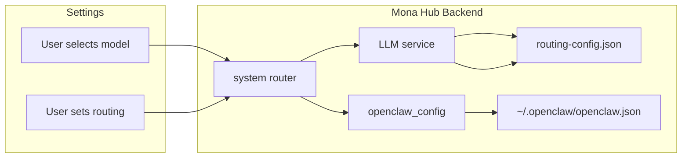
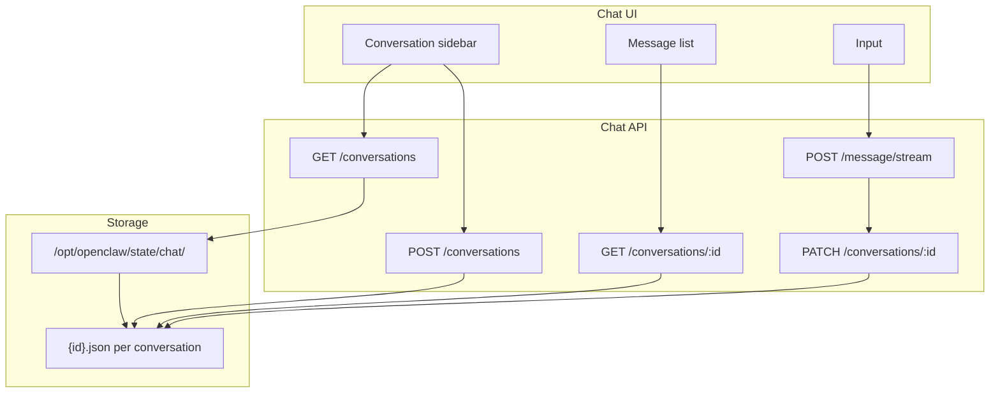

# OpenClaw/Mona Link Fixes and Persistent Chat History

## Part A: OpenClaw / Mona Hub link fixes

### A1. Persist active model and routing mode to disk

**Problem:** [device-cli/mona_hub/backend/services/llm.py](device-cli/mona_hub/backend/services/llm.py) keeps `_active_model_id` and `_routing_config` only in memory. `set_active_model()` and `set_routing_mode()` do not write to [routing-config.json](device-cli/openclaw_setup/provisioner.py) (provisioner writes `auto_routing_enabled` and `routes` only; no `active_model_id` in file). After Hub restart, the user’s choices are lost.

**Change:**

- **Backend – LLM service:** When `set_active_model(model_id)` is called, write the updated config to `ROUTING_CONFIG_PATH`: load existing JSON, set `active_model_id` to the given id, write back. When `set_routing_mode(auto)` is called, set `auto_routing_enabled` in the same structure and write back.
- **Backend – startup:** In `LLMService.__init_`_ (and in `get_routing_config()`), read `active_model_id` from the file if present and set `self._active_model_id` so the UI shows the persisted value.
- **Provisioner:** In `_setup_auto_routing()`, include `active_model_id: null` (or first model from the plan) in the initial `routing-config.json` so the schema is consistent.

Result: Active model and routing mode survive Hub restarts and tab switches (UI reloads from API which reads file).

### A2. Sync active local model to OpenClaw so the gateway uses it

**Problem:** Chat always sends `"model": "openclaw"` to the gateway; the gateway uses `agents.defaults.model` from `~/.openclaw/openclaw.json`. When the user selects a **local** model in Settings (e.g. `qwen-3.5-9b`), that is never written to `openclaw.json`, so the gateway keeps using the previous default (e.g. API model).

**Change:**

- **New helper in** [device-cli/mona_hub/backend/services/openclaw_config.py](device-cli/mona_hub/backend/services/openclaw_config.py): Add `sync_openclaw_active_model(model_id: str | None)` that:
  - If `model_id` is a known local model (e.g. exists under `/opt/openclaw/models/<model_id>` or is in the list from `get_available_models()`), set `agents.defaults.model` to `ollama/<model_id>` in `~/.openclaw/openclaw.json` (load, merge, write, chown).
  - If `model_id` is None or not local, leave `openclaw.json` unchanged (API default remains from LLM config sync).
- **Backend – system router:** In [device-cli/mona_hub/backend/routers/system.py](device-cli/mona_hub/backend/routers/system.py), after `llm_service.set_active_model(body.model_id)` in `set_active_model`, call `openclaw_config.sync_openclaw_active_model(body.model_id)` so the gateway’s default model stays in sync with the Settings dropdown.

Result: Choosing a local model in Settings updates both routing-config and OpenClaw’s default model; the gateway then uses that model for chat without changing the chat API contract.

### A3. Optional: pass model through to gateway (if supported)

**Current:** [device-cli/mona_hub/backend/services/llm.py](device-cli/mona_hub/backend/services/llm.py) `generate()` and `generate_stream()` accept `model_id` and `complexity` but do not use them; payload is always `"model": "openclaw"`. [device-cli/mona_hub/backend/routers/chat.py](device-cli/mona_hub/backend/routers/chat.py) does not pass `model_id` or `complexity` to the LLM service.

**Recommendation:** Defer until the OpenClaw reference gateway is confirmed to support a per-request model override (e.g. query param or body field). Once it does, add: (1) chat router passes `model_id` from request/context to `llm_service.generate`*, (2) LLM service includes that in the gateway request if present. No code change in this plan beyond A1–A2.

---

## Part B: Persistent chat history

### B1. Backend: JSON-file chat storage and API

**New module:** `backend/services/chat_history.py`

- **Storage root:** `CHAT_HISTORY_DIR = Path("/opt/openclaw/state/chat")` (create in provisioner or on first use; same pattern as other state under `/opt/openclaw/state`).
- **Schema per conversation:** One file per conversation: `{id}.json` with:
  - `id`, `title` (optional; e.g. first user message snippet), `created_at`, `updated_at`, `last_accessed_at` (ISO8601), `messages`: array of `{ role, content }`.
- **Operations:** `list_conversations()` (list files, return metadata sorted by `updated_at` desc), `get_conversation(id)` (read file, update `last_accessed_at`), `create_conversation()` (generate uuid, write file with empty messages), `append_messages(id, new_messages, title?)` (append, set `updated_at` and `last_accessed_at`, optionally set `title` from first user message), `delete_conversation(id)`.
- **Drain:** `drain_older_than(days=30)`: list all files, parse `last_accessed_at`, delete files where age > 30 days. Call from a startup hook or a simple background scheduler (e.g. once per day or on Hub startup).

**New/updated routes in** [device-cli/mona_hub/backend/routers/chat.py](device-cli/mona_hub/backend/routers/chat.py):

- `GET /api/chat/conversations` – return list from `list_conversations()`.
- `GET /api/chat/conversations/{id}` – return full conversation from `get_conversation(id)` (backend updates `last_accessed_at`).
- `POST /api/chat/conversations` – body optional `{ "title": "..." }`; create via `create_conversation()`, return `{ id, ... }`.
- `PATCH /api/chat/conversations/{id}` – body `{ "messages": [...], "title": "..." }`; append messages and/or set title via `append_messages` (used after stream or non-stream response).
- `DELETE /api/chat/conversations/{id}` – delete file.

**Integration with existing message endpoints:**

- Remove or stop using the in-memory `conversations` dict for persistence.
- In `send_message`: resolve or create conversation by id; after getting `response_text`, call `append_messages(conversation_id, [user_msg, assistant_msg])` (and optionally set title from first user message if still unset).
- In `send_message_stream`: same resolve/create; after stream completes (in the generator), call `append_messages(conversation_id, [user_msg, assistant_msg])` and optionally set title. Keep returning `conversation_id` in the `done` SSE event.
- If client sends no `conversation_id` or id not found: create a new conversation via `create_conversation()` and use that id for the rest of the request.

**Provisioner:** Ensure directory exists: e.g. in [device-cli/openclaw_setup/provisioner.py](device-cli/openclaw_setup/provisioner.py) add `/opt/openclaw/state/chat` to the list of dirs created in `_create_directories()` (or create on first use in chat_history.py with same permissions as other state dirs).

### B2. Frontend: conversation list, sidebar, and persistence

**Routing and layout:**

- Add a route that includes conversation id: e.g. `Route path="chat"` and `Route path="chat/:conversationId"` so the default Chat view can show either “new” or a specific conversation. Keep index route `/` pointing to the chat view (e.g. redirect to `/chat` or `/chat/new`).
- In [device-cli/mona_hub/frontend/src/components/dashboard/DashboardLayout.tsx](device-cli/mona_hub/frontend/src/components/dashboard/DashboardLayout.tsx): when the current route is Chat (path `/` or `/chat` or `/chat/:id`), render a **sidebar** (e.g. left column) containing:
  - “New chat” button (creates conversation via API and navigates to it).
  - List of conversations from `GET /api/chat/conversations` (show title or “New chat” and date; click = navigate to `/chat/:id` and load that conversation).
- Main content area remains the existing chat UI (message list + input).

**Chat page and data flow:**

- [device-cli/mona_hub/frontend/src/components/dashboard/ChatInterface.tsx](device-cli/mona_hub/frontend/src/components/dashboard/ChatInterface.tsx) (or a thin wrapper) should:
  - Read `conversationId` from route params (e.g. `useParams()` for `/chat/:conversationId`). If none (e.g. `/chat` or `/`), treat as “current” conversation: either load last-open id from localStorage or show empty “new” state.
  - On mount: if `conversationId` is present and not `new`, call `GET /api/chat/conversations/:id` and set messages in state; if “new”, start with empty messages and no id until first send.
  - When user sends a message: if no conversation id, first `POST /api/chat/conversations` to create one, then send message with that id; after response (stream or not), backend will have persisted messages; optionally refresh conversation list in sidebar.
  - When user selects a conversation in the sidebar: navigate to `/chat/:id` and load messages (input disabled while loading). When user clicks “New chat”: create conversation, navigate to `/chat/:id` with empty messages.
- **Disable input and sidebar actions while streaming:** Already `disabled={isStreaming}` on the input; extend so that “New chat” and conversation switches in the sidebar are disabled when `isStreaming` (and optionally `isLoading`) so only one conversation is active at a time.

**Hook and API updates:**

- [device-cli/mona_hub/frontend/src/hooks/useChat.ts](device-cli/mona_hub/frontend/src/hooks/useChat.ts): Accept an initial `conversationId` (from route) and optionally an initial `messages` (from loaded conversation). When stream or non-stream completes, the backend has already persisted; frontend can optionally call `PATCH` only if it needs to update title or optimistically avoid a refetch. Prefer a single source of truth: after completion, refetch conversation or rely on backend append so that switching tabs and coming back reloads from API.
- [device-cli/mona_hub/frontend/src/lib/api.ts](device-cli/mona_hub/frontend/src/lib/api.ts): Add `listConversations()`, `getConversation(id)`, `createConversation(title?)`, `updateConversation(id, { messages?, title? })`, `deleteConversation(id)`.

**Persistence across tab switch:**

- When user navigates to Tools or Settings, Chat unmounts. When they return, Chat remounts; if the route is `/chat/:id`, load that conversation from `GET /api/chat/conversations/:id`. Optionally persist “last open conversation id” in localStorage and redirect `/` or `/chat` to `/chat/:lastId` so the last-used conversation reopens.

### B3. Auto-drain (30 days)

- In the backend, run `drain_older_than(30)` either:
  - On Hub startup (e.g. in FastAPI lifespan or main after app creation), or
  - Via a minimal background task (e.g. daily) that calls the same function.
- No separate “cron” required if startup drain is sufficient for a single-user desktop app; otherwise add a simple async loop or scheduler that runs once per 24h.

---

## Implementation order

1. **A1** – Persist and load `active_model_id` and `auto_routing_enabled` in routing-config and LLM service.
2. **A2** – Add `sync_openclaw_active_model()` and call it from `set_active_model`.
3. **B1** – Chat history module, directory, CRUD API, and wire existing message/stream endpoints to it; add drain and call it on startup.
4. **B2** – Frontend: API client, sidebar in dashboard for Chat route, routes with `:conversationId`, load/save conversation by id, disable input and sidebar when streaming.
5. **Provisioner** – Add `chat` directory under state and (if needed) `active_model_id` in initial routing-config.

---

## Files to add

- [device-cli/mona_hub/backend/services/chat_history.py](device-cli/mona_hub/backend/services/chat_history.py) – storage and drain logic.

## Files to change

- [device-cli/mona_hub/backend/services/llm.py](device-cli/mona_hub/backend/services/llm.py) – persist/load routing config (active_model_id, auto_routing_enabled).
- [device-cli/mona_hub/backend/services/openclaw_config.py](device-cli/mona_hub/backend/services/openclaw_config.py) – add `sync_openclaw_active_model(model_id)`.
- [device-cli/mona_hub/backend/routers/system.py](device-cli/mona_hub/backend/routers/system.py) – call `sync_openclaw_active_model` after `set_active_model`.
- [device-cli/mona_hub/backend/routers/chat.py](device-cli/mona_hub/backend/routers/chat.py) – new conversation CRUD routes; message/stream use chat_history and persist after each message.
- [device-cli/openclaw_setup/provisioner.py](device-cli/openclaw_setup/provisioner.py) – create `.../state/chat`; optionally add `active_model_id` to initial routing-config.
- [device-cli/mona_hub/frontend/src/App.tsx](device-cli/mona_hub/frontend/src/App.tsx) – add `/chat` and `/chat/:conversationId` routes.
- [device-cli/mona_hub/frontend/src/components/dashboard/DashboardLayout.tsx](device-cli/mona_hub/frontend/src/components/dashboard/DashboardLayout.tsx) – conditional sidebar for Chat with conversation list and “New chat”.
- [device-cli/mona_hub/frontend/src/components/dashboard/ChatInterface.tsx](device-cli/mona_hub/frontend/src/components/dashboard/ChatInterface.tsx) – wire to conversation id from route, load/save via API, disable input/sidebar when streaming.
- [device-cli/mona_hub/frontend/src/hooks/useChat.ts](device-cli/mona_hub/frontend/src/hooks/useChat.ts) – accept conversationId and initial messages; work with new API.
- [device-cli/mona_hub/frontend/src/lib/api.ts](device-cli/mona_hub/frontend/src/lib/api.ts) – add conversation CRUD API functions.

---

## Data flow (high level)

