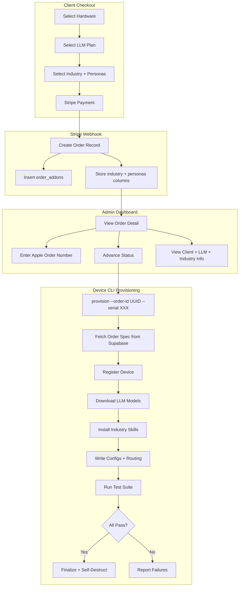

# Comprehensive Order Tracking and Automated Setup Pipeline

## Current State

**Database:** Orders store `hardware_type`, `hardware_config` (JSONB), `software_package`, `total_price_hkd`, and `notes`. Industry and personas are dumped as a text string in the `notes` column. There is no `apple_order_number` column. `order_addons` stores model/bundle selections correctly.

**Admin UI:** The order detail page ([admin-order-content.tsx](web/src/app/[locale]/(admin)/admin/orders/[id]/admin-order-content.tsx)) shows hardware, total, Stripe ID, date, addons, devices, and status timeline. It does **not** show: client name/email, industry, personas, Apple order number, or LLM plan summary.

**Device CLI:** The provisioner ([provisioner.py](device-cli/openclaw_setup/provisioner.py)) takes `--order-id` + `--serial`, registers a device, installs fixed dependencies, reads `order_addons` for model IDs but only prints them (no actual download), and writes placeholder industry skills. It has no concept of the order's industry, personas, or bundle type.

---

## Phase 1: Schema Migration

New migration file: `supabase/migrations/002_order_tracking.sql`

- Add columns to `orders`:
  - `industry TEXT` (nullable, stores industry slug)
  - `personas TEXT[]` (Postgres text array, stores persona slugs)
  - `apple_order_number TEXT` (nullable, admin-entered)
- Migrate existing data: `UPDATE orders SET industry = ... FROM notes WHERE notes LIKE 'Industry:%'` (best-effort parse)
- No schema changes to `order_addons` or `devices` (they already capture what's needed)
- Update TypeScript types in [database.ts](web/src/types/database.ts) to add `industry`, `personas`, `apple_order_number` to the `Order` interface

---

## Phase 2: Webhook and Checkout Fixes

In [webhook route](web/src/app/api/webhooks/stripe/route.ts):

- Write `industry` and `personas` to their new dedicated columns instead of stuffing them into `notes`
- Keep `notes` for free-text admin notes only

No changes to the checkout flow steps themselves (industry + persona selection already works).

---

## Phase 3: Admin Dashboard Enhancements

### Orders list ([admin-dashboard-content.tsx](web/src/app/[locale]/(admin)/admin/admin-dashboard-content.tsx))

- Add columns: Client (name or email from joined `profiles`), Industry, LLM Plan (bundle name or "A la carte" or "API only")
- The server page must join `profiles` on `client_id` and join `order_addons` to summarize plan type

### Order detail ([admin-order-content.tsx](web/src/app/[locale]/(admin)/admin/orders/[id]/admin-order-content.tsx))

Rebuild into a comprehensive detail view with these sections:

1. **Client Info** -- Name, email (from `profiles`), company, phone, industry on profile
2. **Order Summary** -- Order ID, status badge, created date, total HKD
3. **Hardware** -- Type (Mac mini M4 / iMac M4), configuration (SSD, color, ethernet from `hardware_config`), Apple order number (editable field)
4. **LLM Plan** -- Bundle name or a-la-carte model list with categories and prices. Show "API only, no local models" if no addons.
5. **Industry and Personas** -- Primary industry with its software stack listed, selected persona add-ons with their software stacks (multi-select, all free). Displayed as badges/chips.
6. **Devices** -- Existing device cards with serial, MAC, setup status
7. **Status Timeline** -- Existing timeline with advance button
8. **Status History** -- Existing log

### Editable fields

- Apple order number: inline-editable text field (new API route `PATCH /api/admin/orders/[id]`)
- Admin notes: editable textarea

---

## Phase 4: Admin API Endpoints

### `PATCH /api/admin/orders/[id]` (new)

- Updates `apple_order_number` and `notes` on the order
- Role-gated to admin/technician (same pattern as existing update-status route)

### `GET /api/provision/order-spec` (new, for device-cli)

- Query params: `order_id` + `serial` (or `email` + `serial`)
- Authenticated via `SUPABASE_SERVICE_KEY` (passed as Bearer token or validated server-side)
- Returns JSON:

```json
{
  "order_id": "uuid",
  "client_email": "...",
  "hardware_type": "mac_mini_m4",
  "hardware_config": { "ssd": "512GB" },
  "industry": "real-estate",
  "personas": ["vibe-coder", "solopreneur"],
  "llm_plan": {
    "type": "bundle",
    "bundle_id": "pro_bundle",
    "models": ["qwen-3.5-0.8b", "qwen-3.5-9b", "qwen-2.5-coder-7b"]
  },
  "software_stacks": {
    "industry": ["PropertyGPT", "ListingSync Agent", "TenancyDoc Automator", "ViewingBot"],
    "personas": ["CodeQwen-9B", "HKDevKit", "DocuWriter", "GitAssistant", "BizOwner OS", "MPFCalc", "SocialSync", "SupplierLedger"]
  }
}
```

For Max Bundle, `models` includes all 16 model IDs. For a-la-carte, the specific selected models. For no addons, `type: "api_only"` and `models: []`.

The `software_stacks` field is derived by looking up industry/persona slugs against the constants (same data as `INDUSTRY_VERTICALS` and `CLIENT_PERSONAS`).

---

## Phase 5: Device CLI Upgrade

### New module: `device-cli/openclaw_setup/order_fetcher.py`

- Fetches the order spec from Supabase directly (using supabase-py, not the web API) by querying `orders`, `order_addons`, `profiles`, and the constants
- Alternatively accepts `email` + `serial` to look up the order (join `orders` on `profiles.id` where email matches, then match serial from linked device or as new)
- Returns a structured `OrderSpec` dataclass with all fields

### Provisioner updates ([provisioner.py](device-cli/openclaw_setup/provisioner.py))

- Fetch full order spec at the start of `run()`
- `_download_models()`: Use `mlx_lm.utils.fetch_from_hub` (or `huggingface_hub.snapshot_download`) to actually download each model in `order_spec.models` to `/opt/openclaw/models/{model-id}/`. Show progress bar per model.
- `_install_industry_skills()`: Based on `order_spec.industry` and `order_spec.personas`, create skill directories under `/opt/openclaw/skills/local/{slug}/` with a manifest JSON listing the software tools. Write a `config.yaml` per skill with the tool name and port.
- `_write_core_configs()`: Inject the industry context into SOUL.md (e.g., "This device serves a {industry} client") and list available tools in AGENTS.md.
- `_setup_auto_routing()` (new): If bundle is `max_bundle`, write `/opt/openclaw/state/routing-config.json` mapping complexity levels to model IDs.
- `_write_active_work_json()` (new): Write `/opt/openclaw/state/active-work.json` with order_id, industry, personas, model list so the test suite and runtime can reference it.
- Store `order_id` in `.setup-credentials` alongside `device_id` and `supabase_url`

### CLI updates ([cli.py](device-cli/openclaw_setup/cli.py))

- `provision` command: Accept `--email` as alternative to `--order-id` (look up order by client email)
- Both `--order-id` and `--email` are optional; at least one required along with `--serial`
- Print a summary of what will be installed before starting (models, industry, personas)

### Test suite updates

- `llm_tests.py`: Read `active-work.json` for expected model list; verify each expected model exists in `/opt/openclaw/models/`; test inference on each downloaded model (not just the first)
- `openclaw_core.py`: Verify industry skill directories exist for the configured industry and personas

---

## Phase 6: Client Dashboard

In the client order detail page, show:

- Industry and persona selections (read-only)
- LLM plan summary (bundle name or model list)
- Apple order number (once admin enters it)
- Device setup progress (already partially shown)

---

## Data Flow Diagram




## Files Changed Summary

- **New:** `supabase/migrations/002_order_tracking.sql`
- **New:** `web/src/app/api/admin/orders/[id]/route.ts` (PATCH endpoint)
- **New:** `device-cli/openclaw_setup/order_fetcher.py`
- **Modified:** [web/src/types/database.ts](web/src/types/database.ts) -- add new Order fields
- **Modified:** [web/src/app/api/webhooks/stripe/route.ts](web/src/app/api/webhooks/stripe/route.ts) -- use new columns
- **Modified:** [web/src/app/[locale]/(admin)/admin/page.tsx](web/src/app/[locale]/(admin)/admin/page.tsx) -- join profiles + addons
- **Modified:** [web/src/app/[locale]/(admin)/admin/admin-dashboard-content.tsx](web/src/app/[locale]/(admin)/admin/admin-dashboard-content.tsx) -- richer table
- **Modified:** [web/src/app/[locale]/(admin)/admin/orders/[id]/page.tsx](web/src/app/[locale]/(admin)/admin/orders/[id]/page.tsx) -- fetch more data
- **Modified:** [web/src/app/[locale]/(admin)/admin/orders/[id]/admin-order-content.tsx](web/src/app/[locale]/(admin)/admin/orders/[id]/admin-order-content.tsx) -- comprehensive detail UI
- **Modified:** [device-cli/openclaw_setup/provisioner.py](device-cli/openclaw_setup/provisioner.py) -- order-aware provisioning
- **Modified:** [device-cli/openclaw_setup/cli.py](device-cli/openclaw_setup/cli.py) -- add --email option
- **Modified:** [device-cli/openclaw_setup/test_suite/llm_tests.py](device-cli/openclaw_setup/test_suite/llm_tests.py) -- validate expected models
- **Modified:** [device-cli/openclaw_setup/test_suite/openclaw_core.py](device-cli/openclaw_setup/test_suite/openclaw_core.py) -- validate industry skills

