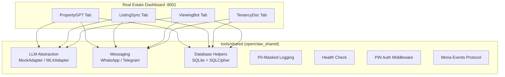

# Real Estate Tools Implementation Plan

## Architecture Overview

All 4 tools run as a single FastAPI application on port 8001 (`http://mona.local:8001`), with tab-based navigation. They share a common Python library (`tools/shared/`) for cross-cutting concerns.




## Directory Structure

```
tools/
├── shared/
│   ├── pyproject.toml
│   └── openclaw_shared/
│       ├── __init__.py
│       ├── config.py           # YAML config loader
│       ├── database.py         # SQLite helpers, schema migration
│       ├── logging.py          # PII-masked logging + daily rotation
│       ├── health.py           # GET /health endpoint factory
│       ├── export.py           # POST /api/export handler
│       ├── auth.py             # PIN auth middleware for dashboard
│       ├── mona_events.py      # Activity feed event writer/reader
│       ├── llm/
│       │   ├── base.py         # Abstract LLMProvider interface
│       │   ├── mlx_adapter.py  # Real mlx-lm + Qwen2.5-7B
│       │   └── mock_adapter.py # Deterministic mock for dev/test
│       └── messaging/
│           ├── base.py         # Abstract MessagingProvider
│           ├── whatsapp.py     # Twilio WhatsApp Business API
│           └── telegram.py     # python-telegram-bot
│
├── 01-real-estate/
│   ├── pyproject.toml
│   ├── config.yaml
│   ├── real_estate/
│   │   ├── __init__.py
│   │   ├── app.py              # Unified FastAPI app, mounts all routers
│   │   ├── database.py         # Schema init for all 4 tools + shared.db
│   │   ├── dashboard/
│   │   │   ├── templates/      # Jinja2 + htmx templates
│   │   │   │   ├── base.html        # Shell: nav, branding, activity feed
│   │   │   │   ├── components/      # Reusable htmx partials
│   │   │   │   ├── property_gpt/    # Search, comparison, chat, floor plan
│   │   │   │   ├── listing_sync/    # Editor, status grid, image preview
│   │   │   │   ├── tenancy_doc/     # Wizard, stamp duty, renewal calendar
│   │   │   │   └── viewing_bot/     # Calendar, map, coordination board
│   │   │   └── static/
│   │   │       ├── css/output.css   # Compiled Tailwind
│   │   │       └── js/app.js        # htmx + Alpine.js
│   │   │
│   │   ├── property_gpt/       # RAG, scrapers, OCR, listing description
│   │   ├── listing_sync/       # Platforms, image processing, tracking
│   │   ├── tenancy_doc/        # Doc generators, stamp duty, renewals
│   │   └── viewing_bot/        # WhatsApp parsing, scheduling, routing
│   └── tests/
```

## Phase 1 -- Shared Infrastructure

Build `tools/shared/` first. This unblocks all 4 tool implementations.

### LLM Abstraction Layer ([tools/shared/openclaw_shared/llm/](tools/shared/openclaw_shared/llm/))

```python
class LLMProvider(ABC):
    @abstractmethod
    async def generate(self, prompt: str, system: str = "", max_tokens: int = 512) -> str: ...
    @abstractmethod
    async def embed(self, texts: list[str]) -> list[list[float]]: ...
```

- `MLXAdapter`: wraps `mlx-lm` with Qwen2.5-7B-Instruct (4-bit). Lazy model loading. Embedding via `bge-base-zh-v1.5`.
- `MockAdapter`: returns deterministic responses keyed on prompt keywords. Generates synthetic embeddings (consistent hash-based vectors).
- Selection via `config.yaml`: `llm.provider: "mlx"` or `llm.provider: "mock"`.

### Common Utilities

- `**config.py**`: Load `config.yaml` with Pydantic validation. Environment variable overrides.
- `**database.py**`: `get_db()` context manager for SQLite connections. Schema migration runner (reads `*.sql` files). Optional SQLCipher encryption.
- `**logging.py**`: `setup_logging(tool_name)` configures `logging` with daily rotation (7-day retention) to `/var/log/openclaw/{tool}.log`. PII masking filter for phone numbers (`+852 9XXX XX89`), HKID (`A1234XX(X)`), names.
- `**health.py**`: `create_health_router(tool_name, version, db_path)` returns a FastAPI router with `GET /health`.
- `**auth.py**`: PIN-based middleware. On first access, prompts for PIN setup. Session cookie with configurable TTL.
- `**mona_events.py**`: Write/read from `mona_events` SQLite table. `emit_event(type, summary, details, requires_human)` and `get_events(since, limit)`.
- `**export.py**`: `POST /api/export` handler. Bundles SQLite + workspace files into a ZIP archive.
- `**messaging/**`: Abstract `MessagingProvider` with `send_text()`, `send_media()`, `receive_webhook()`. WhatsApp (Twilio) and Telegram (python-telegram-bot) adapters.

### Dependencies (`tools/shared/pyproject.toml`)

Core: `fastapi`, `uvicorn`, `pyyaml`, `pydantic>=2.0`, `python-dateutil`, `httpx`, `apscheduler`
LLM: `mlx-lm` (optional extra)
Messaging: `twilio`, `python-telegram-bot`

## Phase 2 -- Real Estate App Scaffold

Build the unified FastAPI application shell and database schemas before tool logic.

### Unified App ([tools/01-real-estate/real_estate/app.py](tools/01-real-estate/real_estate/app.py))

- Single FastAPI instance mounting 4 tool routers at `/property-gpt/`, `/listing-sync/`, `/tenancy-doc/`, `/viewing-bot/`
- Jinja2 template engine with htmx integration
- Tailwind CSS (compiled via standalone CLI) with MonoClaw design tokens (navy `#1a1f36`, gold `#d4a843`)
- Alpine.js for lightweight client-side interactivity
- Shared sidebar/tab navigation, activity feed panel, approval queue component
- Base template includes bilingual toggle (EN/TC)
- Static file serving from `dashboard/static/`
- PIN auth middleware from shared library

### Database Schemas ([tools/01-real-estate/real_estate/database.py](tools/01-real-estate/real_estate/database.py))

Initialize 5 SQLite databases on startup:

- `property_gpt.db`: `buildings`, `transactions`, `query_log` tables
- `listing_sync.db`: `listings`, `platform_posts`, `images` tables
- `tenancy_doc.db`: `tenancies`, `documents`, `renewal_alerts` tables
- `viewing_bot.db`: `viewings`, `availability_windows`, `follow_ups`, `message_log` tables
- `shared.db`: Cross-tool data (e.g., PropertyGPT building data referenced by ListingSync)

### First-Run Config Wizard

Served at `/setup/` on first launch (when `config.yaml` is empty/missing). Step-by-step form:

1. Business Profile (agency name, EAA license, address)
2. Messaging (Twilio creds, Telegram token, default language)
3. Platform Credentials (28Hse, Squarefoot logins; Land Registry access)
4. Seed demo data toggle
5. Connection test panel

## Phase 3 -- Tool Backends (Parallelizable)

These 4 tools can be built independently and concurrently. Each tool is a Python subpackage with its own `routes.py` (FastAPI router) and domain logic.

### 3A. PropertyGPT ([tools/01-real-estate/real_estate/property_gpt/](tools/01-real-estate/real_estate/property_gpt/))

**RAG Pipeline**:

- `rag/embedder.py`: Wraps shared `LLMProvider.embed()`. Ingests building data JSON into ChromaDB collections (one per district). Batch ingestion with progress tracking.
- `rag/retriever.py`: Query ChromaDB with natural language. Filter by district, price range, bedrooms. Returns ranked building records with metadata.
- `rag/generator.py`: Composes RAG prompt (system + retrieved context + user query). Streams response via shared `LLMProvider.generate()`. Cites source buildings in output.
- `rag/prompts/`: System prompts for search, description generation, comparable analysis, and Q&A.

**Scrapers**:

- `scrapers/land_registry.py`: Fetch recent transaction data from IRIS Online. 2-second delay between requests. Cache in `transactions` table.
- `scrapers/building_db.py`: Aggregate building info from Centadata/RVD public pages. Populate `buildings` table.

**OCR**:

- `ocr/floor_plan.py`: macOS Vision framework via `pyobjc-framework-Vision`. Extract room dimensions from floor plan images. Return structured JSON with room list and areas.

**HK-Specific Logic**:

- MTR proximity scoring (A/B/C/D based on walking time with 1.3x urban factor)
- School net zone mapping (net number -> schools list)
- Saleable vs gross area enforcement
- Stamp duty tier inclusion in comparisons
- Bilingual output (EN + Traditional Chinese)

**Key Routes**: `GET /property-gpt/search`, `POST /property-gpt/chat`, `POST /property-gpt/describe`, `POST /property-gpt/compare`, `POST /property-gpt/ocr/floor-plan`, `GET /property-gpt/trends`

### 3B. ListingSync ([tools/01-real-estate/real_estate/listing_sync/](tools/01-real-estate/real_estate/listing_sync/))

**Platforms**:

- `platforms/base.py`: Abstract `PlatformAdapter` with `post_listing()`, `update_listing()`, `remove_listing()`, `get_stats()`.
- `platforms/twentyeight_hse.py`: Playwright automation for 28Hse. Persistent browser context. Map internal fields to 28Hse form (district/estate dropdowns, Chinese-first descriptions). Max 20 photos.
- `platforms/squarefoot.py`: Playwright automation for Squarefoot. Different form structure, English-first. Max 30 photos.
- `platforms/whatsapp.py`: Format listing as WhatsApp message (text + images) via shared messaging provider.

**Image Processing** (`processing/`):

- `images.py`: Pillow-based pipeline. Resize to platform specs (28Hse: 1024x768, Squarefoot: 1200x900). EAA watermark (bottom-right, semi-transparent, min 12px at 1080p). Brightness/contrast normalization. Process one image at a time (memory safety).
- `description.py`: LLM-based description rewriting. Single master description -> platform-adapted versions (28Hse Chinese-first, Squarefoot English-first, WhatsApp punchy one-liner). Saleable area compliance check.
- `seo.py`: Extract keywords from listing. Inject platform-specific SEO terms.

**Tracking**:

- `tracking/lifecycle.py`: Status management (active/under-offer/sold/withdrawn). Status change propagates to all platforms.
- `tracking/performance.py`: Scrape platform listing pages for views/inquiries. Weekly performance reports.

**Scheduling**: APScheduler for optimal posting (8-9am, 6-7pm HKT). Rate limit: max 5 new listings/hour. Exponential backoff on failures. Retry up to 3x.

**Key Routes**: `POST /listing-sync/listings`, `PUT /listing-sync/listings/{id}`, `POST /listing-sync/listings/{id}/sync`, `POST /listing-sync/listings/{id}/process-images`, `GET /listing-sync/performance`

### 3C. TenancyDoc ([tools/01-real-estate/real_estate/tenancy_doc/](tools/01-real-estate/real_estate/tenancy_doc/))

**Generators**:

- `generators/tenancy_agreement.py`: Jinja2-templated DOCX generation via `python-docx`. Standard SAR clauses. Supports fixed-term and periodic tenancies. Bilingual (EN/TC) output.
- `generators/provisional.py`: Provisional agreement (臨時租約) with deposit (2 months), commission split, handover date, special conditions.
- `generators/inventory.py`: Room-by-room checklist with condition notes, appliance serials, photo refs. PDF output via `reportlab`.
- `generators/cr109.py`: Form CR109 (Notice of New Letting). Fixed-layout PDF via `reportlab` matching government form spec.
- `generators/stamp_duty.py`: Calculator per IRD rates. Rates stored in `config.yaml` (configurable for Budget changes). Handles premium, rent-free periods, renewal options.

**Tracking**:

- `tracking/renewals.py`: APScheduler monitors `tenancies` table. Fires alerts at 90/60/30 days before expiry. Generates renewal offer letters.
- `tracking/notifications.py`: Dispatches reminders via WhatsApp/Telegram to agents, landlords, tenants.

**HK-Specific Logic**:

- HKID validation (check digit algorithm: 1-2 letters + 6 digits + check digit)
- Security deposit cap warning (flag > 3 months)
- Break clause standard (2-year term, exercisable after 12 months, 2 months notice)
- Government rent/rates clause handling

**Templates**: Ship DOCX templates in `tenancy_doc/templates/`. Users can override in workspace.

**Key Routes**: `POST /tenancy-doc/agreements`, `GET /tenancy-doc/stamp-duty/calculate`, `POST /tenancy-doc/cr109`, `POST /tenancy-doc/inventory`, `GET /tenancy-doc/renewals`, `GET /tenancy-doc/documents`

### 3D. ViewingBot ([tools/01-real-estate/real_estate/viewing_bot/](tools/01-real-estate/real_estate/viewing_bot/))

**Messaging**:

- `messaging/parser.py`: LLM-based intent extraction from WhatsApp messages. Extract property ref, date/time, party size. Fallback to structured form on parse failure.
- `messaging/templates/`: YAML message templates (confirmation, reminder, follow-up, reschedule) in EN + Traditional Chinese.

**Scheduling**:

- `scheduling/slots.py`: Calculate available slots from property availability windows and agent calendar. Respect 10am-8pm viewing hours.
- `scheduling/conflict.py`: Detect double-bookings, travel time conflicts. Use district-to-district travel time matrix (cross-harbour +20min, NT +30min).
- `scheduling/optimizer.py`: Group viewings by district. Suggest optimal viewing order (nearest-neighbor routing with Haversine distance).
- `scheduling/calendar.py`: Apple Calendar integration via `pyobjc-framework-EventKit`. Read/write appointments. Graceful fallback to SQLite-only if Calendar access denied.

**Three-Way Coordination**: Propose times to viewer + landlord + agent. Confirm only when all accept. Handle rescheduling and cancellation flows.

**Weather**: Poll HK Observatory API for typhoon/rainstorm warnings. Auto-cancel viewings on T8+ or Black Rainstorm. Trigger rescheduling workflow.

**Key Routes**: `POST /viewing-bot/webhook` (Twilio incoming), `POST /viewing-bot/viewings`, `GET /viewing-bot/viewings/today`, `POST /viewing-bot/viewings/{id}/confirm`, `GET /viewing-bot/route/today`, `GET /viewing-bot/weather`

## Phase 4 -- Dashboard GUI (Parallelizable per Tab)

All tabs use the same base template with MonoClaw branding. htmx handles dynamic content loading without full page reloads.

### Base Template Components

- **Sidebar**: Tab links (PropertyGPT, ListingSync, TenancyDoc, ViewingBot) with active indicator
- **Activity Feed**: Right panel showing Mona events (polls `mona_events` table via `GET /api/events`)
- **Approval Queue**: Amber-badged items requiring human action
- **Status Cards**: Per-tool KPIs at top of each tab
- **Settings Gear**: Opens per-tool config modal
- **Language Toggle**: EN / 繁中 switch (stores preference in cookie)

### PropertyGPT Tab

- Search bar with district/price/bedroom filter dropdowns
- Property cards with transaction history sparklines (Chart.js)
- Side-by-side comparison table (htmx partial updates)
- Chat panel with streaming LLM responses (SSE via htmx `hx-ext="sse"`)
- Floor plan viewer with OCR overlay
- Price trend charts (daily digest view)

### ListingSync Tab

- Master listing form with image drag-drop gallery (Dropzone.js)
- Platform status grid (rows=listings, columns=platforms, colored indicators)
- Image processing before/after preview
- Performance charts (views/inquiries per platform, Chart.js)
- "Sync All" button + per-platform manual controls
- Lifecycle status controls

### TenancyDoc Tab

- Multi-step agreement wizard (htmx step transitions)
- Live PDF preview (rendered server-side, displayed in iframe)
- Stamp duty calculator widget (auto-updates via htmx on input change)
- Renewal calendar (FullCalendar.js, color-coded urgency)
- Document archive table with version history and download links
- CR109 filing status tracker

### ViewingBot Tab

- Weekly calendar view (FullCalendar.js, color-coded by status)
- District route map (Leaflet.js with OpenStreetMap tiles)
- Three-party coordination board (status cards per viewing)
- Follow-up tracker with interest tags (hot/warm/cold)
- Weather alert banner (polls HKO API)

## Phase 5 -- Integration and Testing

- Wire inter-tool communication (PropertyGPT building data -> ListingSync, PropertyGPT -> ViewingBot property details) via `shared.db`
- End-to-end test: create listing in ListingSync -> auto-generate description via PropertyGPT LLM
- Verify all health check endpoints aggregate correctly
- Test data export (`POST /api/export`) produces valid ZIP
- Validate first-run wizard flow
- Run testing criteria from each prompt specification

## Dependency Summary (`tools/01-real-estate/pyproject.toml`)

- **Core**: `fastapi`, `uvicorn[standard]`, `jinja2`, `python-multipart`, `pyyaml`, `pydantic>=2.0`, `httpx`, `apscheduler`
- **Database**: `aiosqlite` (or sync `sqlite3`)
- **LLM**: `openclaw-shared[mlx]` (optional MLX extra)
- **RAG**: `chromadb`, `sentence-transformers`
- **Documents**: `python-docx`, `reportlab`, `PyPDF2`, `pdfplumber`
- **Images**: `Pillow`, `pillow-heif`
- **Browser**: `playwright`
- **Calendar**: `icalendar`, `pyobjc-framework-EventKit`
- **Date parsing**: `dateparser`, `python-dateutil`
- **Messaging**: `twilio`, `python-telegram-bot`
- **OCR**: `pyobjc-framework-Vision`
- **Data**: `pandas`, `numpy`

## Parallelization Strategy

```mermaid
gantt
    title Real Estate Implementation Timeline
    dateFormat X
    axisFormat %s

    section Phase1
    Shared Library           :p1, 0, 1
    
    section Phase2
    App Scaffold + DB        :p2, 1, 2
    Dashboard Base Template  :p2b, 1, 2

    section Phase3
    PropertyGPT Backend      :p3a, 2, 4
    ListingSync Backend      :p3b, 2, 4
    TenancyDoc Backend       :p3c, 2, 4
    ViewingBot Backend       :p3d, 2, 4

    section Phase4
    PropertyGPT GUI Tab      :p4a, 3, 5
    ListingSync GUI Tab      :p4b, 3, 5
    TenancyDoc GUI Tab       :p4c, 3, 5
    ViewingBot GUI Tab       :p4d, 3, 5

    section Phase5
    Integration + Testing    :p5, 5, 6
```




- Phase 1 (shared library) must complete first
- Phase 2 (scaffold) depends on Phase 1
- Phase 3 (4 backends) runs in parallel after Phase 2
- Phase 4 (4 GUI tabs) can overlap with late Phase 3 (routes must exist for htmx endpoints)
- Phase 5 wires everything together

