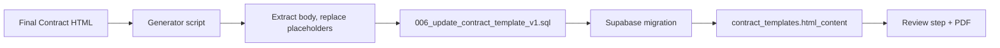

# Replace Placeholder Contract with Full Final Contract

## Goal

Use the full **Final Contract - MonoClaw.html** as the contract template (version `v1.0`) instead of the current short placeholder, while keeping the same NSS placeholder syntax so [contract-review-step.tsx](web/src/app/[locale]/(checkout)/order/contract/review/contract-review-step.tsx) and [pdf-generator.ts](web/src/lib/pdf-generator.ts) require no changes.

## Source and target

- **Source**: [web/src/content/legal/Final Contract - MonoClaw.html](web/src/content/legal/Final Contract - MonoClaw.html) — Word “Save as Web Page” export; body from ~~line 4210 to 13299 (~~9k lines).
- **Target**: `contract_templates` row with `version = 'v1.0'` (currently seeded in [supabase/migrations/004_signing_system.sql](supabase/migrations/004_signing_system.sql)).

## Placeholder mapping (from document to NSS)

| Document placeholder                                                                                                                                 | NSS replacement                                                                                                                                                                                                                                  |
| ---------------------------------------------------------------------------------------------------------------------------------------------------- | ------------------------------------------------------------------------------------------------------------------------------------------------------------------------------------------------------------------------------------------------ |
| DATED: **[DATE]**                                                                                                                                    | `{{signed_date}}`                                                                                                                                                                                                                                |
| PARTIES (2): **[CLIENT FULL NAME/ENTITY NAME]**, **[Jurisdiction]**, **[Number]**, “/ an individual holding **[HKID/Passport]** number **[Number]**” | Replace entire (2) paragraph with `{{#if_individual}}` block (individual: `{{legal_name}}` only) and `{{#if_entity}}` block (entity: `{{legal_name}}`, `{{entity_jurisdiction}}`, `{{br_number}}`)                                               |
| SERVICE PROVIDER **Date: [DATE]**                                                                                                                    | `{{signed_date}}`                                                                                                                                                                                                                                |
| CLIENT: **[CLIENT FULL LEGAL NAME/ENTITY NAME]**                                                                                                     | `{{legal_name}}`                                                                                                                                                                                                                                 |
| CLIENT **Signature:** (blank)                                                                                                                        | `{{#if_individual}}` … `{{legal_name}}` … `{{/if_individual}}` and `{{#if_entity}}` … `{{representative_name}}` and Title: `{{representative_title}}` … `{{/if_entity}}` |
| CLIENT **Date: [DATE]**                                                                                                                              | `{{signed_date}}`                                                                                                                                                                                                                                |
| (add) **Contract ID:**                                                                                                                               | `{{contract_id}}`                                                                                                                                                                                                                                |

Exact locations in the file:

- **DATED**: ~4223–4224 (`[DATE]` in PARTIES header).
- **PARTIES (2)**: single `
` containing `(2)` and `[CLIENT FULL NAME/ENTITY NAME]` through `...Data Subject\"</b>).` (~4246–4261).
- **End block**: SERVICE PROVIDER Name/Title/Date (~~13240–13257), then CLIENT (~~13265–13296). Insert Contract ID before `
`.

## Implementation approach

The body is ~9k lines and contains single quotes and complex HTML. Putting it inline in a hand-written migration would be error-prone. Use a **one-time generator script** that:

1. Reads [Final Contract - MonoClaw.html](web/src/content/legal/Final Contract - MonoClaw.html).
2. Extracts body inner HTML (same logic as [web/src/lib/legal.ts](web/src/lib/legal.ts) `extractBodyInnerHtml`: from first `<body...>` to `</body>`).
3. Applies the replacements above so the document uses the same NSS placeholders and conditionals as the current seed (so `renderContractHtml` and PDF `mergeTemplate` keep working).
4. Writes a new migration that runs `UPDATE contract_templates SET html_content = $content WHERE version = 'v1.0'`. Escape the string for PostgreSQL (e.g. `E'...'` with single quotes doubled, or dollar-quoting `$body$...$body$` to avoid escaping).

Recommended: **dollar-quoting** in the migration (e.g. `$body$...$body$`) so the raw HTML does not need quote escaping. The migration file will be large (~9k+ lines) but valid.

Optional: strip or simplify Word inline `style` attributes (e.g. reuse a `stripStyleAttributes`-style pass) so the contract viewer and PDF styling stay consistent; do this in the script before writing the migration.

## Deliverables

1. **Generator script** (e.g. `web/scripts/generate-contract-migration.ts` or `.js`):
  - Read `web/src/content/legal/Final Contract - MonoClaw.html`.
  - Extract body; optionally strip inline styles.
  - Replace DATED [DATE], PARTIES (2) (with if_individual / if_entity blocks), SERVICE PROVIDER Date, CLIENT name/signature/date, and add Contract ID.
  - Write `supabase/migrations/006_update_contract_template_v1.sql` containing a single `UPDATE contract_templates SET html_content = $body$...$body$ WHERE version = 'v1.0';`.
  - Document in script or README: run with `npx ts-node` or `node` (if JS) from `web/` to regenerate the migration after editing the source HTML.
2. **Migration** `006_update_contract_template_v1.sql`:
  - Only updates existing row: `UPDATE contract_templates SET html_content = ... WHERE version = 'v1.0';`.
  - No new tables or columns. Safe to run on existing DBs that already have the v1.0 row from 004.
3. **No changes** to [contract-review-step.tsx](web/src/app/[locale]/(checkout)/order/contract/review/contract-review-step.tsx), [pdf-generator.ts](web/src/lib/pdf-generator.ts), or API routes — they already consume `template.html_content` and merge the same placeholders.

## Replacement details for the script

- **PARTIES (2)**: Replace the single paragraph that currently contains both “[CLIENT FULL NAME/ENTITY NAME], incorporated in [Jurisdiction] with company number [Number] / an individual holding [HKID/Passport] number [Number]” with two full paragraphs wrapped in conditionals, matching the structure used in 004 (individual: one line with `{{legal_name}}`; entity: `{{legal_name}}`, `{{entity_jurisdiction}}`, `{{br_number}}`).
- **CLIENT block**: Replace the line containing `[CLIENT FULL LEGAL NAME/ENTITY NAME]` with `{{legal_name}}`. Replace the “Signature:” line’s empty content with the conditional signature block (individual: `signature-font` + `{{legal_name}}`; entity: `signature-font` + `{{representative_name}}` and a line for Title `{{representative_title}}`). Replace both remaining `[DATE]` with `{{signed_date}}`. Insert a line “Contract ID: {{contract_id}}” before the closing `
` of the main content (before `</body>`).
- **All other [DATE]**: Replace with `{{signed_date}}` so the document is consistent.

## Flow

After running the script once to generate the migration, apply it with `supabase db push` or your usual migration workflow. The contract shown in the NSS flow and in the generated PDF will then be the full Final Contract text with placeholders filled from the signing session.