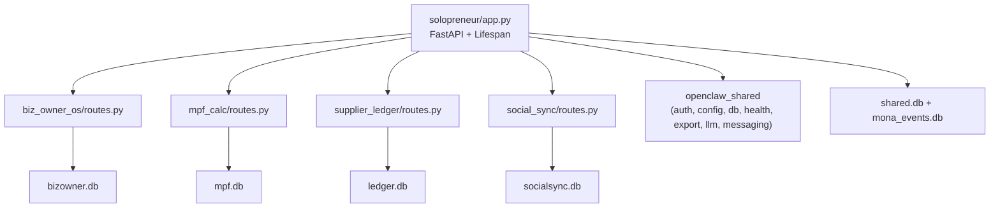

# Solopreneur Dashboard Implementation Plan

## Architecture Overview

A single FastAPI application on port **8506** with four feature tabs, following the exact patterns from existing tools (e.g., [tools/03-fnb-hospitality/](tools/03-fnb-hospitality/)).




## Directory Structure

```
tools/11-solopreneur/
├── config.yaml
├── pyproject.toml
├── solopreneur/
│   ├── __init__.py
│   ├── app.py
│   ├── database.py
│   ├── seed_data.py
│   ├── biz_owner_os/        # Tab 1: BizOwner OS
│   │   ├── __init__.py
│   │   ├── routes.py
│   │   ├── whatsapp/
│   │   │   ├── __init__.py
│   │   │   ├── inbox_manager.py
│   │   │   ├── auto_responder.py
│   │   │   └── broadcast.py
│   │   ├── pos/
│   │   │   ├── __init__.py
│   │   │   ├── pos_connector.py
│   │   │   ├── sales_aggregator.py
│   │   │   └── inventory_tracker.py
│   │   ├── accounting/
│   │   │   ├── __init__.py
│   │   │   ├── transaction_logger.py
│   │   │   ├── categorizer.py
│   │   │   ├── pnl_report.py
│   │   │   └── cash_flow.py
│   │   ├── crm/
│   │   │   ├── __init__.py
│   │   │   ├── customer_database.py
│   │   │   └── engagement_tracker.py
│   │   └── digest/
│   │       ├── __init__.py
│   │       ├── daily_digest.py
│   │       └── alert_engine.py
│   ├── mpf_calc/             # Tab 2: MPFCalc
│   │   ├── __init__.py
│   │   ├── routes.py
│   │   ├── calculation/
│   │   │   ├── __init__.py
│   │   │   ├── mpf_engine.py
│   │   │   ├── income_rules.py
│   │   │   ├── employee_classifier.py
│   │   │   └── voluntary_contrib.py
│   │   ├── reporting/
│   │   │   ├── __init__.py
│   │   │   ├── remittance_generator.py
│   │   │   ├── annual_summary.py
│   │   │   ├── compliance_report.py
│   │   │   └── pdf_export.py
│   │   ├── payroll/
│   │   │   ├── __init__.py
│   │   │   ├── employee_manager.py
│   │   │   └── payroll_processor.py
│   │   └── notifications/
│   │       ├── __init__.py
│   │       ├── reminder_engine.py
│   │       └── whatsapp.py
│   ├── supplier_ledger/      # Tab 3: SupplierLedger
│   │   ├── __init__.py
│   │   ├── routes.py
│   │   ├── ledger/
│   │   │   ├── __init__.py
│   │   │   ├── invoice_manager.py
│   │   │   ├── payment_recorder.py
│   │   │   ├── aging_engine.py
│   │   │   └── reconciler.py
│   │   ├── statements/
│   │   │   ├── __init__.py
│   │   │   ├── statement_generator.py
│   │   │   ├── statement_sender.py
│   │   │   └── pdf_builder.py
│   │   ├── forecasting/
│   │   │   ├── __init__.py
│   │   │   ├── cash_flow.py
│   │   │   └── collection_predictor.py
│   │   └── reminders/
│   │       ├── __init__.py
│   │       ├── overdue_alerter.py
│   │       └── scheduler.py
│   ├── social_sync/          # Tab 4: SocialSync
│   │   ├── __init__.py
│   │   ├── routes.py
│   │   ├── publishing/
│   │   │   ├── __init__.py
│   │   │   ├── instagram_publisher.py
│   │   │   ├── facebook_publisher.py
│   │   │   ├── whatsapp_status.py
│   │   │   └── multi_publisher.py
│   │   ├── content/
│   │   │   ├── __init__.py
│   │   │   ├── image_optimizer.py
│   │   │   ├── video_optimizer.py
│   │   │   ├── caption_optimizer.py
│   │   │   └── cta_generator.py
│   │   ├── scheduling/
│   │   │   ├── __init__.py
│   │   │   ├── calendar_manager.py
│   │   │   ├── scheduler.py
│   │   │   └── optimal_times.py
│   │   └── analytics/
│   │       ├── __init__.py
│   │       ├── ig_analytics.py
│   │       ├── fb_analytics.py
│   │       └── report_generator.py
│   └── dashboard/
│       ├── static/
│       │   ├── css/styles.css
│       │   └── js/app.js
│       └── templates/
│           ├── base.html
│           ├── setup.html
│           ├── biz_owner_os/
│           │   ├── index.html
│           │   └── partials/
│           │       ├── boss_mode.html
│           │       ├── revenue_dashboard.html
│           │       ├── whatsapp_inbox.html
│           │       ├── inventory_alerts.html
│           │       └── customer_crm.html
│           ├── mpf_calc/
│           │   ├── index.html
│           │   └── partials/
│           │       ├── employee_table.html
│           │       ├── monthly_calculator.html
│           │       ├── remittance_preview.html
│           │       ├── compliance_dashboard.html
│           │       └── whatif_calculator.html
│           ├── supplier_ledger/
│           │   ├── index.html
│           │   └── partials/
│           │       ├── supplier_directory.html
│           │       ├── aging_report.html
│           │       ├── receivables_tracker.html
│           │       ├── cash_flow_forecast.html
│           │       └── transaction_log.html
│           └── social_sync/
│               ├── index.html
│               └── partials/
│                   ├── post_composer.html
│                   ├── content_calendar.html
│                   ├── platform_connections.html
│                   └── engagement_analytics.html
└── tests/
    ├── __init__.py
    ├── test_biz_owner_os/__init__.py
    ├── test_mpf_calc/__init__.py
    ├── test_supplier_ledger/__init__.py
    └── test_social_sync/__init__.py
```

## Phase 1: Scaffold (sequential -- must come first)

These files establish the foundation that all four feature modules depend on.

### 1a. `config.yaml`

Port 8506. Standard `llm`, `messaging`, `database` (`~/OpenClawWorkspace/solopreneur`), `auth` sections. `extra` section includes:

- Business profile (name, BR number, type, operating hours, phone)
- POS settings (provider: ichef/lightspeed/square/csv, API credentials)
- Payment methods (cash, octopus, fps, credit_card, alipay, wechat_pay)
- MPF settings (trustee name, contribution day default 10, scheme name)
- Supplier/ledger defaults (default_payment_terms_days: 30, reminder intervals)
- Social accounts (instagram_access_token, facebook_page_id, facebook_access_token)
- Scheduling defaults (digest_time: "08:00", posting_times, reminder_intervals)
- HK public holidays 2026

### 1b. `pyproject.toml`

Package name: `openclaw-solopreneur`. Dependencies: `openclaw-shared`, `fastapi`, `uvicorn`, `jinja2`, `python-multipart`, `pyyaml`, `pydantic`, `httpx`, `apscheduler`, `psutil`, `python-dateutil`, `Pillow`, `plotly`, `openpyxl`, `reportlab`, `sse-starlette`. Optional: `mlx`, `messaging`, `macos`, `all`.

### 1c. `solopreneur/app.py`

Follow [tools/03-fnb-hospitality/fnb_hospitality/app.py](tools/03-fnb-hospitality/fnb_hospitality/app.py) exactly:

- Lifespan: `load_config` -> `init_all_databases` -> `create_llm_provider`
- Middleware: `PINAuthMiddleware`
- Routes: `/` redirects to `/biz-owner-os/`, `/setup/` GET/POST, `/api/events`, `/api/events/{id}/acknowledge`, `/api/connection-test`
- Mount four feature routers: `biz_owner_os_router`, `mpf_calc_router`, `supplier_ledger_router`, `social_sync_router`
- Health and export routers

### 1d. `solopreneur/database.py`

Six databases: `bizowner.db`, `mpf.db`, `ledger.db`, `socialsync.db`, `shared.db`, `mona_events.db`. Define SQL schemas from the four prompt data models. The shared DB links customers across tools by phone number.

### 1e. Dashboard base templates

- `base.html`: Four sidebar tabs (BizOwner OS, MPFCalc, SupplierLedger, SocialSync). Same dark theme (#0f1225, #1a1f36, #d4a843). Tailwind CDN, Chart.js, htmx, Alpine.js. "Solopreneur Dashboard" subtitle.
- `setup.html`: Multi-step wizard (7 steps per prompt specs): Business Profile, Messaging, POS Integration, MPF Trustee, Social Accounts, Payment Terms, Sample Data + Connection Test.
- `static/css/styles.css` and `static/js/app.js`: Match existing tool patterns.

---

## Phase 2: Feature Modules (parallelizable -- 4 independent workstreams)

Each module follows the same pattern: `routes.py` (APIRouter with prefix), business logic sub-modules, and htmx partial templates.

### 2a. BizOwner OS (`solopreneur/biz_owner_os/`)

Router prefix: `/biz-owner-os`

**Business logic modules:**

- `whatsapp/inbox_manager.py` -- Aggregate and manage WhatsApp messages from Twilio webhook. Tag messages (handled/pending/needs_attention). Quick-reply template lookup.
- `whatsapp/auto_responder.py` -- Keyword-based routing (hours, menu, pricing) with fallback to LLM. Bilingual templates (EN/TC).
- `whatsapp/broadcast.py` -- Send promotional messages to tagged customer segments.
- `pos/pos_connector.py` -- Multi-provider POS API connector (iCHEF REST API primary, Lightspeed, Square). CSV import fallback. Standardized `Sale` output.
- `pos/sales_aggregator.py` -- Daily/weekly/monthly rollups. Revenue by payment method (cash, Octopus, FPS, credit card, AlipayHK, WeChat Pay). Top-selling items.
- `pos/inventory_tracker.py` -- Monitor stock from POS data. Low-stock detection against configurable thresholds.
- `accounting/transaction_logger.py` -- Income/expense CRUD with receipt photo upload (stored in workspace `receipts/`). 
- `accounting/categorizer.py` -- LLM-powered expense categorization into: rent, salary, inventory, utilities, marketing, equipment, mpf, insurance, other.
- `accounting/pnl_report.py` -- Monthly P&L generation (revenue - expenses). HK profits tax rate awareness (8.25% first HK$2M, 16.5% thereafter).
- `accounting/cash_flow.py` -- Cash flow tracking and simple forecasting.
- `crm/customer_database.py` -- Customer profile CRUD. Deduplication by phone (HK 8-digit). Merge WhatsApp contacts + POS customers.
- `crm/engagement_tracker.py` -- Purchase frequency, total spend, recency scoring.
- `digest/daily_digest.py` -- Morning summary: yesterday's revenue, today's pending messages, low-stock items, upcoming MPF deadlines. LLM narrative.
- `digest/alert_engine.py` -- Low-stock and follow-up alerts via WhatsApp/Telegram.

**Routes:**

- `GET /biz-owner-os/` -- Main page with Boss Mode KPI cards
- `GET /biz-owner-os/partials/boss-mode` -- KPI cards partial
- `GET /biz-owner-os/partials/revenue-dashboard` -- Revenue charts
- `GET /biz-owner-os/partials/whatsapp-inbox` -- Message feed
- `GET /biz-owner-os/partials/inventory-alerts` -- Low-stock warnings
- `GET /biz-owner-os/partials/customer-crm` -- Customer cards
- `POST /biz-owner-os/sales` -- Record manual sale
- `POST /biz-owner-os/expenses` -- Record expense
- `POST /biz-owner-os/webhook` -- Twilio WhatsApp webhook
- `POST /biz-owner-os/broadcast` -- Send broadcast message
- `GET /biz-owner-os/analytics/revenue` -- Revenue trend data (JSON for Chart.js)

**Templates:** `biz_owner_os/index.html` extends `base.html`, partials for each view.

### 2b. MPFCalc (`solopreneur/mpf_calc/`)

Router prefix: `/mpf-calc`

**Business logic modules:**

- `calculation/mpf_engine.py` -- Core engine using `decimal.Decimal`. Rules: 5% rate, HK$30,000 max relevant income, HK$7,100 minimum threshold, HK$1,500 cap. Employee exempt below minimum; employer always 5%.
- `calculation/income_rules.py` -- Classify relevant income components (basic salary, overtime, commission, bonus). Exclude severance/long service, non-cash housing.
- `calculation/employee_classifier.py` -- Full-time / part-time / casual. 60-day employment rule window calculation from `start_date`.
- `calculation/voluntary_contrib.py` -- TVC tracking with HK$60,000/year tax deduction cap.
- `reporting/remittance_generator.py` -- Generate remittance statements per trustee (HSBC, AIA, Manulife, Sun Life, BCT) using openpyxl templates.
- `reporting/annual_summary.py` -- Employee-level annual MPF summaries for BIR56A/IR56B.
- `reporting/compliance_report.py` -- MPFA compliance records. Late contribution detection + 5% surcharge calculation.
- `reporting/pdf_export.py` -- PDF generation via reportlab.
- `payroll/employee_manager.py` -- Employee CRUD with income component definitions.
- `payroll/payroll_processor.py` -- Monthly payroll processing: compute relevant income -> calculate MPF -> determine net pay.
- `notifications/reminder_engine.py` -- APScheduler: remind 5 days before contribution day (10th of next month).
- `notifications/whatsapp.py` -- Send reminders via Twilio/Telegram.

**Routes:**

- `GET /mpf-calc/` -- Main page with employee table and compliance status
- `GET /mpf-calc/partials/employee-table` -- Employee list partial
- `GET /mpf-calc/partials/monthly-calculator` -- Monthly contribution calculator
- `GET /mpf-calc/partials/remittance-preview` -- Statement preview
- `GET /mpf-calc/partials/compliance-dashboard` -- Compliance status
- `GET /mpf-calc/partials/whatif-calculator` -- What-if salary calculator
- `POST /mpf-calc/employees` -- Add employee
- `PUT /mpf-calc/employees/{id}` -- Update employee
- `POST /mpf-calc/calculate/{month}` -- Calculate monthly contributions
- `POST /mpf-calc/remittance/{month}` -- Generate remittance statement
- `GET /mpf-calc/remittance/{month}/download` -- Download PDF/Excel
- `GET /mpf-calc/annual-summary/{year}` -- Annual summary

### 2c. SupplierLedger (`solopreneur/supplier_ledger/`)

Router prefix: `/supplier-ledger`

**Business logic modules:**

- `ledger/invoice_manager.py` -- Invoice CRUD with partial payment support. Auto-compute `balance = total_amount - paid_amount`. Status transitions: outstanding -> partially_paid -> paid / overdue.
- `ledger/payment_recorder.py` -- Payment recording and allocation to invoices. Cheque number and bank reference tracking.
- `ledger/aging_engine.py` -- Aging calculation from due date (HK convention). Buckets: current, 30, 60, 90+ days.
- `ledger/reconciler.py` -- Bank statement CSV import (HSBC format primary). Match by exact amount, then amount + date range (+-3 days). LLM fallback for description parsing.
- `statements/statement_generator.py` -- Monthly statement per contact: opening balance, transactions, payments, closing balance. DD/MM/YYYY format.
- `statements/statement_sender.py` -- Auto-send via WhatsApp or email (smtplib).
- `statements/pdf_builder.py` -- PDF statement formatting via reportlab.
- `forecasting/cash_flow.py` -- 30/60/90-day projection: sum expected collections + committed payables.
- `forecasting/collection_predictor.py` -- Simple collection likelihood based on customer payment history.
- `reminders/overdue_alerter.py` -- Overdue detection at 7/14/30 days past due. WhatsApp reminder sending.
- `reminders/scheduler.py` -- APScheduler for monthly statement generation (1st of month) and periodic overdue checks.

**Routes:**

- `GET /supplier-ledger/` -- Main page with payables/receivables overview
- `GET /supplier-ledger/partials/supplier-directory` -- Contacts list
- `GET /supplier-ledger/partials/aging-report` -- Aging table
- `GET /supplier-ledger/partials/receivables-tracker` -- Receivables
- `GET /supplier-ledger/partials/cash-flow-forecast` -- Cash flow chart
- `GET /supplier-ledger/partials/transaction-log` -- Transaction history
- `POST /supplier-ledger/contacts` -- Add supplier/customer
- `POST /supplier-ledger/invoices` -- Create invoice
- `POST /supplier-ledger/payments` -- Record payment
- `POST /supplier-ledger/bank-import` -- Import bank statement CSV
- `POST /supplier-ledger/reconcile` -- Run reconciliation
- `GET /supplier-ledger/statements/{contact_id}/{month}` -- Download statement PDF

### 2d. SocialSync (`solopreneur/social_sync/`)

Router prefix: `/social-sync`

**Business logic modules:**

- `publishing/instagram_publisher.py` -- Instagram Graph API (via Facebook Business). Feed posts, stories, reels.
- `publishing/facebook_publisher.py` -- Facebook Pages API posting.
- `publishing/whatsapp_status.py` -- WhatsApp Status via Twilio (with manual fallback).
- `publishing/multi_publisher.py` -- Orchestrate simultaneous cross-platform posting with per-platform error handling.
- `content/image_optimizer.py` -- Pillow `ImageOps.fit()` to target dimensions: IG feed 1080x1080, IG story 1080x1920, FB 1200x630. Separate optimized copy per platform.
- `content/video_optimizer.py` -- Basic video format conversion (moviepy).
- `content/caption_optimizer.py` -- LLM-powered caption enhancement. HK-specific hashtag suggestions (#hkfoodie, #hkig, #852, #hongkong, #hklife).
- `content/cta_generator.py` -- wa.me click-to-chat links, FPS payment links, location CTAs.
- `scheduling/calendar_manager.py` -- Content calendar CRUD. Pre-load HK seasonal events (CNY, Mid-Autumn, Christmas, 11.11, Black Friday).
- `scheduling/scheduler.py` -- APScheduler `date` trigger for one-time scheduled posts. Job ID stored in DB for cancellation.
- `scheduling/optimal_times.py` -- HK market defaults: lunch 12:00-13:00, evening 18:00-19:00, prime 20:00-22:00, late night 22:00-00:00.
- `analytics/ig_analytics.py` -- Instagram insights retrieval (daily fetch, not real-time).
- `analytics/fb_analytics.py` -- Facebook page insights.
- `analytics/report_generator.py` -- Weekly performance summary.

**Routes:**

- `GET /social-sync/` -- Main page with post composer and calendar
- `GET /social-sync/partials/post-composer` -- Rich editor
- `GET /social-sync/partials/content-calendar` -- Monthly calendar
- `GET /social-sync/partials/platform-connections` -- Connection status
- `GET /social-sync/partials/engagement-analytics` -- Analytics charts
- `POST /social-sync/posts` -- Create/schedule post
- `POST /social-sync/posts/{id}/publish` -- Publish immediately
- `DELETE /social-sync/posts/{id}` -- Delete/cancel scheduled post
- `POST /social-sync/media/upload` -- Upload image/video
- `GET /social-sync/analytics/weekly` -- Weekly report data
- `GET /social-sync/hashtags/suggest` -- Hashtag suggestions

---

## Phase 3: Seed Data and Tests (parallelizable after Phase 2)

### 3a. `solopreneur/seed_data.py`

Follow [tools/03-fnb-hospitality/fnb_hospitality/seed_data.py](tools/03-fnb-hospitality/fnb_hospitality/seed_data.py) pattern. Seed functions per tool:

- `seed_biz_owner_os()` -- Sample sales (various payment methods), expenses (rent, salary, inventory), customers (WhatsApp contacts), inventory items, WhatsApp messages
- `seed_mpf_calc()` -- Sample employees (full-time, part-time, casual with various salaries around the min/max thresholds), contribution history, payroll records
- `seed_supplier_ledger()` -- Sample contacts (suppliers/customers), invoices (various ages for aging demo), payments, bank transactions
- `seed_social_sync()` -- Sample posts (draft/scheduled/published), platform_posts, analytics data, content calendar with HK events, hashtag library
- `seed_all(db_paths)` -- Calls all seeders

### 3b. Test stubs

Empty `__init__.py` in each test directory, following existing pattern.

---

## Key Implementation Details

- **Monetary precision**: MPFCalc uses `decimal.Decimal` throughout; other modules can use `float` since they are less audit-sensitive
- **Shared customer linking**: The `shared.db` has a `shared_contacts` table linking phone numbers across BizOwner OS customers, SupplierLedger contacts, and WhatsApp contacts
- **Bilingual support**: Templates use Alpine.js `lang` toggle (EN/繁中) matching existing pattern
- **HK-specific**: All amounts in HKD, dates DD/MM/YYYY in user-facing outputs, phone numbers in +852XXXXXXXX format
- **Background tasks**: APScheduler for daily digest (08:00 HKT), MPF reminders (5 days before contribution day), monthly statements (1st of month), scheduled social posts

