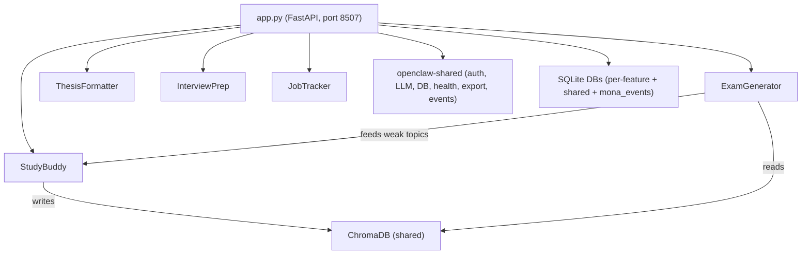

# Student Dashboard Implementation Plan

## Architecture Overview

The student dashboard follows the same architecture as existing tools (immigration, F&B): a single FastAPI application hosting 5 feature modules with a shared Jinja2/htmx/Alpine.js dashboard at `http://mona.local:8507`.

**Note**: The prompts reference Streamlit, but the project convention uses FastAPI + Jinja2 + htmx + Alpine.js. We follow the established convention.




## Directory Structure

```
tools/12-student/
├── config.yaml
├── pyproject.toml
├── student/
│   ├── __init__.py
│   ├── app.py
│   ├── database.py
│   ├── seed_data.py
│   ├── dashboard/
│   │   ├── static/
│   │   │   ├── css/styles.css
│   │   │   └── js/app.js
│   │   └── templates/
│   │       ├── base.html
│   │       ├── setup.html
│   │       ├── study_buddy/
│   │       │   ├── index.html
│   │       │   └── partials/ (6 partials)
│   │       ├── exam_generator/
│   │       │   ├── index.html
│   │       │   └── partials/ (7 partials)
│   │       ├── thesis_formatter/
│   │       │   ├── index.html
│   │       │   └── partials/ (4 partials)
│   │       ├── interview_prep/
│   │       │   ├── index.html
│   │       │   └── partials/ (5 partials)
│   │       └── job_tracker/
│   │           ├── index.html
│   │           └── partials/ (5 partials)
│   ├── study_buddy/
│   │   ├── __init__.py
│   │   ├── routes.py
│   │   ├── ingestion/ (pdf_parser, pptx_parser, docx_parser, chunker, batch_importer)
│   │   ├── indexing/ (embedder, chroma_store, course_organizer)
│   │   ├── retrieval/ (qa_engine, search_engine, citation_tracker)
│   │   └── study/ (flashcard_generator, summary_generator, exam_prep, anki_exporter)
│   ├── exam_generator/
│   │   ├── __init__.py
│   │   ├── routes.py
│   │   ├── generation/ (past_paper_parser, content_generator, custom_generator, distractor_engine, bloom_classifier, subject_adapter)
│   │   ├── exam/ (exam_builder, exam_engine, answer_manager)
│   │   ├── grading/ (auto_grader, llm_grader, calculation_grader, rubric_generator, feedback_engine)
│   │   ├── discussion/ (discussion_engine, context_builder, followup_generator)
│   │   └── analytics/ (performance_tracker, weakness_analyzer, trend_reporter)
│   ├── thesis_formatter/
│   │   ├── __init__.py
│   │   ├── routes.py
│   │   ├── formatting/ (template_engine, styles_manager, page_numbering, margins_fonts)
│   │   ├── generation/ (toc_generator, list_of_figures, list_of_tables, front_matter)
│   │   ├── bibliography/ (bib_formatter, bibtex_handler, citation_inserter)
│   │   ├── validation/ (format_checker, completeness_checker, report_generator)
│   │   └── profiles/ (hku.json, cuhk.json, hkust.json, polyu.json, cityu.json, generic.json)
│   ├── interview_prep/
│   │   ├── __init__.py
│   │   ├── routes.py
│   │   ├── problems/ (problem_loader, problem_generator, test_cases)
│   │   ├── practice/ (code_runner, hint_engine, solution_explainer, mock_interview)
│   │   └── tracking/ (progress_tracker, weakness_analyzer, study_plan)
│   └── job_tracker/
│       ├── __init__.py
│       ├── routes.py
│       ├── parsing/ (ctgoodjobs_parser, jobsdb_parser, linkedin_parser, generic_parser, jd_structurer)
│       ├── matching/ (cv_parser, keyword_matcher, gap_analyzer)
│       ├── tracking/ (pipeline_manager, interview_scheduler, analytics_engine)
│       └── generation/ (cover_letter, follow_up_drafter)
└── tests/
    ├── __init__.py
    ├── conftest.py
    ├── test_study_buddy/
    ├── test_exam_generator/
    ├── test_thesis_formatter/
    ├── test_interview_prep/
    └── test_job_tracker/
```

---

## Phase 1: Project Scaffolding

### 1a. `pyproject.toml`

Based on [tools/02-immigration/pyproject.toml](tools/02-immigration/pyproject.toml):

- **name**: `openclaw-student`
- **Core deps**: `openclaw-shared`, `fastapi`, `uvicorn`, `jinja2`, `python-multipart`, `pyyaml`, `pydantic`, `httpx`, `apscheduler`, `psutil`, `python-dateutil`
- **StudyBuddy/ExamGenerator**: `chromadb`, `sentence-transformers`, `PyMuPDF`, `python-pptx`, `python-docx`, `genanki`
- **ExamGenerator**: `openpyxl`, `latex2sympy2`
- **ThesisFormatter**: `citeproc-py`, `bibtexparser`, `docx2pdf`, `reportlab`
- **InterviewPrep**: (no extra beyond LLM)
- **JobTracker**: `playwright`, `rapidfuzz`, `plotly`
- **Optional**: `mlx` (openclaw-shared[mlx]), `messaging` (openclaw-shared[messaging]), `macos` (pyobjc-framework-Vision)

### 1b. `config.yaml`

Based on [tools/02-immigration/config.yaml](tools/02-immigration/config.yaml):

- `tool_name: student`, `port: 8507`
- Standard LLM, messaging, database, auth sections
- `database.workspace_path: "~/OpenClawWorkspace/student"`
- `extra` section with: student profile fields, university, programme, year, graduation_date, preferred_languages, grading_scale (HK standard), problem_library_topics, interview_default_duration, scraping_delay_seconds, chroma_collection_prefix, etc.

### 1c. `app.py`

Following [tools/02-immigration/immigration/app.py](tools/02-immigration/immigration/app.py):

- FastAPI lifespan: load config, init DBs, init ChromaDB, create LLM provider
- State: config, db_paths, llm, workspace, chroma_client
- Mount static files, templates
- Shared middleware (PINAuthMiddleware), auth/health/export routers
- Root `/` redirects to `/study-buddy/`
- `/setup/` GET/POST for the 6-step wizard (Student Profile, Messaging, Course Setup, Document Library, Sample Data, Connection Test)
- `/api/events` and `/api/events/{id}/acknowledge` for Mona events
- `/api/connection-test` checks all DBs, LLM, ChromaDB, WhatsApp, Telegram, Playwright
- 5 feature routers mounted

### 1d. `database.py`

Following [tools/02-immigration/immigration/database.py](tools/02-immigration/immigration/database.py):

- `init_all_databases(workspace)` returns `dict[str, Path]` for:
  - `study_buddy` (courses, documents, chunks, queries, flashcards)
  - `exam_generator` (exams, exam_questions, exam_attempts, attempt_answers, exam_discussions, past_papers)
  - `thesis_formatter` (formatting_profiles, thesis_projects, validation_results, sections)
  - `interview_prep` (problems, attempts, progress, mock_interviews, study_plans)
  - `job_tracker` (job_listings, cv_profiles, applications, interviews, analytics_snapshots)
  - `shared` (shared_students table with profile data)
  - `mona_events`
- All schemas from the prompt data models, applied via `run_migrations`

### 1e. `seed_data.py`

Following [tools/02-immigration/immigration/seed_data.py](tools/02-immigration/immigration/seed_data.py):

- Demo courses (COMP3001, ECON2220, LAWS3000, etc.)
- Sample documents and flashcards for StudyBuddy
- Sample exam with MCQ questions for ExamGenerator
- Sample thesis project for ThesisFormatter
- 200 coding problems (JSON) for InterviewPrep (seeded from problem JSON files)
- Sample job listings and applications for JobTracker
- University formatting profiles for ThesisFormatter (HKU, CUHK, HKUST, PolyU, CityU, generic)

---

## Phase 2: Dashboard Layer (base + 5 feature templates)

### 2a. `base.html`

Following [tools/02-immigration/immigration/dashboard/templates/base.html](tools/02-immigration/immigration/dashboard/templates/base.html):

- Tailwind + Chart.js + htmx + Alpine.js
- Sidebar: 5 nav tabs (StudyBuddy, ExamGenerator, ThesisFormatter, InterviewPrep, JobTracker)
- Language toggle (EN/繁中), Activity Feed, Settings
- Blocks: title, head, status_cards, content, scripts

### 2b. `setup.html`

6-step wizard: Student Profile, Messaging, Course Setup, Document Library, Sample Data, Connection Test.

### 2c. `styles.css` and `app.js`

- CSS: Navy/gold design tokens (matching other tools), student-specific utilities
- JS: Activity badge, chart defaults, code editor initialization (for InterviewPrep), dropzone for file uploads, Kanban drag-drop (for JobTracker), timer utilities (for ExamGenerator)

### 2d. Feature index templates + partials

Each feature gets an `index.html` with status cards, sub-tabs, and htmx-loaded partial templates:


| Feature             | Status Cards                        | Sub-tabs                                        | Key Partials                                                                                 |
| ------------------- | ----------------------------------- | ----------------------------------------------- | -------------------------------------------------------------------------------------------- |
| **StudyBuddy**      | Courses, Documents, Flashcards Due  | Courses, Search, Q&A, Flashcards, Summaries     | course_browser, document_uploader, qa_chat, flashcard_review, search_results, summary_viewer |
| **ExamGenerator**   | Exams Created, Attempts, Avg Score  | Create, Take Exam, Results, Discussion, History | exam_wizard, exam_interface, grading_view, discussion_chat, exam_history, topic_breakdown    |
| **ThesisFormatter** | Projects, Validations, Issues Found | Templates, Upload, Validate, Format, Export     | template_selector, validation_report, format_preview, section_editor                         |
| **InterviewPrep**   | Problems Solved, Streak, Weak Areas | Problems, Practice, Mock Interview, Progress    | problem_browser, code_editor, hint_panel, solution_view, progress_dashboard                  |
| **JobTracker**      | Applications, Interviews, Offers    | Kanban, Add Job, CV Match, Analytics, Calendar  | kanban_board, job_detail, cover_letter_editor, analytics_charts, interview_calendar          |


---

## Phase 3: Feature Backend Modules (parallelizable)

### 3a. StudyBuddy

**routes.py**: APIRouter prefix `/study-buddy`, page route + API routes + htmx partials

**ingestion/**:

- `pdf_parser.py`: PyMuPDF text extraction with page tracking
- `pptx_parser.py`: python-pptx slide content extraction (one chunk per slide)
- `docx_parser.py`: python-docx paragraph extraction
- `chunker.py`: 500-token chunks with section awareness; slide-level chunking for PPTX
- `batch_importer.py`: Bulk import from course folder paths

**indexing/**:

- `embedder.py`: sentence-transformers `paraphrase-multilingual-MiniLM-L12-v2` wrapper
- `chroma_store.py`: ChromaDB persistent client, course-level collections, add/query/delete
- `course_organizer.py`: Semester/course/topic hierarchy management

**retrieval/**:

- `qa_engine.py`: RAG pipeline — retrieve top 8 chunks, pass to LLM with citation instruction
- `search_engine.py`: Hybrid semantic + keyword search with course/topic scope filtering
- `citation_tracker.py`: Map chunk IDs back to document + page for inline citations

**study/**:

- `flashcard_generator.py`: LLM generates 3-5 Q&A pairs per section, tagged by Bloom's level
- `summary_generator.py`: Brief/detailed/key-concepts summaries from indexed content
- `exam_prep.py`: Analyze past papers, classify by topic, retrieve relevant chunks
- `anki_exporter.py`: Export flashcards as `.apkg` via genanki

### 3b. ExamGenerator

**routes.py**: APIRouter prefix `/exam-generator`

**generation/**:

- `past_paper_parser.py`: macOS Vision OCR for scanned PDFs, LLM-based question boundary detection
- `content_generator.py`: Generate questions from StudyBuddy's ChromaDB index chunks
- `custom_generator.py`: Generate from user-specified topics/requirements
- `distractor_engine.py`: LLM-based plausible MCQ distractor generation
- `bloom_classifier.py`: Classify/target Bloom's taxonomy levels
- `subject_adapter.py`: Subject-specific prompt templates (detect from course code prefix: COMP, ECON, LAWS, etc.)

**exam/**:

- `exam_builder.py`: Assemble questions with ordering, point allocation, section structure
- `exam_engine.py`: Session management (start, save, submit, timer), auto-save every 30s
- `answer_manager.py`: Persist student answers with auto-save and recovery

**grading/**:

- `auto_grader.py`: MCQ, true/false, multi-select instant grading
- `llm_grader.py`: Free-form answer grading against auto-generated rubric
- `calculation_grader.py`: Step-by-step verification with partial credit
- `rubric_generator.py`: Generate rubrics from source material chunks
- `feedback_engine.py`: Per-question feedback with source citations

**discussion/**:

- `discussion_engine.py`: Post-exam Socratic chat with Mona (context-aware)
- `context_builder.py`: Build context from question + answer + rubric + source chunks (4K token budget)
- `followup_generator.py`: Generate follow-up questions on weak areas

**analytics/**:

- `performance_tracker.py`: Track scores across attempts, topics, difficulty
- `weakness_analyzer.py`: Identify weak topics; feed back to StudyBuddy for flashcard prioritization
- `trend_reporter.py`: Grade trend charts and improvement summaries

### 3c. ThesisFormatter

**routes.py**: APIRouter prefix `/thesis-formatter`

**formatting/**:

- `template_engine.py`: Apply university formatting profile to a .docx
- `styles_manager.py`: Word style definitions per university (heading levels, fonts, spacing)
- `page_numbering.py`: Roman numerals for front matter, Arabic from Chapter 1, section breaks
- `margins_fonts.py`: Margin and font enforcement per profile

**generation/**:

- `toc_generator.py`: Insert TOC field codes from document headings
- `list_of_figures.py`: Scan for figures, generate LoF with captions and page refs
- `list_of_tables.py`: Scan for tables, generate LoT
- `front_matter.py`: Title page, abstract (EN + TC), declaration generation

**bibliography/**:

- `bib_formatter.py`: Format bibliography per university citation style
- `bibtex_handler.py`: Parse .bib files via bibtexparser
- `citation_inserter.py`: In-text citation formatting

**validation/**:

- `format_checker.py`: Check margins, fonts, spacing against profile rules
- `completeness_checker.py`: Verify all required sections present
- `report_generator.py`: Generate validation report with pass/fail per rule

**profiles/**: JSON files for HKU, CUHK, HKUST, PolyU, CityU, generic — each containing margins, fonts, spacing, required sections, heading styles

### 3d. InterviewPrep

**routes.py**: APIRouter prefix `/interview-prep`

**problems/**:

- `problem_loader.py`: Load problem library from JSON files (arrays, strings, trees, graphs, dp, sorting)
- `problem_generator.py`: LLM-based problem variation generation
- `test_cases.py`: Test case management, edge case generation

**practice/**:

- `code_runner.py`: Sandboxed subprocess execution (Python/JS) with 5s timeout, 256MB memory limit via ulimit
- `hint_engine.py`: 3-level progressive hints via LLM (strategy -> algorithm -> implementation)
- `solution_explainer.py`: Post-solve walkthrough with complexity analysis
- `mock_interview.py`: 45-minute timed session, 2 problems, no hints, post-session review

**tracking/**:

- `progress_tracker.py`: Per-topic solve rate, timing, hint usage
- `weakness_analyzer.py`: Identify weak topics (solve rate < 30%)
- `study_plan.py`: Generate personalized practice plans with spaced repetition

### 3e. JobTracker

**routes.py**: APIRouter prefix `/job-tracker`

**parsing/**:

- `ctgoodjobs_parser.py`: Playwright scraper with 2-3s delay between requests
- `jobsdb_parser.py`: Playwright scraper for JobsDB
- `linkedin_parser.py`: Manual paste primary; httpx fallback with rate limiting
- `generic_parser.py`: Free-text JD parsing
- `jd_structurer.py`: LLM-based field extraction (title, company, salary, requirements, benefits)

**matching/**:

- `cv_parser.py`: PDF/DOCX CV text extraction, LLM skill/education/experience extraction
- `keyword_matcher.py`: Combined exact skill matching (rapidfuzz) + semantic similarity (sentence-transformers)
- `gap_analyzer.py`: Identify missing skills/keywords between CV and JD

**tracking/**:

- `pipeline_manager.py`: Kanban stage management (saved -> applied -> ... -> accepted/rejected)
- `interview_scheduler.py`: Interview dates, reminders (WhatsApp 24h before), prep notes
- `analytics_engine.py`: Response rate, conversion rates, volume over time, analytics snapshots

**generation/**:

- `cover_letter.py`: LLM-generated cover letter from JD + CV highlights
- `follow_up_drafter.py`: Post-interview follow-up email drafts

---

## Phase 4: Tests

Following the pattern from [tools/03-fnb-hospitality/tests/conftest.py](tools/03-fnb-hospitality/tests/conftest.py):

- `conftest.py`: Shared fixtures (test client, temp workspace, mock config, mock LLM)
- One test directory per feature with focused test modules matching the testing criteria from each prompt

---

## Key Implementation Notes

- **ChromaDB sharing**: StudyBuddy is the sole writer to `~/OpenClawWorkspace/student/chroma_db/`; ExamGenerator reads the same directory. Both use the same `chroma_client` from `app.state`.
- **Grading scale**: HK standard (A+ = 4.3, A = 4.0, A- = 3.7, B+ = 3.3, ..., F = 0.0)
- **Bilingual**: EN/Traditional Chinese throughout; embeddings use `paraphrase-multilingual-MiniLM-L12-v2`
- **Code editor**: Use CodeMirror (loaded via CDN in templates) instead of streamlit-ace for the htmx-based dashboard
- **Kanban drag-drop**: Use SortableJS (CDN) for the JobTracker pipeline board
- **Math rendering**: MathJax (CDN) for LaTeX in ExamGenerator
- **Memory budget**: ~7-8GB with LLM + ChromaDB; tools advise closing other LLM-intensive tools
- **Security**: PIN auth, SQLite encryption at rest, zero cloud processing for copyrighted materials

