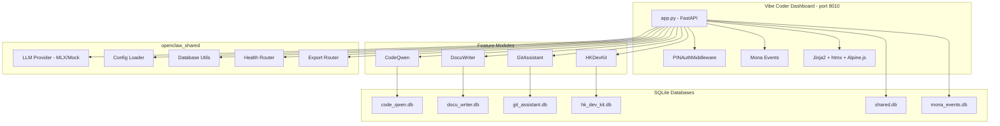

# Vibe Coder Implementation Plan

## Architecture Overview




## Directory Structure

All files live under `tools/10-vibe-coder/`:

```
tools/10-vibe-coder/
  config.yaml
  pyproject.toml
  vibe_coder/
    __init__.py
    app.py
    database.py
    seed_data.py
    dashboard/
      static/css/output.css
      static/js/app.js
      templates/
        base.html
        setup.html
        code_qwen/
          index.html
          partials/editor.html, explanation.html, refactor.html, chat.html, stats.html
        docu_writer/
          index.html
          partials/file_tree.html, doc_viewer.html, diff_view.html, export_panel.html
        git_assistant/
          index.html
          partials/pr_generator.html, release_notes.html, issue_labeler.html, commit_helper.html
        hk_dev_kit/
          index.html
          partials/connector_gallery.html, boilerplate.html, api_tester.html, snippet_browser.html
    code_qwen/
      __init__.py
      routes.py
      inference/model_loader.py, completion_engine.py, chat_engine.py, streaming.py
      features/explainer.py, refactorer.py, debugger.py, docstring_writer.py
      prompts/system_prompts.yaml
    docu_writer/
      __init__.py
      routes.py
      analyzers/project_analyzer.py, python_parser.py, js_parser.py, git_analyzer.py, freshness_checker.py
      generators/readme_generator.py, api_doc_generator.py, docstring_generator.py, architecture_generator.py, changelog_generator.py
      templates/readme.md.j2, api_doc.md.j2, architecture.md.j2
    git_assistant/
      __init__.py
      routes.py
      pr/diff_analyzer.py, description_generator.py, reviewer_suggester.py
      release/commit_analyzer.py, notes_generator.py, version_helper.py
      issues/issue_fetcher.py, auto_labeler.py, label_taxonomy.py
      commits/message_improver.py, conventional_commits.py
    hk_dev_kit/
      __init__.py
      routes.py
      connectors/fps/qr_generator.py, payment_client.py, fps_types.py
      connectors/octopus/merchant_client.py, transaction.py, octopus_types.py
      connectors/govhk/open_data_client.py, weather.py, transport.py, geodata.py
      connectors/common/hkid_validator.py, phone_formatter.py, address_parser.py
      generator/scaffolder.py, config_builder.py
      generator/templates/ (Jinja2 project templates)
      snippets/snippet_library.py, snippets.json
  tests/
    __init__.py
    test_code_qwen/__init__.py
    test_docu_writer/__init__.py
    test_git_assistant/__init__.py
    test_hk_dev_kit/__init__.py
```

## Key Implementation Details

### 1. Scaffolding (`config.yaml`, `pyproject.toml`, `app.py`, `database.py`)

**[config.yaml](tools/10-vibe-coder/config.yaml)** -- port 8010, tool_name `vibe-coder`, workspace `~/OpenClawWorkspace/vibe-coder`. Extra settings include: developer profile prefs, model warm/cold mode, GitHub token ref, FPS/Octopus/GovHK API configs, default languages, coding style prefs.

**[pyproject.toml](tools/10-vibe-coder/pyproject.toml)** -- `openclaw-vibe-coder`, depends on `openclaw-shared`, `fastapi`, `uvicorn`, `jinja2`, `pydantic`, `httpx`, `gitpython`, `qrcode`, `Pillow`, `tree-sitter`, `tree-sitter-languages`. Optional deps: `[mlx]`, `[messaging]`, `[macos]`, `[all]`.

**[app.py](tools/10-vibe-coder/vibe_coder/app.py)** -- Follows the exact pattern from immigration/fnb: lifespan loads config + init DBs + create LLM provider; mounts static files; adds PINAuthMiddleware; shared event API; dashboard page routes (`/`, `/setup/`, `/api/connection-test`); includes 4 feature routers + health + export routers.

**[database.py](tools/10-vibe-coder/vibe_coder/database.py)** -- Defines 4 schema strings (one per feature) from the SQL in each prompt's Data Model section, plus a `SHARED_SCHEMA`. `init_all_databases()` returns paths for `code_qwen.db`, `docu_writer.db`, `git_assistant.db`, `hk_dev_kit.db`, `shared.db`, `mona_events.db`.

### 2. CodeQwen Feature

**Routes** (`/code-qwen/`, API endpoints):

- `GET /code-qwen/` -- Dashboard page with Monaco editor, explanation panel, refactoring sidebar, chat
- `POST /api/code-qwen/complete` -- Code completion (accepts prefix/suffix, returns completion via SSE)
- `POST /api/code-qwen/explain` -- Code explanation
- `POST /api/code-qwen/refactor` -- Refactoring suggestions
- `POST /api/code-qwen/debug` -- Bug detection
- `POST /api/code-qwen/chat` -- Chat-based code Q&A (streaming SSE)
- `GET /api/code-qwen/stats` -- Usage analytics
- `GET /api/code-qwen/history` -- Conversation history

**Business logic**:

- `inference/model_loader.py` -- Wraps `openclaw_shared.llm` for Qwen-2.5-Coder-7B; manages warm/cold mode
- `inference/completion_engine.py` -- FIM (fill-in-middle) completion using `<|fim_prefix|>`, `<|fim_suffix|>`, `<|fim_middle|>` tokens; prefix/suffix hash caching
- `inference/chat_engine.py` -- Chat-based Q&A with conversation context
- `inference/streaming.py` -- SSE response formatting via `sse-starlette` or manual `StreamingResponse`
- `features/explainer.py` -- Sends code + prompt to LLM, returns structured explanation (supports EN/ZH)
- `features/refactorer.py` -- Analyzes code for structure, naming, performance improvements
- `features/debugger.py` -- Identifies bugs, logic errors, anti-patterns
- `features/docstring_writer.py` -- Auto-generates docstrings/JSDoc

### 3. DocuWriter Feature

**Routes** (`/docu-writer/`, API endpoints):

- `GET /docu-writer/` -- Dashboard page
- `POST /api/docu-writer/analyze` -- Analyze project structure
- `POST /api/docu-writer/readme` -- Generate README
- `POST /api/docu-writer/api-docs` -- Generate API documentation
- `POST /api/docu-writer/docstrings` -- Generate inline documentation
- `POST /api/docu-writer/architecture` -- Generate architecture overview
- `POST /api/docu-writer/changelog` -- Generate changelog from git history
- `POST /api/docu-writer/freshness` -- Check documentation freshness
- `GET /api/docu-writer/projects` -- List analyzed projects

**Business logic**:

- `analyzers/project_analyzer.py` -- Walks directory tree, identifies language, counts files/functions
- `analyzers/python_parser.py` -- Uses `ast` module to extract functions, classes, signatures, docstrings
- `analyzers/js_parser.py` -- Uses `tree-sitter` for JS/TS parsing
- `analyzers/git_analyzer.py` -- Uses `GitPython` for commit history
- `analyzers/freshness_checker.py` -- Hashes code elements, compares against stored hashes
- `generators/*.py` -- Each uses LLM + Jinja2 templates to produce documentation

### 4. GitAssistant Feature

**Routes** (`/git-assistant/`, API endpoints):

- `GET /git-assistant/` -- Dashboard page
- `POST /api/git-assistant/pr-description` -- Generate PR description from diff
- `POST /api/git-assistant/reviewers` -- Suggest reviewers
- `POST /api/git-assistant/release-notes` -- Generate release notes between tags
- `POST /api/git-assistant/label-issue` -- Auto-label GitHub issue
- `POST /api/git-assistant/improve-commit` -- Improve commit message
- `POST /api/git-assistant/branch-summary` -- Summarize branch changes
- `GET /api/git-assistant/repos` -- List configured repositories

**Business logic**:

- `pr/diff_analyzer.py` -- Parses git diffs, summarizes per-file changes for large diffs (>500 lines)
- `pr/description_generator.py` -- LLM-generates structured PR description (summary, motivation, changes, testing)
- `pr/reviewer_suggester.py` -- Computes ownership scores: `0.6 * recent_commit_weight + 0.4 * blame_lines`
- `release/commit_analyzer.py` -- Categorizes commits (conventional commits parsing or LLM fallback)
- `release/notes_generator.py` -- Groups commits by category, generates formatted release notes
- `issues/auto_labeler.py` -- Fetches repo's label taxonomy, uses LLM to select labels from fixed set
- `commits/message_improver.py` -- Rewrites commit messages to conventional commits format

### 5. HKDevKit Feature

**Routes** (`/hk-dev-kit/`, API endpoints):

- `GET /hk-dev-kit/` -- Dashboard page
- `POST /api/hk-dev-kit/fps/qr` -- Generate FPS QR code (EMV standard)
- `POST /api/hk-dev-kit/fps/payment` -- Initiate FPS payment
- `POST /api/hk-dev-kit/octopus/payment` -- Octopus payment processing
- `GET /api/hk-dev-kit/govhk/weather` -- GovHK weather data
- `GET /api/hk-dev-kit/govhk/transport` -- GovHK transport data
- `POST /api/hk-dev-kit/validate/hkid` -- HKID validation
- `POST /api/hk-dev-kit/validate/phone` -- Phone number formatting
- `POST /api/hk-dev-kit/generate` -- Generate boilerplate project
- `GET /api/hk-dev-kit/snippets` -- Search code snippets
- `GET /api/hk-dev-kit/connectors` -- List available connectors

**Business logic**:

- `connectors/fps/qr_generator.py` -- EMV QR code generation per HKMA spec using `qrcode` library
- `connectors/fps/payment_client.py` -- Unified FPS interface with bank-specific adapters (HSBC, StanChart)
- `connectors/octopus/merchant_client.py` -- Octopus SDK wrapper (tap-authorize-confirm flow)
- `connectors/govhk/open_data_client.py` -- Base GovHK client with caching (1hr weather, 24hr demographic)
- `connectors/govhk/weather.py` -- HK Observatory API typed responses
- `connectors/common/hkid_validator.py` -- Check digit algorithm (pure function)
- `connectors/common/phone_formatter.py` -- +852, 8-digit validation, mobile prefix check (5/6/7/9)
- `connectors/common/address_parser.py` -- Territory > District > Building > Floor > Unit
- `generator/scaffolder.py` -- Jinja2-based project scaffolding with conditional integrations
- `snippets/snippet_library.py` -- SQLite-backed search over curated HK-specific code snippets

### 6. Dashboard Templates

**[base.html](tools/10-vibe-coder/vibe_coder/dashboard/templates/base.html)** -- Standard MonoClaw dark theme (navy-950/900, gold accents). Sidebar with 4 tabs: CodeQwen, DocuWriter, GitAssistant, HKDevKit. Language toggle (EN/ZH), activity feed panel, settings link. CDN loads: Tailwind output.css, Chart.js 4.4, htmx 2.0, Alpine.js 3.14.

**[setup.html](tools/10-vibe-coder/vibe_coder/dashboard/templates/setup.html)** -- Multi-step wizard:

1. Developer profile (name, languages, coding style)
2. Model config (warm/cold mode, context window)
3. Project setup (default directories)
4. GitHub integration (token via `gh auth token`)
5. HK API keys (FPS, Octopus, GovHK)
6. Telegram bot config
7. Seed demo data option
8. Connection test

**Feature pages** -- Each extends `base.html`, overrides `` and ``. Uses htmx for dynamic partial loading. CodeQwen page includes Monaco editor via CDN.

### 7. Seed Data

**[seed_data.py](tools/10-vibe-coder/vibe_coder/seed_data.py)** -- Populates all 4 databases with demo data:

- CodeQwen: sample conversations, cached completions, usage stats
- DocuWriter: sample project analysis, generated docs, code elements
- GitAssistant: sample repo, PR generations, release notes, code ownership
- HKDevKit: sample projects, curated snippets (HKID, phone, address, FPS), API configs

### 8. Static Assets

- `output.css` -- Compiled Tailwind with custom navy/gold theme colors
- `app.js` -- Shared JS: activity feed polling, htmx event handlers, Monaco editor init, Chart.js dashboard charts, Alpine.js component helpers

## Parallelization Strategy

The implementation can be split across 4 parallel workstreams after the shared scaffolding is done:

- **Workstream A**: Scaffolding (config.yaml, pyproject.toml, app.py, database.py, seed_data.py, base.html, setup.html, static assets)
- **Workstream B**: CodeQwen (all inference/, features/, routes, templates)
- **Workstream C**: DocuWriter + GitAssistant (both are LLM+Git based, share patterns)
- **Workstream D**: HKDevKit (connectors, generator, snippets, routes, templates)

